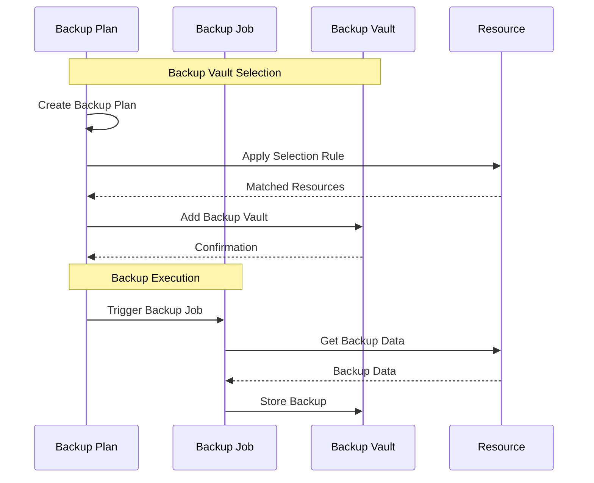

## Advanced Architecture

At its core, [[Master/Git_hub_notes/AWS-SAP-C02-Notes-main/README|AWS Backup]] is a fully managed backup service that helps customers centralize and automate their backups across various AWS services. It provides a unified interface to manage backups, set up backup [[policies]], and monitor backup activity. The service uses the concept of a "backup vault" which acts as a container for storing and organizing backups.

### [[RDS_Instance_Types|Global Scale Considerations]]

[[Master/Git_hub_notes/AWS-SAP-C02-Notes-main/README|AWS Backup]] is regional by default but can be designed for global reach by deploying backup vaults in multiple regions and replicating data using the following methods:

1. **Cross-region recovery**: Perform manual cross-region restores from one backup vault to another. This method requires manual intervention and doesn't provide automated failover or [[Master/Git_hub_notes/AWS-SAP-C02-Notes-main/README|disaster recovery]] capabilities.
2. **[[AWS_SA_PRO_Obsidian_Notes/Master/11-migrations/datasync|AWS DataSync]]**: Automatically transfer backups between two backup vaults in different regions. [[AWS_SA_PRO_Obsidian_Notes/Master/Migration_and_Transfer/DataSync|DataSync]] charges apply based on the amount of data transferred and network egress costs.

### Under the Hood Mechanics

[[Master/Git_hub_notes/AWS-SAP-C02-Notes-main/README|AWS Backup]] uses the following components under the hood:

- **Backup Plans**: A collection of rules that define when and how often to create backups for specific resources. These plans consist of one or more backup schedules and optional transition and deletion settings.
- **Backup Jobs**: The actual process of creating a backup, including resource selection, metadata handling, and storage management.
- **Backup Vaults**: Logical containers for storing backups, providing an additional layer of organization.
- **Backup Selection Rules**: Define the scope of resources included in a backup plan.

Here's a Mermaid sequence diagram showing how these components interact:



## Comparison & Anti-Patterns

| Service | Suitable For | Not Suitable For |
| --- | --- | --- |
| [[Git_hub_notes/AWS-SAP-C02-Notes-main/README|AWS Backup]] | Centralized backup solution for multiple AWS services. | Standalone [[ec2]] instances without support for [[Git_hub_notes/AWS-SAP-C02-Notes-main/README|AWS backup]] services. |
| [[Git_hub_notes/AWS-SAP-C02-Notes-main/README|EBS]] Snapshots | Single-volume backups for Amazon [[Git_hub_notes/AWS-SAP-C02-Notes-main/README|EBS]] volumes. | Large-scale, cross-service backups. |
| Lifecycle Manager | Application lifecycle management for Amazon [[Git_hub_notes/AWS-SAP-C02-Notes-main/README|RDS]]. | General-purpose backup solution. |

Common anti-patterns include:

- Using [[Master/Git_hub_notes/AWS-SAP-C02-Notes-main/README|AWS Backup]] for non-supported resources like [[ec2]] instances without associated [[Master/Git_hub_notes/AWS-SAP-C02-Notes-main/README|EBS]] volumes.
- Using [[Master/Git_hub_notes/AWS-SAP-C02-Notes-main/README|EBS]] snapshots instead of [[Master/Git_hub_notes/AWS-SAP-C02-Notes-main/README|AWS Backup]] for cross-service backups.

## [[appsync|Security]] & Governance

Complex [[Master/Git_hub_notes/AWS-SAP-C02-Notes-main/README|IAM]] [[policies]] should follow the principle of least privilege. Here's an example JSON policy allowing users to describe backup plans and jobs:

```json
{
    "Version": "2012-10-17",
    "Statement": [
        {
            "Effect": "Allow",
            "Action": [
                "backup:Describe*",
                "backup:Get*",
                "backup:List*"
            ],
            "Resource": "*"
        }
    ]
}
```

Cross-account access involves configuring appropriate [[Master/Git_hub_notes/AWS-SAP-C02-Notes-main/README|IAM]] roles and permissions in both source and destination accounts. [[organizations]] SCPs can enforce backup [[policies]] at the organizational level.

## Performance & Reliability

Throttling limits depend on the region and account type. To handle throttling exceptions, implement exponential backoff strategies using SDK retries, increasing wait times after each failure.

HA/DR patterns involve setting up backup plans for critical resources and ensuring they have sufficient replication and redundancy configurations.

## [[Master/Git_hub_notes/AWS-SAP-C02-Notes-main/README|Cost Optimization]]

Granular cost controls include selecting specific resource types to include in your backup plan and fine-tuning the backup frequency and retention periods. Calculate costs using the AWS Pricing Calculator.

## Professional Exam Scenario

### Scenario 1

Your company manages multiple AWS accounts within an [[AWS Organization]]. Your CTO wants to ensure all accounts adhere to a consistent backup strategy. Which of the following options would you recommend?

A) Implement [[Master/Git_hub_notes/AWS-SAP-C02-Notes-main/README|AWS Backup]] in each individual AWS account.
B) Enable Organizational Units (OUs) and apply backup [[policies]] to OU levels.
C) Configure Service Control [[policies]] (SCPs) to restrict backups only to supported AWS services.
D) Set up a single [[Master/Git_hub_notes/AWS-SAP-C02-Notes-main/README|AWS Backup]] instance in the master account and share it with other members.

Answer: B) Implementing backup [[policies]] at the OU level allows granular control while maintaining consistency across accounts.

### Scenario 2

As part of a new project, you need to store backups for Amazon [[dynamodb|DynamoDB tables]] and Amazon Elastic Block Store ([[Master/Git_hub_notes/AWS-SAP-C02-Notes-main/README|EBS]]) volumes. What is the most efficient way to achieve this?

A) Create separate backup plans for [[dynamodb]] and [[Master/Git_hub_notes/AWS-SAP-C02-Notes-main/README|EBS]] resources.
B) Use [[Master/Git_hub_notes/AWS-SAP-C02-Notes-main/README|EBS]] snapshots for both [[dynamodb]] and [[Master/Git_hub_notes/AWS-SAP-C02-Notes-main/README|EBS]] resources.
C) Combine [[dynamodb]] and [[Master/Git_hub_notes/AWS-SAP-C02-Notes-main/README|EBS]] into a single backup plan.
D) Leverage [[AWS_SA_PRO_Obsidian_Notes/Master/11-migrations/datasync|AWS DataSync]] to move backups between different backup vaults.

Answer: A) Creating separate backup plans for [[dynamodb]] and [[Master/Git_hub_notes/AWS-SAP-C02-Notes-main/README|EBS]] resources enables targeted backups and better resource management.