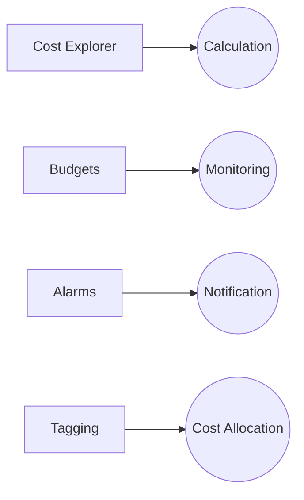

## Advanced Architecture
At the core of [[ec2]] is the concept of instance families, each designed for specific use cases based on workload requirements. Understanding their [[RDS_Instance_Types|internals]] is critical to architecting scalable and efficient systems.

* **General Purpose (T and M5/M6/M7)**: Balance CPU, memory, and network resources. Ideal for small to medium databases, web servers, and application servers.
* **Compute Optimized (C5 and R5)**: High-performance processors with lower memory-to-CPU ratio. Suitable for compute-intensive applications like batch processing, high-traffic web-tiers, and video encoding.
* **Memory Optimized (R5, X1, and Z1d)**: Highly-available and scalable [[ram]] for large in-memory datasets or real-time analytics. Recommended for relational databases, [[api-gateway|caching]] fleets, and high-performance datastores.
* **Accelerated Computing (P3, P4, G4)**: GPU-based instances for machine learning, graphics rendering, and video transcoding.

Global scale can be achieved using [Placement Groups](https://docs.aws.amazon.com/AWSEC2/latest/UserGuide/placement-groups.html) for low-latency connectivity among homogeneous instances. However, it may introduce single points of failure if not combined with appropriate [Availability Zone](https://docs.aws.amazon.com/AWSEC2/latest/UserGuide/using-regions-availability-zones.html) and [Region Pair](https://docs.aws.amazon.com/vpc/latest/privatelink/create-region-pair.html) strategies.

## Comparison & Anti-Patterns

| Service          | Use Case                                                              |
| ---------------- | -------------------------------------------------------------------- |
| **[[Fargate]]**      | Containerized microservices without managing underlying infrastructure.    |
| **[[lambda]]**       | Event-driven serverless architecture requiring minimal resource management.   |
| **[[Git_hub_notes/AWS-SAP-C02-Notes-main/README|App Runner]]**   | Simplified container deployment without managing scaling or networking.     |
| **Batch**        | Scheduled, parallel, and distributed workloads without manual intervention.    |

Anti-patterns include running stateful applications on stateless instances, neglecting proper [spot instance](https://aws.amazon.com/ec2/spot/) integration, and failing to leverage [Spot Fleet](https://aws.amazon.com/ec2/spot/fleet/) to optimize costs.

## [[appsync|Security]] & Governance
Complex [[Master/Git_hub_notes/AWS-SAP-C02-Notes-main/README|IAM]] [[policies]] involve granular permissions for users, groups, and roles. For cross-account access, consider [[sts]] [AssumeRole](https://docs.aws.amazon.com/STS/latest/APIReference/API_AssumeRole.html) and [AssumeRoleWithWebIdentity](https://docs.aws.amazon.com/STS/latest/APIReference/API_AssumeRoleWithWebIdentity.html). To limit risk, apply [Service Control Policies (SCPs)](https://docs.aws.amazon.com/organizations/latest/userguide/orgs_manage_policies_scps.html) at the organization level.

## Performance & Reliability
Throttling limits vary by instance type. Implement exponential backoff strategies when dealing with throttled API calls. Achieve high availability and [[Master/Git_hub_notes/AWS-SAP-C02-Notes-main/README|disaster recovery]] through [Auto Scaling Groups](https://aws.amazon.com/autoscaling/) and [Spot Fleet](https://aws.amazon.com/ec2/spot/fleet/), along with [Multi-AZ deployments](https://docs.aws.amazon.com/AmazonRDS/latest/UserGuide/concepts-high-availability.html).

## [[Master/Git_hub_notes/AWS-SAP-C02-Notes-main/README|Cost Optimization]]
Granular cost controls include setting up [Budgets](https://docs.aws.amazon.com/cost-management/latest/userguide/working-with-budgets.html), [Alarms](https://docs.aws.amazon.com/cost-explorer/latest/userguide/ce-what-is-ce.html#ce-alarms), and [Tagging](https://aws.amazon.com/answers/account-billing-management/how-can-i-allocate-costs-incurred-by-multiple-users-or-projects/). Calculate costs using [Cost Explorer](https://aws.amazon.com/cost-explorer/).

## Professional Exam Scenario 1
A company needs to run a large-scale data analysis pipeline that requires high computational power but does not need permanent storage. They want to minimize costs while maintaining performance. Which solution would you recommend?

### Solution
Use [Spot Instances](https://aws.amazon.com/ec2/spot/) with an [Auto Scaling Group](https://aws.amazon.com/autoscaling/) configured to scale out during periods of low spot prices and scale in during periods of high demand. This strategy allows the company to take advantage of unused [[ec2]] capacity at steep discounts compared to On-Demand pricing.

#### Incorrect Answer
Implementing a [Scheduled Scaling](https://docs.aws.amazon.com/autoscaling/ec2/userguide/schedule-instances-start-stop.html) strategy could result in suboptimal usage since it doesn't account for fluctuating market [[cloudformation|conditions]].

## Professional Exam Scenario 2
A media streaming platform wants to ensure high availability across multiple regions while minimizing latency between viewers and content delivery networks (CDNs). How should they architect their system using [[ec2]] instance families?

### Solution
The media streaming platform should implement a multi-region architecture using [Regional Placement Groups](https://docs.aws.amazon.com/AWSEC2/latest/UserGuide/placement-groups.html#placement-groups-regional) within each region, connected via [[AWS_SA_PRO_Obsidian_Notes/Master/VPC|VPC]] Peering or [AWS Global Accelerator](https://aws.amazon.com/global-accelerator/).

For optimal performance, select instance types from the **Compute Optimized** family (such as C5 or C6g) for the CDN edge nodes and **Memory Optimized** instances (like R5 or R6g) for the origin servers hosting the media content.

To further reduce latency, enable [Amazon CloudFront](https://aws.amazon.com/cloudfront/) in front of the regional architecture.

#### Incorrect Answer
Using a single region with multiple Availability Zones might not provide sufficient geographical coverage required for low-latency connections between viewers and CDNs.