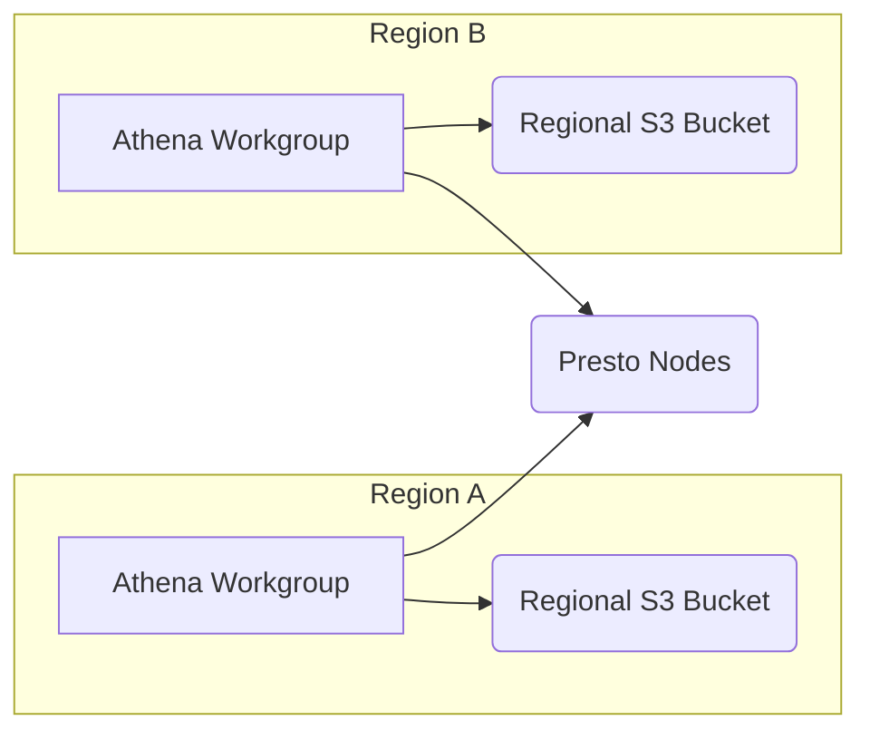

**[[RDS_Instance_Types|1. Advanced Architecture]]**

[[AWS_SA_PRO_Obsidian_Notes/Master/27-databases/athena|Athena]] is a serverless, interactive query service that allows you to analyze data in Amazon [[AWS_SA_PRO_Obsidian_Notes/Master/S3|S3]] using standard SQL. It scales automatically and has no infrastructure to manage or capacity planning to do. Under the hood, [[AWS_SA_PRO_Obsidian_Notes/Master/27-databases/athena|Athena]] uses Presto distributed query engine to execute queries.

When working at scale, it's important to understand how data is partitioned and stored within [[AWS_SA_PRO_Obsidian_Notes/Master/S3|S3]]. Partitioning your data can significantly improve query performance by reducing the amount of data scanned. For global deployments, you should store your data in the region closest to your users to minimize latency. To achieve this, create separate [[AWS_SA_PRO_Obsidian_Notes/Master/27-databases/athena|Athena]] workgroups per region, and configure each workgroup with a regional [[AWS_SA_PRO_Obsidian_Notes/Master/S3|S3]] bucket.



**[[RDS_Instance_Types|2. Comparison & Anti-Patterns]]**

| Service          | Use Case                                                              |
|-----------------|-----------------------------------------------------------------------|
| [[AWS_SA_PRO_Obsidian_Notes/Master/27-databases/athena|Athena]]          | Ad-hoc queries against large datasets in [[Srinivas_Notes/S3|S3]]                            |
| [[redshift]] Spectrum| Query data directly from [[Srinivas_Notes/S3|S3]] while using [[redshift]] for advanced analytics|
| [[glue]] [[glue|Data Catalog]]| Metadata repository for data lakes                                     |

Anti-pattern: Using [[AWS_SA_PRO_Obsidian_Notes/Master/27-databases/athena|Athena]] as an operational data store. Its interactive nature makes it unsuitable for real-time reporting or dashboards requiring frequent data updates. Consider services like [[Timestream]], Elasticsearch, or [[kinesis|Kinesis Data Firehose]] instead.

**[[RDS_Instance_Types|3. Security & Governance]]**

To enforce cross-account access, create an [[Master/Git_hub_notes/AWS-SAP-C02-Notes-main/README|IAM]] role in the account containing the [[AWS_SA_PRO_Obsidian_Notes/Master/S3|S3]] bucket with permissions to read objects. In the other account, grant permissions to assume the role. This way, users from the second account can perform queries without exposing [[AWS_SA_PRO_Obsidian_Notes/Master/S3|S3]] data directly.

```json
{
  "Version": "2012-10-17",
  "Statement": [
    {
      "Effect": "Allow",
      "Principal": {"AWS": "arn:aws:iam::123456789012:role/AssumeRole"},
      "Action": "sts:AssumeRole",
      "Condition": {}
    }
  ]
}
```

Use Service Control [[policies]] (SCPs) in [[organizations|AWS Organizations]] to limit who can create or delete [[AWS_SA_PRO_Obsidian_Notes/Master/27-databases/athena|Athena]] workgroups, modify query execution settings, or change column level encryption configurations.

**[[RDS_Instance_Types|4. Performance & Reliability]]**

[[AWS_SA_PRO_Obsidian_Notes/Master/27-databases/athena|Athena]] imposes soft limits on API requests and query executions. Monitor [[cloudwatch]] metrics such as `QueryExecutionStarted` and `QueryExecutionSucceeded` to detect potential throttling issues. Implement exponential backoff strategies when handling throttling exceptions.

For high availability and [[Master/Git_hub_notes/AWS-SAP-C02-Notes-main/README|disaster recovery]], distribute your data across multiple regions and configure distinct [[AWS_SA_PRO_Obsidian_Notes/Master/27-databases/athena|Athena]] workgroups in each location. If one region becomes unavailable, queries can still be executed in the remaining regions.

**[[RDS_Instance_Types|5. Cost Optimization]]**

Granular cost control can be achieved by setting up [[Budgets]], alerts, and usage reports at the workgroup level. Calculate costs based on your specific usage profile:
- Number of queries per day
- Size of input data
- Amount of data scanned during query execution

Here's a formula to estimate the daily cost of running queries:

Daily Cost = (Number of Queries * Query Cost) + (Data Scanned * Storage Cost)

**[[RDS_Instance_Types|6. Professional Exam Scenarios]]**

*Scenario 1:* An organization stores all its logs in Amazon [[AWS_SA_PRO_Obsidian_Notes/Master/S3|S3]]. They want to run ad-hoc queries over these logs but don't want to expose their data directly to external consultants.

Correct answer: Create an [[Master/Git_hub_notes/AWS-SAP-C02-Notes-main/README|IAM]] role in the [[AWS_SA_PRO_Obsidian_Notes/Master/S3|S3]] account allowing consultants to assume the role. Set up an [[AWS_SA_PRO_Obsidian_Notes/Master/27-databases/athena|Athena]] workgroup in a different account for consultants, pointing to the [[AWS_SA_PRO_Obsidian_Notes/Master/S3|S3]] bucket via a resource policy.

Incorrect answer: Grant consultants direct access to the [[AWS_SA_PRO_Obsidian_Notes/Master/S3|S3]] bucket.

*Scenario 2:* A company wants to optimize their [[AWS_SA_PRO_Obsidian_Notes/Master/27-databases/athena|Athena]] spend due to increasing costs from growing query volume.

Correct answer: Implement granular cost controls by setting up [[Budgets]], alerts, and usage reports at the workgroup level. Evaluate alternative solutions such as [[redshift]] Spectrum if advanced analytics capabilities are required.

Incorrect answer: Disable query history or set up quotas for individual users. These actions may hinder productivity and not effectively address the underlying issue of rising costs.