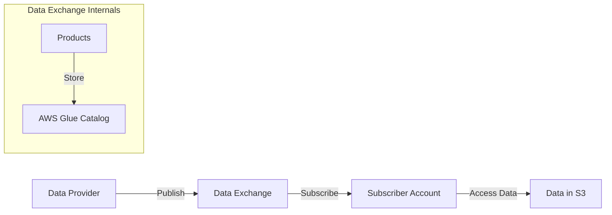

## Advanced Architecture

At its core, [[AWS_SA_PRO_Obsidian_Notes/Master/08-data-analytics/others|AWS Data Exchange]] is a fully managed service that makes it easy to find, subscribe to, and use third-party data in the cloud. It operates at global scale, allowing you to exchange data between accounts, regions, and even across different [[organizations|AWS Organizations]]. The following diagram provides an "under the hood" view of how Data Exchange works:



Data providers publish their datasets as products within Data Exchange. These products can include one or more data sets, which are stored in Amazon [[AWS_SA_PRO_Obsidian_Notes/Master/S3|S3]]. To enable secure access to these data sets, Data Exchange creates corresponding items in [[glue|AWS Glue]] [[glue|Data Catalog]], making the data easily discoverable and queryable using services like [[AWS_SA_PRO_Obsidian_Notes/Master/Analytics/Athena|Athena]], [[redshift]] Spectrum, and [[emr]].

## Comparison & Anti-Patterns

Here's a comparison table highlighting when not to use Data Exchange and potential alternatives:

| Scenario | Alternatives |
|---|---|
| Sharing data between multiple AWS accounts within the same organization. | AWS [[Storage Gateway]], [[Git_hub_notes/certified-aws-solutions-architect-professional-main/11-migrations/datasync|AWS DataSync]], or custom scripts using AWS SDKs. |
| Sharing large datasets that don't require curation by a third-party provider. | Amazon [[Srinivas_Notes/S3|S3]] Transfer Acceleration, [[Git_hub_notes/certified-aws-solutions-architect-professional-main/11-migrations/datasync|AWS DataSync]], or [[Git_hub_notes/AWS-SAP-C02-Notes-main/README|AWS Snow Family]]. |
| Real-time streaming data sharing. | Amazon [[kinesis|Kinesis Data Streams]], [[Amazon Managed Streaming for Apache Kafka (MSK)]], or [[iot|AWS IoT]] Rules Engine. |

Common anti-patterns involve attempting to share data that doesn't fit the intended use cases of Data Exchange, such as attempting to share data directly from [[ec2]] instances without using [[AWS_SA_PRO_Obsidian_Notes/Master/S3|S3]], or trying to share data across [[organizations]] without proper [[appsync|security]] measures in place.

## [[appsync|Security]] & Governance

[[appsync|Security]] and governance in Data Exchange involve setting up fine-grained [[Master/Git_hub_notes/AWS-SAP-C02-Notes-main/README|IAM]] [[policies]], cross-account access, and applying Service Control [[policies]] (SCPs) within an [[AWS Organization]]. Here's an example JSON policy snippet granting permissions:

```json
{
    "Version": "2012-10-17",
    "Statement": [
        {
            "Effect": "Allow",
            "Action": [
                "dataexchange:DescribeDataSet",
                "dataexchange:DescribeProduct",
                "dataexchange:GetLatestManifestFile",
                "glue:GetDatabase",
                "glue:GetTable",
                "s3:ListBucket",
                "s3:GetObject"
            ],
            "Resource": "*"
        }
    ]
}
```

Cross-account access can be configured using [[Master/Git_hub_notes/AWS-SAP-C02-Notes-main/README|IAM]] roles assuming necessary permissions. For centralized control over multiple accounts, apply SCPs at the organization level to restrict unwanted actions.

## Performance & Reliability

Data Exchange has throttling limits depending on the action performed. For instance, there's a limit of 20 requests per second for certain API calls. In case of hitting these limits, implement exponential backoff strategies to ensure reliable operation.

For high availability and [[Master/Git_hub_notes/AWS-SAP-C02-Notes-main/README|disaster recovery]], Data Exchange stores data in Amazon [[AWS_SA_PRO_Obsidian_Notes/Master/S3|S3]], which automatically replicates data across multiple regions. Additionally, Data Exchange supports [[AWS_SA_PRO_Obsidian_Notes/Master/03-networking/privatelink|AWS PrivateLink]], enabling secure, private connectivity between [[AWS_SA_PRO_Obsidian_Notes/Master/03-networking/privatelink|VPC endpoints]].

## [[Master/Git_hub_notes/AWS-SAP-C02-Notes-main/README|Cost Optimization]]

Granular cost controls can be achieved through various methods:

* Implementing usage-based [[billing]] for individual products.
* Using [[AWS_SA_PRO_Obsidian_Notes/Master/S3|S3]] lifecycle [[policies]] to transition older objects into lower-cost [[AWS_SA_PRO_Obsidian_Notes/Master/04-storage/s3|storage classes]].
* Enforcing [[Budgets]] and alerts at the [[AWS Organization]] level.

Calculating costs involves understanding the pricing model of Data Exchange:

* A flat fee based on the number of active subscriptions.
* Per-gigabyte ingress and egress charges for transferring data.
* Additional fees for using [[Master/Git_hub_notes/AWS-SAP-C02-Notes-main/README|other AWS services]] (e.g., Amazon [[AWS_SA_PRO_Obsidian_Notes/Master/S3|S3]] storage, [[glue|AWS Glue]] crawler usage).

## Professional Exam Scenarios

### Scenario 1: Multi-Account Strategy

Suppose a media company wants to share data between multiple departments while maintaining separate AWS accounts for each department. Which solution would best meet these requirements?

#### Correct Answer:

Use [[AWS_SA_PRO_Obsidian_Notes/Master/08-data-analytics/others|AWS Data Exchange]] along with [[organizations|AWS Organizations]] to create a central product catalog accessible by all departments. Then, configure cross-account access via [[Master/Git_hub_notes/AWS-SAP-C02-Notes-main/README|IAM]] roles and SCPs to enforce [[appsync|security]] [[policies]]. This approach allows for centralized management while ensuring data isolation between departments.

#### Incorrect Answers:

1. Using [[AWS_SA_PRO_Obsidian_Notes/Master/S3|S3]] bucket [[policies]] to grant access would not provide centralized management and might result in improperly configured permissions.
2. Directly sharing data between [[ec2]] instances without using [[AWS_SA_PRO_Obsidian_Notes/Master/S3|S3]] would not allow for easy discovery, querying, and integration with other AWS analytics services.

### Scenario 2: Large-Scale Data Distribution

An enterprise seeks to distribute a massive dataset (over 1 PB) to thousands of users worldwide. What strategy could optimize performance and minimize costs?

#### Correct Answer:

Use Data Exchange along with [[AWS_SA_PRO_Obsidian_Notes/Master/S3|S3]] Transfer Acceleration to efficiently upload data once and then leverage Data Exchange to manage subscriptions and access control. Enable [[AWS_SA_PRO_Obsidian_Notes/Master/S3|S3]] Intelligent-Tiering to automatically move less frequently accessed data to lower-cost storage tiers. Finally, set up [[Master/Git_hub_notes/AWS-SAP-C02-Notes-main/README|CloudFront]] distributions for faster content delivery to users around the world.

#### Incorrect Answers:

1. Using [[AWS_SA_PRO_Obsidian_Notes/Master/11-migrations/datasync|AWS DataSync]] for large-scale distribution would result in higher costs due to its per-GB pricing model compared to Data Exchange.
2. Utilizing AWS [[Storage Gateway]] for direct data transfers from user machines would not optimize performance nor minimize costs for such a large dataset.