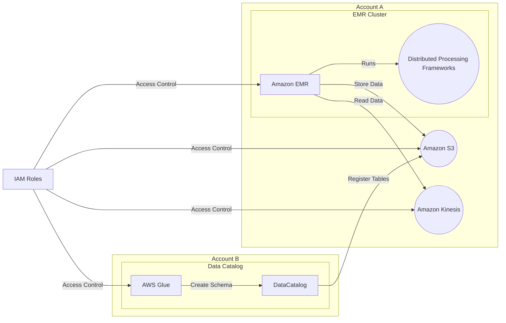

**[[RDS_Instance_Types|1. Advanced Architecture]]**

[[emr]] architecture consists of a managed cluster of Amazon [[ec2]] instances that can run various distributed data processing frameworks such as Apache Hadoop, Spark, and Presto. The following diagram shows an advanced [[emr]] architecture with multi-account setup, fine-grained access control using [[Master/Git_hub_notes/AWS-SAP-C02-Notes-main/README|IAM]] roles, and integration with [[Master/Git_hub_notes/AWS-SAP-C02-Notes-main/README|other AWS services]] like [[kinesis]], [[AWS_SA_PRO_Obsidian_Notes/Master/S3|S3]], and [[glue]].

The [[emr]] cluster runs on top of [[ec2]] instances, which can be launched in multiple availability zones (AZs) for high availability. [[emr]] automatically configures the underlying hardware for optimal performance based on the workload requirements. The data processed by [[emr]] is stored in [[AWS_SA_PRO_Obsidian_Notes/Master/S3|S3]], and data streams from [[kinesis]] can be consumed directly into [[emr]] clusters for real-time analytics.

**[[RDS_Instance_Types|2. Comparison & Anti-Patterns]]**

| Service | Use Case | Anti-Pattern |
| --- | --- | --- |
| [[emr]] | Real-time data processing, batch processing, machine learning, graph processing | Not suitable for single node or small-scale data processing tasks |
| [[redshift]] | Data warehousing, business intelligence reporting, OLAP | Not suitable for unstructured data processing |
| [[kinesis]] | Real-time streaming data processing | Not suitable for offline or batch processing |

Common anti-patterns include running [[emr]] clusters without proper termination protection, leading to unexpected costs when clusters are accidentally terminated. Another mistake is not optimizing the number of [[ec2]] instances and instance types, leading to underutilized resources or poor performance.

**[[RDS_Instance_Types|3. Security & Governance]]**

To enforce [[appsync|security]] and governance [[iam|best practices]], it is recommended to use the principle of least privilege while granting access to [[emr]] clusters. This can be achieved by creating [[Master/Git_hub_notes/AWS-SAP-C02-Notes-main/README|IAM]] roles with specific permissions required for each user or service. For example, the following JSON policy grants read-only access to [[AWS_SA_PRO_Obsidian_Notes/Master/S3|S3]]:
```json
{
    "Version": "2012-10-17",
    "Statement": [
        {
            "Effect": "Allow",
            "Action": [
                "s3:GetObject",
                "s3:ListBucket"
            ],
            "Resource": [
                "arn:aws:s3:::example-bucket/*",
                "arn:aws:s3:::example-bucket"
            ]
        }
    ]
}
```
Cross-account access can be enabled by creating a role in one account and allowing users in another account to assume the role. Organization Service Control [[policies]] (SCPs) can be used to enforce [[control-tower|guardrails]] across all accounts within an organization.

**[[RDS_Instance_Types|4. Performance & Reliability]]**

Throttling limits in [[emr]] depend on the type and number of [[ec2]] instances used in the cluster. To handle throttling issues, it is recommended to implement exponential backoff strategies in applications that interact with [[emr]]. High availability and [[Master/Git_hub_notes/AWS-SAP-C02-Notes-main/README|disaster recovery]] (HA/DR) patterns can be implemented by launching [[emr]] clusters in multiple availability zones and replicating data between regions using [[AWS_SA_PRO_Obsidian_Notes/Master/S3|S3]] cross-region replication.

**[[RDS_Instance_Types|5. Cost Optimization]]**

Granular cost controls can be implemented by setting up [[billing]] alarms, monitoring usage trends, and terminating idle [[emr]] clusters. The following formula can be used to calculate the cost of an [[emr]] cluster:
```python
Cost = (Number of Instances * Instance Type Cost * Hours Used) + (Data Storage Cost)
```
For example, if an [[emr]] cluster uses 10 m5.xlarge instances for 10 hours per day, and stores 1TB of data in [[AWS_SA_PRO_Obsidian_Notes/Master/S3|S3]], the daily cost would be:
```python
Cost = (10 * $0.18 * 10 * 24) + ($0.023 * 1) = $43.2 + $0.023 = $43.223
```
**[[RDS_Instance_Types|6. Professional Exam Scenarios]]**

**Scenario 1:** A company needs to process large datasets in real-time and store the results in [[AWS_SA_PRO_Obsidian_Notes/Master/S3|S3]]. They want to ensure that the solution is highly available and scalable.

Correct Answer: [[emr]] can be integrated with [[kinesis]] to consume real-time data streams and store the results in [[AWS_SA_PRO_Obsidian_Notes/Master/S3|S3]]. By launching [[emr]] clusters in multiple AZs and storing data in [[AWS_SA_PRO_Obsidian_Notes/Master/S3|S3]], the solution will be highly available and scalable.

Incorrect Answer: Running a single [[emr]] cluster in a single AZ is not highly available and may not be able to handle large datasets in real-time.

**Scenario 2:** A healthcare company wants to analyze sensitive patient data stored in [[AWS_SA_PRO_Obsidian_Notes/Master/S3|S3]] using [[emr]]. They need to ensure that only authorized users have access to the data.

Correct Answer: The healthcare company should create [[Master/Git_hub_notes/AWS-SAP-C02-Notes-main/README|IAM]] roles with specific permissions required for each user or service to access the [[emr]] cluster and [[AWS_SA_PRO_Obsidian_Notes/Master/S3|S3]] bucket. They could also consider using encryption at rest and in transit to further secure the data.

Incorrect Answer: Granting full access to the [[emr]] cluster and [[AWS_SA_PRO_Obsidian_Notes/Master/S3|S3]] bucket is not a good practice and violates the principle of least privilege.