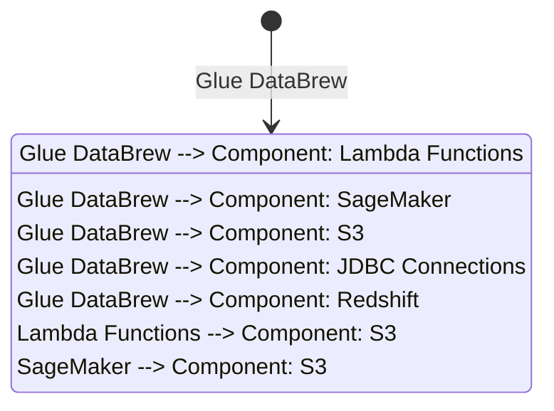

**1. Advanced [[glue]] DataBrew Architecture**

[[glue]] DataBrew is a visual data [[Master/Git_hub_notes/certified-aws-solutions-architect-professional-main/README|preparation]] service that enables users to clean, transform, and prepare data for analytics without writing code. It supports a range of data sources like [[AWS_SA_PRO_Obsidian_Notes/Master/S3|S3]], JDBC, and [[redshift]], and allows scheduling of jobs for automated data processing.

Internally, DataBrew uses a combination of serverless technologies such as [[lambda|AWS Lambda]] functions and [[Master/Git_hub_notes/AWS-SAP-C02-Notes-main/README|Amazon SageMaker]] to perform data transformations. The service has a central metadata repository that stores information about datasets, recipes, and projects. This repository facilitates global scale by replicating metadata across multiple regions for faster data transformation.

The following Mermaid diagram illustrates the interactions between various components in a typical [[glue]] DataBrew setup:



**[[RDS_Instance_Types|2. Comparison & Anti-Patterns]]**

| Service | Use Case | Anti-Pattern |
|---|---|---|
| [[glue]] DataBrew | Simple to moderately complex data transformations | Complex transformations requiring custom logic or advanced algorithms |
| [[glue|AWS Glue]] ETL | Custom ETL workflows, complex transformations, and large datasets | Small-scale transformations, ad-hoc analysis, or simple transformations |
| [[Git_hub_notes/certified-aws-solutions-architect-professional-main/08-data-analytics/others|AWS Lake Formation]] | [[glue|Data catalog]] management, fine-grained access control, and auditing | Standalone data [[Git_hub_notes/certified-aws-solutions-architect-professional-main/README|preparation]] tasks |

Common anti-patterns include using DataBrew for highly complex transformations better suited for [[glue]] ETL or Lake Formation.

**[[RDS_Instance_Types|3. Security & Governance]]**

DataBrew supports complex [[Master/Git_hub_notes/AWS-SAP-C02-Notes-main/README|IAM]] [[policies]] allowing granular access control. For cross-account access, you can create an [[Master/Git_hub_notes/AWS-SAP-C02-Notes-main/README|IAM]] role in the destination account and attach a policy granting permissions to the source account ARN. To enforce organization-wide restrictions, use Service Control [[policies]] (SCPs) at the organizational level.

Example JSON policy snippet:

```json
{
    "Effect": "Allow",
    "Action": [
        "databrew:CreateProject",
        "databrew:CreateDataset",
        "databrew:CreateRecipe"
    ],
    "Resource": [
        "*"
    ],
    "Condition": {
        "StringEqualsIfExists": {
            "aws:SourceVpce": [
                "vpce-12345678"
            ]
        }
    }
}
```

**[[RDS_Instance_Types|4. Performance & Reliability]]**

[[glue]] DataBrew supports throttling limits depending on the type of operation. Users should implement exponential backoff strategies when encountering throttling [[api-gateway|errors]]. High availability and [[Master/Git_hub_notes/AWS-SAP-C02-Notes-main/README|disaster recovery]] patterns involve configuring DataBrew across multiple regions and leveraging [[AWS_SA_PRO_Obsidian_Notes/Master/04-storage/s3|S3 replication]] for data redundancy.

**[[RDS_Instance_Types|5. Cost Optimization]]**

Granular cost controls in DataBrew are achieved through resource tagging, which helps track and optimize costs based on specific use cases. Additionally, regularly reviewing underutilized resources and deleting them can help minimize unnecessary expenses.

**[[RDS_Instance_Types|6. Professional Exam Scenarios]]**

**Scenario A:**
You need to set up a multi-account [[glue]] DataBrew environment for a large enterprise with strict [[appsync|security]] requirements. How would you ensure secure cross-account access while enforcing company-wide restrictions?

Correct answer: Implement a centralized [[Master/Git_hub_notes/AWS-SAP-C02-Notes-main/README|IAM]] role within the destination account with a policy granting necessary permissions to the source account(s). Enforce additional [[appsync|security]] measures by implementing Service Control [[policies]] (SCPs) at the organizational level.

Incorrect answer: Create individual [[Master/Git_hub_notes/AWS-SAP-C02-Notes-main/README|IAM]] roles in each account and manually maintain their permissions.

**Scenario B:**
Your team needs to process large datasets with complex transformations using [[glue]] DataBrew. However, DataBrew imposes [[AWS_SA_PRO_Obsidian_Notes/Master/12-security-and-config/cloudhsm|limitations]] on the number of transformations and dataset size. What alternative solution would address these challenges?

Correct answer: Utilize [[glue|AWS Glue]] ETL or [[AWS_SA_PRO_Obsidian_Notes/Master/08-data-analytics/others|AWS Lake Formation]] for more advanced data processing capabilities.

Incorrect answer: Increase the number of concurrent DataBrew sessions or request a limit increase from AWS support.