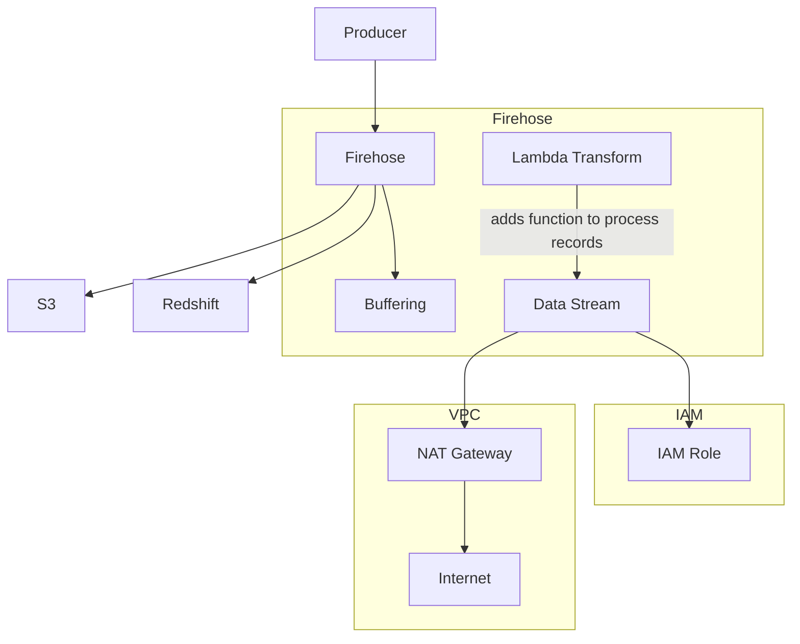

**[[RDS_Instance_Types|1. Advanced Architecture]]**

[[kinesis|Kinesis Data Firehose]] is a fully managed service that can automatically load data into destinations like Amazon [[AWS_SA_PRO_Obsidian_Notes/Master/S3|S3]], [[redshift]], Elasticsearch, and Splunk. It can handle near real-time data ingestion and transform data via [[lambda]] before loading it.

Internally, [[kinesis|Kinesis Data Firehose]] buffers incoming records to minimize the number of requests made to the destination. Buffering happens in two ways: record buffering and size buffering. Record buffering waits for a specified number of records (default: 1000) while size buffering waits for the buffer size to reach a certain threshold (default: 1 MB).

For [[RDS_Instance_Types|global scale considerations]], [[kinesis]] Data Firehise supports delivery streams across multiple regions using the "Cross-Region Delivery" feature. This allows you to create a single delivery stream that sends data to an [[AWS_SA_PRO_Obsidian_Notes/Master/S3|S3]] bucket in another region, providing [[Master/Git_hub_notes/AWS-SAP-C02-Notes-main/README|disaster recovery]] and lower-latency access to your data.

When creating a Firehose delivery stream, you need to specify a [[AWS_SA_PRO_Obsidian_Notes/Master/VPC|VPC]] (if sending data to private endpoints) and an [[Master/Git_hub_notes/AWS-SAP-C02-Notes-main/README|IAM]] role with necessary permissions. The following Mermaid code demonstrates the architecture:



**[[RDS_Instance_Types|2. Comparison & Anti-Patterns]]**

| Service | Real-Time Ingestion | Serverless | Scalable | Cost-Effective |
| --- | --- | --- | --- | --- |
| [[kinesis|Kinesis Data Firehose]] | Yes | Yes | Yes | Yes |
| [[kinesis|Kinesis Data Streams]] | Optional (w/ KCL or [[lambda]]) | No | Yes | Less costly when processing large volumes |
| [[sqs]] + [[lambda]] | Yes | Yes | Limited by [[lambda]] concurrency | More expensive than Firehose |

Anti-pattern: Using [[kinesis|Kinesis Data Firehose]] when dealing with time-series datasets requiring sequential access or high-frequency data retrieval. Consider using [[kinesis|Kinesis Data Streams]] with KCL or [[Timestream]] instead.

**[[RDS_Instance_Types|3. Security & Governance]]**

To secure [[kinesis|Kinesis Data Firehose]], follow these [[iam|best practices]]:

- Implement least privilege [[Master/Git_hub_notes/AWS-SAP-C02-Notes-main/README|IAM]] [[policies]] (e.g., deny unauthorized actions)
- Use cross-account access to allow other accounts to send data to your Firehose
- Set up Organization SCPs to restrict creating or modifying Firehose resources

Example JSON policy:

```json
{
  "Version": "2012-10-17",
  "Statement": [
    {
      "Sid": "DenyUnallowedActions",
      "Effect": "Deny",
      "Action": [
          "firehose:*"
      ],
      "Resource": [
          "*"
      ],
      "Condition": {
          "StringNotEqualsIfExists": {
              "aws:PrincipalArn": [
                  "arn:aws:iam::*:role/MyFirehoseRole"
              ]
          }
      }
    }
  ]
}
```

**[[RDS_Instance_Types|4. Performance & Reliability]]**

Throttle limits depend on the destination service. For example, [[AWS_SA_PRO_Obsidian_Notes/Master/S3|S3]] has a limit of 5 PUT requests per second, which can be increased by contacting AWS support. To ensure reliability, implement exponential backoff strategies when handling [[api-gateway|errors]] during data transmission.

HA/DR patterns include deploying Firehose delivery streams in multiple regions and configuring them to write data to separate [[AWS_SA_PRO_Obsidian_Notes/Master/S3|S3]] buckets in each region.

**[[RDS_Instance_Types|5. Cost Optimization]]**

Granular cost controls in Firehose include monitoring usage metrics such as data processed and stored, and setting alarms based on those metrics. Calculate costs by considering the volume of data ingested, the number of active delivery streams, and any additional charges from [[Master/Git_hub_notes/AWS-SAP-C02-Notes-main/README|Lambda functions]] used for data transformation.

**[[RDS_Instance_Types|6. Professional Exam Scenarios]]**

*Scenario 1*
You have a client who needs to collect logs from their web application servers in multiple regions and store them in a centralized location for real-time analysis. They want to perform some data transformations on the log data before storing it. Which solution would meet these requirements?

Correct Answer: Implement [[kinesis|Kinesis Data Firehose]] in each region to collect logs from the web application servers. Configure [[Master/Git_hub_notes/AWS-SAP-C02-Notes-main/README|Lambda functions]] to transform the log data before storing it in a centralized [[AWS_SA_PRO_Obsidian_Notes/Master/S3|S3]] bucket.

Incorrect Answer: Implement [[kinesis|Kinesis Data Streams]] in each region to collect logs from the web application servers. Configure [[Master/Git_hub_notes/AWS-SAP-C02-Notes-main/README|Lambda functions]] to transform the log data before storing it in a centralized [[AWS_SA_PRO_Obsidian_Notes/Master/S3|S3]] bucket.

Justification: [[kinesis|Kinesis Data Firehose]] provides real-time data collection, serverless data transformation through [[lambda]], and direct integration with [[AWS_SA_PRO_Obsidian_Notes/Master/S3|S3]]. While [[kinesis|Kinesis Data Streams]] could also collect data, they require more manual management and do not provide built-in serverless data transformation capabilities.

*Scenario 2*
Your organization wants to prevent users from accidentally deleting [[kinesis|Kinesis Data Firehose]] resources. How should you address this concern?

Correct Answer: Create an Organization Service Control Policy ([[SCP]]) that denies specific API actions related to [[kinesis|Kinesis Data Firehose]].

Incorrect Answer: Modify [[Master/Git_hub_notes/AWS-SAP-C02-Notes-main/README|IAM]] roles assigned to users to remove unnecessary API permissions related to [[kinesis|Kinesis Data Firehose]].

Justification: Organizational SCPs apply to all accounts within an organization, ensuring consistent [[appsync|security]] [[policies]]. Modifying individual user roles may lead to inconsistent configurations if new users are added or existing users change roles.