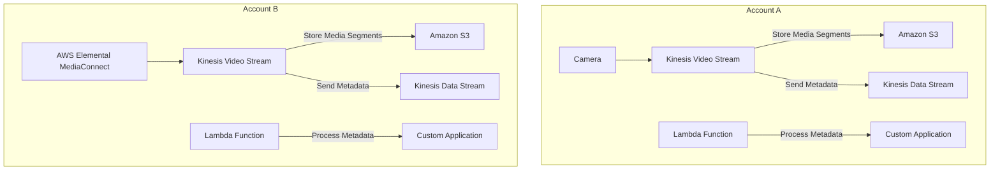

**Advanced Architecture**

[[kinesis-video-streams|Kinesis Video Streams]] is a highly scalable and durable solution for securely ingesting, processing, and storing video data in real-time. It uses a combination of Amazon [[kinesis|Kinesis Data Streams]], Amazon [[AWS_SA_PRO_Obsidian_Notes/Master/S3|S3]], and [[lambda|AWS Lambda]] to handle metadata, store media segments, and process data respectively. The following diagram illustrates an advanced architecture using [[kinesis-video-streams|Kinesis Video Streams]]:



The architecture includes two accounts (A and B) that independently collect video streams from cameras or other sources. Each account has its own [[kinesis]] Video Stream, which stores media segments in Amazon [[AWS_SA_PRO_Obsidian_Notes/Master/S3|S3]] for long-term storage. Metadata is sent to a [[kinesis]] Data Stream, triggering [[Master/Git_hub_notes/AWS-SAP-C02-Notes-main/README|Lambda functions]] that further process the data before sending it to custom applications.

**Comparison & Anti-Patterns**

| Service       | Use Case                              |
|---------------|----------------------------------------|
| KVS           | Real-time video streaming, storage      |
| AWS Elemental | Live video production, encoding        |
| AWS Medialive | Broadcast-quality live video streaming |

Anti-patterns include using KVS for non-video content (e.g., text or images), as well as using it for batch or offline processing instead of real-time streaming.

**[[appsync|Security]] & Governance**

Complex [[Master/Git_hub_notes/AWS-SAP-C02-Notes-main/README|IAM]] [[policies]] can be created to restrict access to [[kinesis-video-streams|Kinesis Video Streams]] based on specific [[cloudformation|conditions]] such as IP address ranges or time intervals. Here is an example JSON policy:

```json
{
  "Version": "2012-10-17",
  "Statement": [
    {
      "Effect": "Allow",
      "Action": [
        "kinesisvideo:*"
      ],
      "Resource": "*",
      "Condition": {
        "IpAddress": {
          "aws:SourceIp": [
            "192.168.0.0/16"
          ]
        },
        "DateGreaterThan": {
          "kinesisvideo:CaptureTime": "2022-07-01T00:00:00Z"
        }
      }
    }
  ]
}
```

Cross-account access can be granted by creating a principal policy in the source account and adding the destination account ARN as the resource.

Organization SCPs can enforce service control [[policies]] across all member accounts, preventing unauthorized usage of [[kinesis-video-streams|Kinesis Video Streams]].

**Performance & Reliability**

Throttling limits for [[kinesis-video-streams|Kinesis Video Streams]] depend on the stream type and number of shards. To avoid throttling [[api-gateway|errors]], implement exponential backoff strategies when retrying failed requests.

HA/DR patterns involve deploying multiple [[kinesis-video-streams|Kinesis Video Streams]] in different regions, replicating metadata between them, and configuring backup mechanisms for media segments stored in Amazon [[AWS_SA_PRO_Obsidian_Notes/Master/S3|S3]].

**[[Master/Git_hub_notes/AWS-SAP-C02-Notes-main/README|Cost Optimization]]**

Granular cost controls can be achieved by monitoring the number of shards and hours used per month. Calculate costs using the formula:

Cost = (Number of Shards \* Price per Shard \* Number of Hours) + (Storage Cost \* Media Segment Storage Size)

**Professional Exam Scenarios**

Scenario 1: A company wants to build a real-time video analytics system for [[appsync|security]] surveillance purposes. They have multiple locations worldwide and require high availability and low latency. Design a solution using [[kinesis-video-streams|Kinesis Video Streams]] and other related services.

Correct answer: Create a separate [[kinesis]] Video Stream per location, using Amazon [[cloudwatch|CloudWatch alarms]] to monitor throttling events and automatically adjust the number of shards based on demand. Send metadata to a centralized Amazon [[kinesis]] Data Stream for further processing by [[Master/Git_hub_notes/AWS-SAP-C02-Notes-main/README|Lambda functions]] and custom applications. Store media segments in Amazon [[AWS_SA_PRO_Obsidian_Notes/Master/S3|S3]] for long-term storage. Implement cross-region replication for [[Master/Git_hub_notes/AWS-SAP-C02-Notes-main/README|disaster recovery]] purposes.

Incorrect answer: Use a single [[kinesis]] Video Stream for all locations and send metadata directly to custom applications without processing. This approach does not provide geographical redundancy and may result in higher latencies due to the centralized metadata processing.

Scenario 2: A sports broadcasting company wants to integrate [[kinesis-video-streams|Kinesis Video Streams]] with AWS Elemental MediaConnect for live video production. Describe how to configure these services to work together and any necessary [[appsync|security]] measures.

Correct answer: Configure AWS Elemental MediaConnect to ingest video streams into a [[kinesis]] Video Stream. Use [[AWS_SA_PRO_Obsidian_Notes/Master/03-networking/privatelink|VPC endpoints]] to ensure secure communication between services. Implement least privilege access [[policies]] to limit who can access the [[kinesis]] Video Stream. Enable encryption at rest and in transit for both [[kinesis-video-streams|Kinesis Video Streams]] and AWS Elemental MediaConnect.