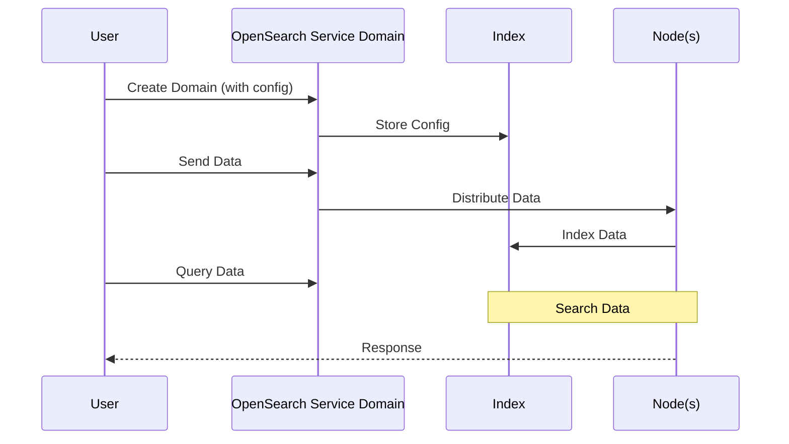

**[[RDS_Instance_Types|1. Advanced Architecture]]**

[[opensearch]] Service is a fully managed search service that makes it easy to set up, operate, and scale a search solution for your website or application. It offers various advanced features such as autoscaling, cross-cluster search, and dedicated master nodes. [[opensearch]] Service supports fine-grained access control and uses the same API as Elasticsearch, allowing you to switch between them seamlessly.

Internally, [[opensearch]] Service creates a domain in which all the indexes, nodes, and settings are contained. Each domain has its own endpoint URL, and multiple domains can be created within an account. The following Mermaid diagram shows how data flows through the different components of an [[opensearch]] Service domain:

Global scale can be achieved using [[AWS_SA_PRO_Obsidian_Notes/Master/VPC|VPC]] Peering, [[Master/Git_hub_notes/AWS-SAP-C02-Notes-main/README|AWS Direct Connect]], or [[AWS_SA_PRO_Obsidian_Notes/Master/AWS Global Accelerator]]. This allows low-latency connections from users worldwide by routing traffic to the closest regional endpoint.

**[[RDS_Instance_Types|2. Comparison & Anti-Patterns]]**

| Service | Use Cases | Scalability | Cost |
| --- | --- | --- | --- |
| [[opensearch]] Service | Log analysis, full-text search, and ML-powered insights. | Highly scalable with auto-scaling and provisioned capacity. | Pay-per-use model based on number of nodes, storage, and data transfer. |
| Amazon ES (Elasticsearch Service) | Same as [[opensearch]] Service but without open-source compatibility. | Limited to provisioned capacity only. | Similar pay-per-use model. |
| [[kinesis|Kinesis Data Firehose]] | Real-time streaming data processing. | Limited to real-time ingestion. | Pay-per-data-processed model. |

Anti-patterns include:

* Using [[opensearch]] Service for real-time streaming data when [[kinesis|Kinesis Data Firehose]] is more suitable.
* Choosing Amazon ES over [[opensearch]] Service when open-source compatibility is required.

**[[RDS_Instance_Types|3. Security & Governance]]**

Complex [[Master/Git_hub_notes/AWS-SAP-C02-Notes-main/README|IAM]] [[policies]] involve granting permissions to specific resources like indices or documents. Here's an example JSON policy snippet:
```json
{
    "Effect": "Allow",
    "Action": [
        "es:DescribeIndex",
        "es:DescribeIndices"
    ],
    "Resource": [
        "arn:aws:es:us-west-2:123456789012:domain/my-domain/*"
    ],
    "Condition": {
        "StringEquals": {
            "es:index-name": [
                "my-index-1",
                "my-index-2"
            ]
        }
    }
}
```
Cross-account access can be granted using resource-based [[policies]] attached to the [[opensearch]] Service domain. For centralized management, you can apply Service Control [[policies]] (SCPs) at the [[organizations|AWS Organizations]] level.

**[[RDS_Instance_Types|4. Performance & Reliability]]**

Throttling limits depend on the instance type and number of nodes. To manage throttling [[api-gateway|errors]], implement exponential backoff strategies using libraries like the AWS SDK.

HA/DR patterns include running multiple replicas across different availability zones, creating snapshots, and storing them in [[AWS_SA_PRO_Obsidian_Notes/Master/S3|S3]]. In case of failure, create a new domain using the stored snapshot.

**[[RDS_Instance_Types|5. Cost Optimization]]**

To optimize costs, enable [[cost-allocation-tags|cost allocation tags]], use smaller instance types for dev environments, and leverage UltraWarm nodes for infrequently accessed data. Calculate costs using the AWS Pricing Calculator or the AWS [[billing|Cost Explorer]].

**[[RDS_Instance_Types|6. Professional Exam Scenarios]]**

Scenario 1: A company needs to analyze logs from multiple applications deployed across several accounts. They want to consolidate log data into a single location while maintaining [[appsync|security]] and governance.

Correct Answer: Implement a centralized [[vpc-flow-logs|logging]] architecture using [[opensearch]] Service with [[AWS_SA_PRO_Obsidian_Notes/Master/VPC|VPC]] Peering and AWS Resource Access Manager. Apply SCPs at the organization level to enforce granular access [[policies]].

Incorrect Answer: Use [[kinesis|Kinesis Data Firehose]] to stream log data to a single [[opensearch]] Service domain. This approach does not support multi-account scenarios natively and may result in increased costs due to data processing fees.

Scenario 2: An e-commerce platform requires a highly available and reliable search infrastructure supporting millions of queries per day.

Correct Answer: Implement an [[opensearch]] Service domain with dedicated master nodes, multiple replicas, and UltraWarm nodes for infrequent data access. Monitor performance metrics and use Auto Scaling to adjust capacity dynamically.

Incorrect Answer: Deploy self-managed Elasticsearch clusters in [[ec2]] instances. This approach lacks native integration with [[Master/Git_hub_notes/AWS-SAP-C02-Notes-main/README|other AWS services]] and requires manual maintenance, increasing operational overhead.