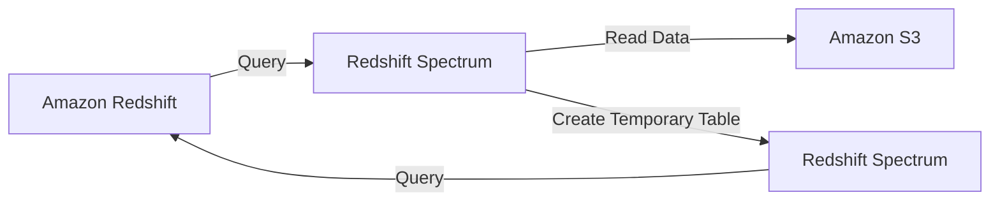

**Advanced Architecture**

[[redshift]] Spectrum is a feature of [[redshift|Amazon Redshift]] that allows you to run SQL queries against data in Amazon [[AWS_SA_PRO_Obsidian_Notes/Master/S3|S3]] without having to load it into [[redshift]] tables. It enables fast, interactive analysis of large volumes of structured and semi-structured data in [[AWS_SA_PRO_Obsidian_Notes/Master/S3|S3]]. Under the hood, [[redshift]] Spectrum uses a massively parallel processing (MPP) execution engine to read data directly from [[AWS_SA_PRO_Obsidian_Notes/Master/S3|S3]] using columnar input/output (I/O).

The following diagram illustrates how [[redshift]] Spectrum works:

When a query is submitted to [[redshift]] Spectrum, it first checks if the required data exists in [[redshift]] tables. If not, it creates a temporary table in the Spectrum schema and reads the data from [[AWS_SA_PRO_Obsidian_Notes/Master/S3|S3]]. The temporary table is deleted after the query finishes executing.

[[redshift]] Spectrum supports advanced features such as automatic data compression, partitioning, and column pruning. These features help improve query performance and reduce costs by minimizing the amount of data read from [[AWS_SA_PRO_Obsidian_Notes/Master/S3|S3]]. Additionally, [[redshift]] Spectrum allows you to use familiar SQL commands and business intelligence tools to analyze data stored in [[AWS_SA_PRO_Obsidian_Notes/Master/S3|S3]].

**Comparison & Anti-Patterns**

Here are some scenarios when not to use [[redshift]] Spectrum and alternative services:

| Scenario | Alternative Service(s) |
| --- | --- |
| Real-time analytics | [[kinesis|Kinesis Data Firehose]], [[kinesis|Kinesis Data Streams]], [[lambda]], [[redshift]] |
| Interactive analytics on small datasets | [[redshift]], [[Collab_Notes_detailed/Analytics/Athena|Athena]], [[quicksight]] |
| Unstructured data analysis | [[Srinivas_Notes/S3|S3]], [[Git_hub_notes/AWS-SAP-C02-Notes-main/README|Glacier]], Elasticsearch, [[kinesis]] |
| Operational reporting | [[Git_hub_notes/AWS-SAP-C02-Notes-main/README|RDS]], [[aurora]], [[DocumentDB]], Elasticsearch |

Common design mistakes include:

* Using [[redshift]] Spectrum as a replacement for [[redshift]] tables instead of a complement.
* Not optimizing data for [[redshift]] Spectrum by applying column encoding, partitioning, or compression.

**[[appsync|Security]] & Governance**

To implement complex [[Master/Git_hub_notes/AWS-SAP-C02-Notes-main/README|IAM]] [[policies]] for [[redshift]] Spectrum, you can use JSON snippets like the following:
```json
{
    "Version": "2012-10-17",
    "Statement": [
        {
            "Effect": "Allow",
            "Action": [
                "redshiftspectrum:CreateExternalSchema",
                "redshiftspectrum:CreateExternalTable",
                "redshiftspectrum:DescribeExternalSchema",
                "redshiftspectrum:DescribeExternalTable",
                "redshiftspectrum:GetQueryExecution",
                "redshiftspectrum:ListExternalSchemas",
                "redshiftspectrum:ListExternalTables"
            ],
            "Resource": "*",
            "Condition": {
                "StringEquals": {
                    "aws:SourceVpce": "vpce-12345678"
                }
            }
        }
    ]
}
```
For cross-account access, you can create an [[Master/Git_hub_notes/AWS-SAP-C02-Notes-main/README|IAM]] role in the source account and attach an [[Master/Git_hub_notes/AWS-SAP-C02-Notes-main/README|IAM]] policy allowing the destination account to perform specific actions. In the destination account, create an [[Master/Git_hub_notes/AWS-SAP-C02-Notes-main/README|IAM]] user or group and grant them permissions to assume the [[Master/Git_hub_notes/AWS-SAP-C02-Notes-main/README|IAM]] role.

Organization Service Control [[policies]] (SCPs) allow you to define [[control-tower|guardrails]] for your organization. For example, you can restrict the creation of new [[redshift]] clusters outside specific [[AWS_SA_PRO_Obsidian_Notes/Master/03-networking/privatelink|VPC endpoints]].

**Performance & Reliability**

[[redshift]] Spectrum has throttling limits based on the number of concurrent queries, users, and sessions. To avoid throttling, implement exponential backoff strategies using [[Master/Git_hub_notes/AWS-SAP-C02-Notes-main/README|Lambda functions]] or SDKs.

High availability (HA) and [[Master/Git_hub_notes/AWS-SAP-C02-Notes-main/README|disaster recovery]] ([[dr]]) patterns depend on the use case. For HA, deploy [[redshift]] clusters in multiple Availability Zones (AZs). For [[dr]], create snapshots of [[redshift]] clusters and store them in [[AWS_SA_PRO_Obsidian_Notes/Master/S3|S3]] or another region.

**[[Master/Git_hub_notes/AWS-SAP-C02-Notes-main/README|Cost Optimization]]**

Granular cost controls include setting up [[billing]] alerts, monitoring usage metrics, and configuring [[redshift]] Spectrum to use only specific [[AWS_SA_PRO_Obsidian_Notes/Master/S3|S3]] buckets or prefixes. Calculate costs using the AWS Pricing Calculator or the [[redshift]] Cost Estimation Reports.

**Professional Exam Scenarios**

Scenario 1: A company stores customer data in [[AWS_SA_PRO_Obsidian_Notes/Master/S3|S3]] and wants to query it using [[redshift]] Spectrum. They want to ensure that only specific users can access the data. Design a solution that meets these requirements.

Correct Answer: Use [[redshift]] Spectrum with an external schema pointing to the [[AWS_SA_PRO_Obsidian_Notes/Master/S3|S3]] bucket. Implement [[Master/Git_hub_notes/AWS-SAP-C02-Notes-main/README|IAM]] [[policies]] that allow specific users to access the schema.

Incorrect Answers:

* Creating a [[redshift]] cluster with public access to the [[AWS_SA_PRO_Obsidian_Notes/Master/S3|S3]] bucket. This violates [[appsync|security]] [[iam|best practices]] and exposes sensitive data.
* Storing the data in a different [[AWS_SA_PRO_Obsidian_Notes/Master/S3|S3]] bucket and creating an [[Master/Git_hub_notes/AWS-SAP-C02-Notes-main/README|IAM]] role for cross-account access. This approach adds unnecessary complexity and increases costs.

Scenario 2: A media company processes large video files and generates metadata that they store in [[AWS_SA_PRO_Obsidian_Notes/Master/S3|S3]]. They want to use [[redshift]] Spectrum to analyze the metadata but are concerned about throttling. What steps can they take to mitigate throttling?

Correct Answer: Use exponential backoff strategies and monitor usage metrics. Consider implementing [[api-gateway|caching]] mechanisms using AWS DataStore or [[elasticache]].

Incorrect Answers:

* Increasing the number of concurrent queries beyond the recommended limit. This may result in unpredictable behavior and increased costs.
* Adding more nodes to the [[redshift]] cluster. This does not address throttling issues related to [[redshift]] Spectrum and increases costs.