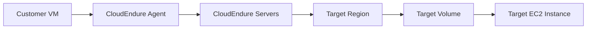

Advanced Architecture
---------------------

At its core, CloudEndure (Legacy) is a [[Master/Git_hub_notes/AWS-SAP-C02-Notes-main/README|disaster recovery]] and migration service that uses block-level storage replication to provide minimal downtime during migration or failover scenarios. The following diagram provides an overview of the internal architecture:



* The **Customer VM** runs a lightweight agent that captures disk writes at the block level. This data is then sent to CloudEndure servers in the source region.
* **CloudEndure Servers** receive and aggregate disk write changes from multiple customer VMs. They also perform deduplication and compression before sending the data to target regions.
* In the **Target Region**, CloudEndure creates replica volumes using the received data. These volumes can be attached to Amazon Elastic Compute Cloud ([[ec2]]) instances as needed.

When designing a solution using CloudEndure, it's important to consider global scale requirements. For example, you may need to implement multi-account strategies for various environments (development, staging, production) or geographical locations. To do this, leverage [[organizations|AWS Organizations]], Service Control [[policies]] (SCPs), and Identity and Access Management ([[Master/Git_hub_notes/AWS-SAP-C02-Notes-main/README|IAM]]) roles.

Comparison & Anti-Patterns
---------------------------

Here are some cases when not to use CloudEndure (Legacy):

| Service        | Comparison Criteria                         | Anti-Patterns                                                                   |
| -------------- | -------------------------------------------- | ------------------------------------------------------------------------------- |
| AWS Server Migration Service | One-time workload migration               | Not suitable for ongoing [[dr]] or frequent migrations                             |
| AWS Database Migration Service | Homogeneous database migrations           | Limited support for non-database workloads                                     |
| [[AWS Application Discovery Service]] | Discovery and planning                      | Not designed for actual migration execution                                       |

Common anti-patterns include trying to use CloudEndure for homogeneous database migrations or attempting to migrate stateful applications without proper [[Master/Git_hub_notes/certified-aws-solutions-architect-professional-main/README|preparation]].

[[appsync|Security]] & Governance
----------------------

To ensure [[appsync|security]] and governance [[iam|best practices]], follow these guidelines:

* Implement strict [[Master/Git_hub_notes/AWS-SAP-C02-Notes-main/README|IAM]] [[policies]] using JSON snippets like this one, which grants permission to create, update, and delete resources within a specific AWS account:

    ```json
    {
        "Version": "2012-10-17",
        "Statement": [
            {
                "Effect": "Allow",
                "Action": [
                    "cloudformation:CreateStack",
                    "cloudformation:UpdateStack",
                    "cloudformation:DeleteStack"
                ],
                "Resource": [
                    "arn:aws:cloudformation:*:123456789012:stack/*"
                ]
            }
        ]
    }
    ```

* Enable cross-account access by creating an [[Master/Git_hub_notes/AWS-SAP-C02-Notes-main/README|IAM]] role in the source account and assuming it from the destination account.
* Implement organization Service Control [[policies]] (SCPs) to limit resource creation and modification across accounts.

Performance & Reliability
--------------------------

When working with CloudEndure, keep throttling limits and exponential backoff strategies in mind:

* Monitor throttling limits to avoid performance degradation.
* Implement exponential backoff strategies when encountering [[api-gateway|errors]] due to throttling.

HA/DR patterns involve configuring CloudEndure to automatically recover instances in the event of a failure. Additionally, consider implementing [[Master/Git_hub_notes/AWS-SAP-C02-Notes-main/README|Route 53]] [[route53|health checks]] and failover rules for automatic traffic rerouting.

[[Master/Git_hub_notes/AWS-SAP-C02-Notes-main/README|Cost Optimization]]
-----------------

Granular cost controls can be applied using AWS [[billing|Cost Explorer]] and [[billing|AWS Budgets]]. Calculate costs using the [CloudEndure pricing calculator](https://calculator.s3.amazonaws.com/index.html). Here's an example calculation for migration costs:

* Number of instances = 10
* Total storage size (GB) = 1000 GB
* Target region = US West (Oregon)
* Monthly cost estimate = $10 \* 10 + ($0.10 / GB) \* 1000 GB = $100 + $100 = $200

Professional Exam Scenarios
---------------------------

Scenario 1: A company wants to migrate their on-premises environment to AWS using CloudEndure. They have 50 Windows and Linux servers with varying configurations. What are the key considerations for this scenario?

Correct answer:

* Ensure all servers meet the minimum system requirements for CloudEndure.
* Create a single [[cloudformation]] stack per server type (Windows and Linux) to simplify management.
* Configure [[Master/Git_hub_notes/AWS-SAP-C02-Notes-main/README|IAM]] [[policies]] to grant permissions for CloudEndure operations.
* Test the migration process thoroughly before committing to a final cutover date.

Incorrect answer:

* Perform manual migrations instead of using CloudEndure to save time and effort.
* Skip testing the migration process since CloudEndure guarantees no data loss.

Scenario 2: A managed service provider needs to offer [[dr]] services to customers running workloads on AWS. Which tools should they use besides CloudEndure?

Correct answer:

* [[Master/Git_hub_notes/AWS-SAP-C02-Notes-main/README|AWS Backup]] for centralized backup management.
* [[AWS_SA_PRO_Obsidian_Notes/Master/11-migrations/datasync|AWS DataSync]] for efficient transfer of data between AWS storage services.
* Amazon [[sns]] for real-time alerting and notification.

Incorrect answer:

* Rely solely on CloudEndure, neglecting other components required for a comprehensive [[dr]] strategy.