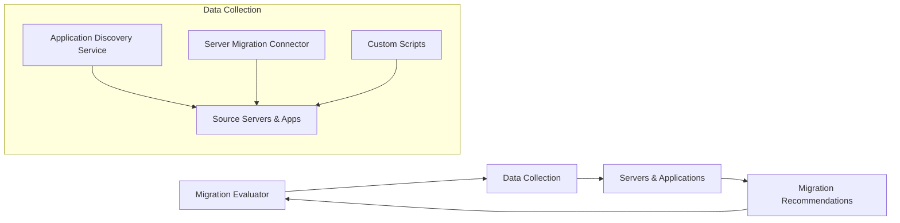

**Advanced Architecture**

Migration Evaluator is a service that helps you to plan migration projects by generating recommendations based on data collected from your source servers and applications. It supports multiple data collection methods, including [[AWS Application Discovery Service]], Server Migration Connector, and custom scripts. The following diagram illustrates its [[RDS_Instance_Types|internals]]:



At a global scale, Migration Evaluator allows you to create assessments across multiple accounts using the [[organizations|AWS Organizations]] feature. This enables centralized management of migration evaluations and simplifies governance.

**Comparison & Anti-Patterns**

| Service | Pros | Cons | Use Case |
| --- | --- | --- | --- |
| Migration Evaluator | Scalable, easy setup, broad server support | Limited customization, not real-time | Initial assessment for migrations |
| [[AWS Application Discovery Service]] | Real-time monitoring, granular insights | Time-consuming setup, resource-intensive | Ongoing monitoring during migrations |
| Custom Scripts | Highly customizable, tailored solutions | Requires development resources, maintenance | Specialized use cases |

Anti-patterns include:

* Using Migration Evaluator for ongoing monitoring instead of Application Discovery Service
* Relying solely on custom scripts without considering scalability and maintainability

**[[appsync|Security]] & Governance**

[[Master/Git_hub_notes/AWS-SAP-C02-Notes-main/README|IAM]] [[policies]] for Migration Evaluator can be complex due to cross-account access requirements. Here's an example JSON policy allowing actions on Migration Evaluator within another account:

```json
{
    "Version": "2012-10-17",
    "Statement": [
        {
            "Effect": "Allow",
            "Action": [
                "migration-evaluator:CreateAssessment",
                "migration-evaluator:GetAssessmentResults",
                "migration-evaluator:GetAssessmentReport"
            ],
            "Resource": [
                "arn:aws:migration-evaluator:*:${OtherAccountId}:assessment/*"
            ]
        }
    ]
}
```

Additionally, Service Control [[policies]] (SCPs) at the organization level can enforce restrictions on Migration Evaluator usage.

**Performance & Reliability**

Migration Evaluator has throttling limits, such as 20 concurrent assessments per region. To handle these [[AWS_SA_PRO_Obsidian_Notes/Master/12-security-and-config/cloudhsm|limitations]], implement exponential backoff strategies when creating or updating assessments. For high availability and [[Master/Git_hub_notes/AWS-SAP-C02-Notes-main/README|disaster recovery]], distribute assessments across multiple regions if needed.

**[[Master/Git_hub_notes/AWS-SAP-C02-Notes-main/README|Cost Optimization]]**

Granular cost controls in Migration Evaluator are limited compared to other services. However, since it's part of the free tier, there are no additional costs associated with using it. Keep track of active assessments to avoid unnecessary spending on unused resources.

**Professional Exam Scenario 1**

You're tasked with migrating a large enterprise environment consisting of thousands of servers. Which architecture would best suit this scenario?

1. Create a single Migration Evaluator assessment for all servers.
2. Distribute assessments across multiple AWS accounts using [[organizations|AWS Organizations]].
3. Use custom scripts exclusively to collect server information.

Answer: 2. Distribute assessments across multiple AWS accounts using [[organizations|AWS Organizations]].

Justification: Distributing assessments provides better scalability and manageability than a single assessment, while avoiding custom script complexity and potential maintenance issues.

**Professional Exam Scenario 2**

Your company wants to monitor server performance continuously during a migration project. Should they use Migration Evaluator or Application Discovery Service?

1. Migration Evaluator, because it offers continuous monitoring capabilities.
2. Application Discovery Service, because it provides real-time monitoring.

Answer: 2. Application Discovery Service, because it provides real-time monitoring.

Justification: Although Migration Evaluator collects data periodically, it does not offer real-time monitoring like Application Discovery Service.