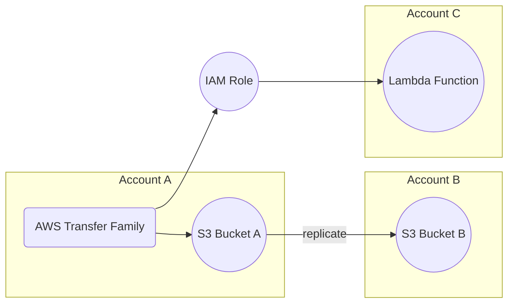

**Advanced Architecture**

The [[transfer-family|AWS Transfer Family]] is a fully managed service that enables secure file transfers directly into and out of Amazon [[AWS_SA_PRO_Obsidian_Notes/Master/S3|S3]] buckets using the SFTP, FTPS, and FTP protocols. It supports pre and post-transfer [[Master/Git_hub_notes/AWS-SAP-C02-Notes-main/README|Lambda functions]], providing data processing capabilities, and allows for the configuration of user [[policies]], permissions, and server settings. The following diagram (Mermaid syntax) illustrates an advanced architecture utilizing multiple accounts, Amazon [[AWS_SA_PRO_Obsidian_Notes/Master/S3|S3]] bucket replication, and [[Master/Git_hub_notes/AWS-SAP-C02-Notes-main/README|IAM]] roles for cross-account access.

Internally, the Transfer Family uses AWS's Network File System (NFS) servers as a bridge between the client's file transfer protocol (FTP/SFTP/FTPS) and Amazon [[AWS_SA_PRO_Obsidian_Notes/Master/S3|S3]]. The NFS servers run within an Amazon Virtual Private Cloud ([[AWS_SA_PRO_Obsidian_Notes/Master/VPC|VPC]]) and connect to the customer's [[AWS_SA_PRO_Obsidian_Notes/Master/VPC|VPC]] or on-premises environment via [[AWS_SA_PRO_Obsidian_Notes/Master/03-networking/vpn|AWS Site-to-Site VPN]] or [[Master/Git_hub_notes/AWS-SAP-C02-Notes-main/README|AWS Direct Connect]]. The NFS servers store files in temporary storage while they are being transferred to Amazon [[AWS_SA_PRO_Obsidian_Notes/Master/S3|S3]].

**Comparison & Anti-Patterns**

| Service | Use Case |
| --- | --- |
| [[Git_hub_notes/certified-aws-solutions-architect-professional-main/11-migrations/datasync|AWS DataSync]] | Large-scale data migrations, near real-time data replication, and recurring data transfers. |
| AWS [[Snowball]] | Physical data transport for large-scale data migration projects. |
| AWS [[kinesis|Kinesis Data Firehose]] | Real-time streaming of data to various AWS services. |
| AWS [[Storage Gateway]] | Providing temporary storage for on-premises applications or migrating workloads to AWS. |

Anti-patterns include storing sensitive data in transit logs, not configuring encryption at rest, and allowing unrestricted public access to the [[AWS_SA_PRO_Obsidian_Notes/Master/S3|S3]] bucket.

**[[appsync|Security]] & Governance**

Complex [[Master/Git_hub_notes/AWS-SAP-C02-Notes-main/README|IAM]] [[policies]] can be configured to enforce least privilege principles when granting access to users and resources. JSON policy example:
```json
{
  "Version": "2012-10-17",
  "Statement": [
    {
      "Effect": "Allow",
      "Action": [
        "s3:PutObject",
        "s3:GetObject"
      ],
      "Resource": "arn:aws:s3:::example-bucket/*",
      "Condition": {
        "StringEquals": {
          "aws:SourceVpce": "vpce-1234abcd"
        }
      }
    }
  ]
}
```
Cross-account access can be achieved by creating an [[Master/Git_hub_notes/AWS-SAP-C02-Notes-main/README|IAM]] role in the source account, which assumes a role in the destination account. Organizational Service Control [[policies]] (SCPs) can restrict actions at the organization level, ensuring consistent [[appsync|security]] configurations across all member accounts.

**Performance & Reliability**

Throttling limits can be increased by contacting AWS support, and exponential backoff strategies should be implemented to handle potential throttling [[api-gateway|errors]]. High availability and [[Master/Git_hub_notes/AWS-SAP-C02-Notes-main/README|disaster recovery]] patterns involve using multiple Transfer Family servers in different regions and replicating [[AWS_SA_PRO_Obsidian_Notes/Master/S3|S3]] buckets across regions.

**[[Master/Git_hub_notes/AWS-SAP-C02-Notes-main/README|Cost Optimization]]**

Granular cost controls can be applied by enabling detailed monitoring and setting up [[billing]] alarms based on usage metrics. [[Master/Git_hub_notes/AWS-SAP-C02-Notes-main/README|Cost optimization]] calculations depend on factors like the number of users, the amount of data transferred, and the frequency of transfers.

**Professional Exam Scenarios**

Scenario 1: A company needs to transfer data from their on-premises systems to Amazon [[AWS_SA_PRO_Obsidian_Notes/Master/S3|S3]] using FTP. They want to ensure the data is encrypted during transmission and stored encrypted in [[AWS_SA_PRO_Obsidian_Notes/Master/S3|S3]]. Which solution meets these requirements?

Correct answer: Implement the [[transfer-family|AWS Transfer Family]] with FTPS and enable default server-side encryption in Amazon [[AWS_SA_PRO_Obsidian_Notes/Master/S3|S3]].

Incorrect answer: Implement the [[transfer-family|AWS Transfer Family]] with SFTP, as it does not provide encryption during transmission.

Scenario 2: A media company wants to automate transcoding of video files uploaded through the [[transfer-family|AWS Transfer Family]]. How would you implement this?

Correct answer: Configure a [[lambda]] function to trigger upon file upload, perform the transcoding, and save the resulting files in a separate folder within the same [[AWS_SA_PRO_Obsidian_Notes/Master/S3|S3]] bucket.

Incorrect answer: Use AWS Elemental [[mediaconvert]] as it does not natively integrate with the [[transfer-family|AWS Transfer Family]].