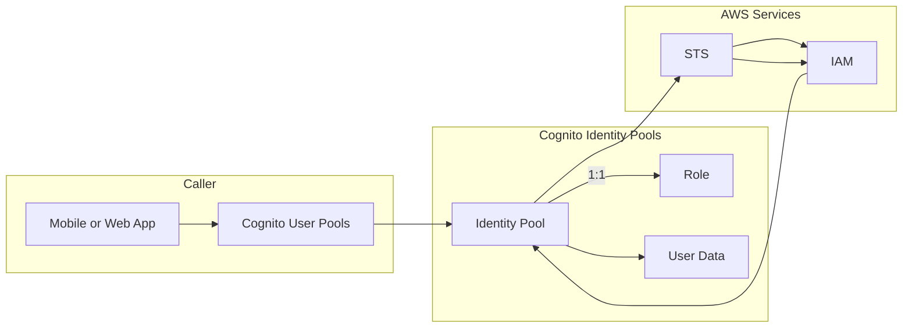

## Advanced Architecture

At its core, [[cognito]] Identity Pools (further: Identity Pools) enable mobile and web applications to securely access AWS services without needing to manage AWS credentials directly in the application. They provide temporary AWS credentials to callers via an implicit role-based trust model. The following diagram illustrates the components of an Identity Pool:



When considering global scale, it is essential to understand that Identity Pools operate within a single region. For global applications, developers should create separate Identity Pools per region and handle token federation centrally using custom solutions.

The "under the hood" mechanics involve creating an Identity Pool through the AWS Management Console, CLI, or SDKs. This action generates an Amazon Resource Name (ARN) representing the Identity Pool and an Unauthenticated Role. Optionally, developers can specify an Authenticated Role. Once created, callers receive temporary [[appsync|security]] credentials by passing a JSON Web Token (JWT) from an authenticated user or a [[cognito]] ID token from an unauthenticated user to the `GetCredentialsForIdentity` API. These temporary [[appsync|security]] credentials allow controlled access to AWS resources.

## Comparison & Anti-Patterns

| Service             | When to Use                                                              |
| ------------------- | ------------------------------------------------------------------------ |
| [[cognito]] Identity Pools | Securely access AWS services from mobile and web apps; fine-grained control over permissions |
| AssumeRoleWithWebIdentity | Access AWS resources across different accounts, assuming an [[Git_hub_notes/AWS-SAP-C02-Notes-main/README|IAM]] role |
| [[sts]] Assumed Roles   | Grant cross-account access for server-to-server communication      |

Anti-patterns include:

- Using Identity Pools when AssumeRoleWithWebIdentity or [[sts]] Assumed Roles would suffice.
- Configuring Identity Pools with overly permissive roles.

## [[appsync|Security]] & Governance

Complex [[Master/Git_hub_notes/AWS-SAP-C02-Notes-main/README|IAM]] [[policies]] may involve multiple Identity Pools, each associated with specific roles. An example policy follows:

```json
{
    "Version": "2012-10-17",
    "Statement": [
        {
            "Effect": "Allow",
            "Action": [
                "cognito-identity:MergeDeveloperIdentities",
                "cognito-identity:UnlinkDeveloperIdentity"
            ],
            "Resource": [
                "*"
            ]
        },
        {
            "Effect": "Allow",
            "Action": [
                "mobileanalytics:PutEvents",
                "cognito-sync:*",
                "execute-api:Invoke"
            ],
            "Resource": [
                "arn:aws:execute-api:*:*:/*"
            ]
        }
    ]
}
```

Cross-account access involves configuring an Identity Pool to reference an [[Master/Git_hub_notes/AWS-SAP-C02-Notes-main/README|IAM]] role in another account, allowing users from both accounts to obtain similar permissions. Organizational Service Control [[policies]] (SCPs) can enforce restrictions on Identity Pools at scale.

## Performance & Reliability

Throttling limits for Identity Pools are as follows:

- GetCredentialsForIdentity: 10 requests per second (RPS) per Identity Pool
- GetId: 10 RPS per Identity Pool

To mitigate throttling issues, implement exponential backoff strategies with jitter. High availability and [[Master/Git_hub_notes/AWS-SAP-C02-Notes-main/README|disaster recovery]] patterns include deploying Identity Pools across multiple regions and replicating data accordingly.

## [[Master/Git_hub_notes/AWS-SAP-C02-Notes-main/README|Cost Optimization]]

Granular cost controls involve setting up Identity Pools based on usage patterns and implementing proper resource tagging. Calculating costs requires understanding the Identity Pool's monthly active users and their usage frequency.

## Professional Exam Scenarios

### Scenario 1

Suppose you need to grant a third-party vendor read-only access to your [[AWS_SA_PRO_Obsidian_Notes/Master/S3|S3]] objects while ensuring they cannot list or write to other [[AWS_SA_PRO_Obsidian_Notes/Master/S3|S3]] buckets. In that case, you should create an Identity Pool with an [[Master/Git_hub_notes/AWS-SAP-C02-Notes-main/README|IAM]] role that has appropriate [[AWS_SA_PRO_Obsidian_Notes/Master/S3|S3]] permissions and share the Identity Pool ARN with the vendor.

#### Correct Answer

Create an Identity Pool with an [[Master/Git_hub_notes/AWS-SAP-C02-Notes-main/README|IAM]] role that has the necessary [[AWS_SA_PRO_Obsidian_Notes/Master/S3|S3]] permissions and share the Identity Pool ARN with the vendor.

#### Incorrect Answers

1. Implementing a custom authorizer function in [[api-gateway|API Gateway]].
2. Sharing the [[AWS_SA_PRO_Obsidian_Notes/Master/S3|S3]] bucket directly with the vendor.
3. Creating a [[lambda]] function with the required [[AWS_SA_PRO_Obsidian_Notes/Master/S3|S3]] permissions and invoking it from the vendor's app.

### Scenario 2

Your organization uses multiple Identity Pools for various projects. To ensure consistent permission management and avoid redundant roles, you want to enforce organizational [[policies]] governing Identity Pools.

#### Correct Answer

Implement Organization Service Control [[policies]] (SCPs) to restrict Identity Pools at scale.

#### Incorrect Answers

1. Implementing [[Master/Git_hub_notes/AWS-SAP-C02-Notes-main/README|IAM]] [[policies]] directly on Identity Pools.
2. Modifying the [[Master/Git_hub_notes/AWS-SAP-C02-Notes-main/README|IAM]] roles associated with Identity Pools.
3. Utilizing [[Master/Git_hub_notes/AWS-SAP-C02-Notes-main/README|IAM]] groups for Identity Pools.