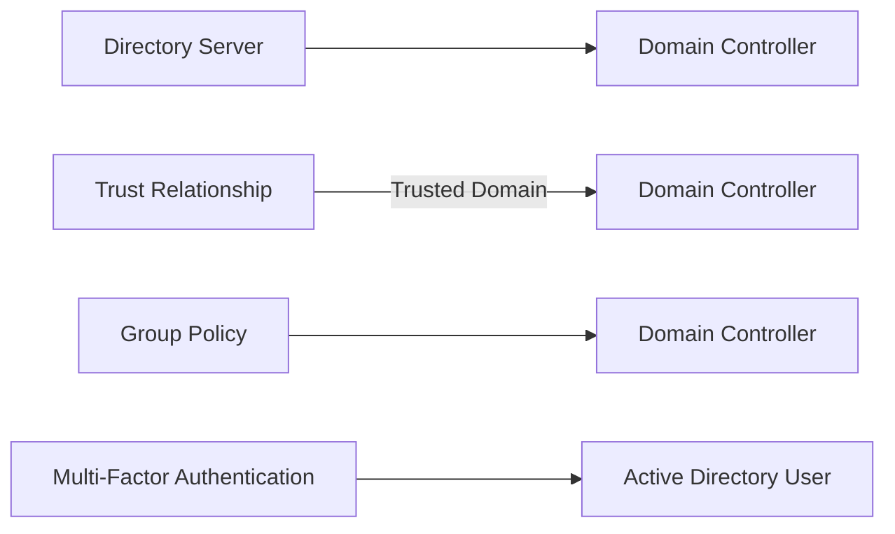

## Advanced Architecture
At its core, AWS Directory Service is a managed service that enables you to set up and run directories in the cloud. It provides two flavors of directory services: AD Connector and Microsoft AD (also known as Simple AD and Enterprise AD). The latter offers more advanced features such as trust relationships, Group Policy, and [[mfa|multi-factor authentication (MFA)]]. Understanding the internal workings of these services is crucial for designing secure and performant solutions.

### [[RDS_Instance_Types|Global Scale Considerations]]
When it comes to global scale, AWS Directory Service supports multiple regions and availability zones within those regions. However, there are some [[AWS_SA_PRO_Obsidian_Notes/Master/12-security-and-config/cloudhsm|limitations]] to be aware of. For instance, AWS Managed Microsoft AD does not support cross-region replication or multi-master replication. Instead, you can leverage [[AWS_SA_PRO_Obsidian_Notes/Master/11-migrations/datasync|AWS DataSync]] or AWS [[Storage Gateway]] to replicate data across regions. Moreover, AWS Directory Service does not currently provide a global load balancer for distributing traffic globally. To achieve high availability and low latency at a global level, consider using Amazon [[Master/Git_hub_notes/AWS-SAP-C02-Notes-main/README|Route 53]] [[route53|Latency-Based Routing]] or [[AWS_SA_PRO_Obsidian_Notes/Master/AWS Global Accelerator]].

### Under the Hood Mechanics
Let's dive deeper into how AWS Directory Service operates under the hood. Here's an overview of the components involved when setting up a Microsoft AD environment:

- **Directory servers**: These are managed by AWS, ensuring automatic patching, failover, and backups.
- **Domain controllers**: They maintain copies of the Active Directory database and enforce [[appsync|security]] [[policies]].
- **Trust relationships**: Trusts allow different domains to share resources and authenticate users between them.
- **Group [[policies]]**: These are rules used to manage user settings and system configurations.
- **[[mfa|Multi-factor Authentication (MFA)]]**: [[mfa]] adds an extra layer of [[appsync|security]] by requiring users to provide a second form of [[api-gateway|authentication]] in addition to their username and password.

Here's a Mermaid diagram illustrating the interaction between these components:

## Comparison & Anti-Patterns
Comparing AWS Directory Service to other services like AWS Single Sign-On (SSO) and AWS Identity and Access Management ([[Master/Git_hub_notes/AWS-SAP-C02-Notes-main/README|IAM]]) is essential for choosing the right tool for your needs.

| Service | Ideal Use Case |
|---|---|
| AWS Directory Service | Centralized user management, domain joining, and enterprise applications integration. |
| AWS SSO | Simplified SSO experience for AWS accounts and third-party web apps. |
| [[Git_hub_notes/AWS-SAP-C02-Notes-main/README|IAM]] | Fine-grained permissions for AWS API requests. |

Common anti-patterns include:

- Using AWS Directory Service as a standalone SSO solution instead of leveraging AWS SSO or federating through external identity providers (IdPs).
- Implementing AWS Directory Service without considering performance and reliability requirements, leading to potential throttling issues and outages.

## [[appsync|Security]] & Governance
Securing your AWS Directory Service environment involves implementing robust [[Master/Git_hub_notes/AWS-SAP-C02-Notes-main/README|IAM]] [[policies]], managing cross-account access, and establishing Organization Service Control [[policies]] (SCPs).

### [[Master/Git_hub_notes/AWS-SAP-C02-Notes-main/README|IAM]] [[policies]]
Consider the following example JSON policy that grants permission to create and delete directory services in AWS Directory Service:
```json
{
  "Version": "2012-10-17",
  "Statement": [
    {
      "Effect": "Allow",
      "Action": [
        "directoryservice:CreateDirectory",
        "directoryservice:DeleteDirectory"
      ],
      "Resource": "*"
    }
  ]
}
```
### Cross-Account Access
To enable cross-account access, attach the necessary [[Master/Git_hub_notes/AWS-SAP-C02-Notes-main/README|IAM]] roles and [[policies]] to the source and destination accounts. Additionally, configure trust relationships between the respective roles.

### Organization SCPs
Implement Organization SCPs to enforce [[control-tower|guardrails]] and centralize control over various aspects of AWS Directory Service, including creating and deleting directory services.

## Performance & Reliability
Ensure your AWS Directory Service implementation meets performance and reliability expectations by understanding throttling limits and applying appropriate backoff strategies.

### Throttling Limits
AWS Directory Service enforces throttling limits to prevent abuse and ensure fairness among customers. Be aware of these limits and design your architecture accordingly.

### Exponential Backoff Strategies
In case of throttled requests, implement exponential backoff strategies to reduce request rates and avoid triggering additional throttling events.

## [[Master/Git_hub_notes/AWS-SAP-C02-Notes-main/README|Cost Optimization]]
Optimizing costs in AWS Directory Service requires understanding granular cost controls. For example, you can limit the number of directory servers per directory, which impacts overall costs. By default, each directory has three directory servers. However, reducing this number may impact availability and reliability.

Additionally, monitor usage metrics such as the number of API calls made to AWS Directory Service and adjust your infrastructure accordingly.

## Professional Exam Scenarios

### Scenario 1
Your company uses AWS Directory Service for centralized user management and enterprise application integration. Due to recent growth, you need to expand your existing setup to accommodate new users and applications. Your organization follows a multi-account strategy with separate accounts for production and development environments.

#### Question
How would you efficiently design the AWS Directory Service setup while maintaining [[appsync|security]], performance, and [[Master/Git_hub_notes/AWS-SAP-C02-Notes-main/README|cost optimization]]?

#### Correct Answer
Implement separate directories for production and development environments, allowing for fine-grained control over resource allocation and access permissions. Utilize [[AWS_SA_PRO_Obsidian_Notes/Master/VPC|VPC]] peering or Direct Connect to connect both environments to the same directory. Apply [[Master/Git_hub_notes/AWS-SAP-C02-Notes-main/README|IAM]] [[policies]] to control who can create and delete directories. Monitor usage metrics and apply [[Master/Git_hub_notes/AWS-SAP-C02-Notes-main/README|cost optimization]] techniques such as limiting the number of directory servers.

#### Incorrect Answers

* Combining production and development environments into a single directory: This violates [[iam|best practices]] for separating concerns and increases the risk of unintended access.
* Sharing credentials across multiple directories: This introduces [[appsync|security]] vulnerabilities and makes it difficult to track and audit user activity.

### Scenario 2
Your organization wants to extend its existing AWS Directory Service setup to another region for improved performance and redundancy.

#### Question
What steps should you take to achieve this goal while minimizing downtime and preserving data integrity?

#### Correct Answer
Use [[AWS_SA_PRO_Obsidian_Notes/Master/11-migrations/datasync|AWS DataSync]] or AWS [[Storage Gateway]] to replicate data from the current directory to the target region. Set up a new directory in the target region and synchronize the data. Implement AWS [[Master/Git_hub_notes/AWS-SAP-C02-Notes-main/README|Route 53]] [[route53|Latency-Based Routing]] or [[AWS_SA_PRO_Obsidian_Notes/Master/AWS Global Accelerator]] to distribute traffic between the original and new regions. Test the new setup thoroughly before switching over completely.

#### Incorrect Answers

* Creating a read-only replica of the existing directory: While this approach improves read performance, it doesn't address write operations or redundancy requirements.
* Setting up a one-way trust relationship between directories: This only allows users from one directory to authenticate on the other, not sharing resources between them.