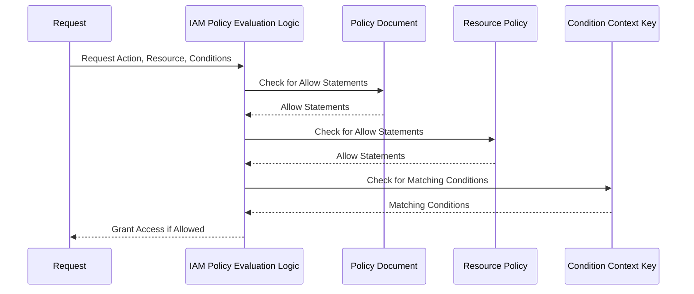

**[[RDS_Instance_Types|1. Advanced Architecture]]**

[[Master/Git_hub_notes/AWS-SAP-C02-Notes-main/README|IAM]] [[policies|Policy Evaluation Logic]] is a critical component of AWS Identity and Access Management ([[Master/Git_hub_notes/AWS-SAP-C02-Notes-main/README|IAM]]) that operates at the center of AWS [[appsync|security]]. It uses a policy-based evaluation logic to determine whether a request is allowed or denied based on the permissions in the user or role's [[Master/Git_hub_notes/AWS-SAP-C02-Notes-main/README|IAM]] policy, resource-based [[policies]], or condition context keys.

At its core, [[Master/Git_hub_notes/AWS-SAP-C02-Notes-main/README|IAM]] [[policies|Policy Evaluation Logic]] involves several components like [[Master/Git_hub_notes/AWS-SAP-C02-Notes-main/README|IAM]] [[policies]], [[Master/Git_hub_notes/AWS-SAP-C02-Notes-main/README|IAM]] Role/User, Resource Policy, and Condition Context Keys. These components interact as follows:

* [[Master/Git_hub_notes/AWS-SAP-C02-Notes-main/README|IAM]] [[policies|Policy Evaluation Logic]] receives a request from an AWS service.
* The request specifies the action, the resource(s), and potentially the [[cloudformation|conditions]] under which the action should be executed.
* [[Master/Git_hub_notes/AWS-SAP-C02-Notes-main/README|IAM]] [[policies|Policy Evaluation Logic]] evaluates the request against the effective permissions associated with the principal (user or role) executing the request.
* Effective permissions are determined by combining the explicit deny and explicit allow statements found in various policy documents.
* If there is no allow statement, then the request is implicitly denied.
* If there are multiple allow statements, they must all be satisfied to grant access.
* If there are any deny statements, they take precedence over allow statements.

Here's a Mermaid flowchart illustrating the sequence of events during [[Master/Git_hub_notes/AWS-SAP-C02-Notes-main/README|IAM]] [[policies|Policy Evaluation Logic]]:



**[[RDS_Instance_Types|2. Comparison & Anti-Patterns]]**

| Service | Use Case | Pros | Cons |
| --- | --- | --- | --- |
| [[Git_hub_notes/AWS-SAP-C02-Notes-main/README|IAM]] [[policies|Policy Evaluation Logic]] | Fine-grained access control | Comprehensive set of actions and resources, easy integration with other services | Can be complex to manage and maintain, especially when dealing with multiple accounts and roles |
| Service Control [[policies]] (SCPs) | Centralized management of permissions across multiple accounts | Simplifies permission management at scale | Limited scope of actions, applies only to [[Git_hub_notes/AWS-SAP-C02-Notes-main/README|IAM]] entities and not resource [[policies]] |
| Bucket [[policies]] | Simpler alternative to [[Git_hub_notes/AWS-SAP-C02-Notes-main/README|IAM]] [[policies]] for controlling [[Srinivas_Notes/S3|S3]] bucket access | Easy to configure, supports JSON syntax | Limited to controlling access to Amazon [[Srinivas_Notes/S3|S3]] resources, does not support [[Git_hub_notes/AWS-SAP-C02-Notes-main/README|other AWS services]] |

Anti-patterns include using [[Master/Git_hub_notes/AWS-SAP-C02-Notes-main/README|IAM]] [[policies]] for controlling access to specific resources instead of using resource-based [[policies]], using [[Master/Git_hub_notes/AWS-SAP-C02-Notes-main/README|IAM]] [[policies]] for cross-account access without considering more efficient methods such as SCPs, and creating overly permissive [[Master/Git_hub_notes/AWS-SAP-C02-Notes-main/README|IAM]] [[policies]] due to lack of understanding of least privilege principle.

**[[RDS_Instance_Types|3. Security & Governance]]**

Complex [[Master/Git_hub_notes/AWS-SAP-C02-Notes-main/README|IAM]] [[policies]] can be created using JSON snippets like the following example, demonstrating how to allow a user to perform `s3:PutObject` action on a specific [[AWS_SA_PRO_Obsidian_Notes/Master/S3|S3]] bucket:

```json
{
    "Version": "2012-10-17",
    "Statement": [
        {
            "Effect": "Allow",
            "Action": "s3:PutObject",
            "Resource": "arn:aws:s3:::example-bucket/*"
        }
    ]
}
```

Cross-account access can be granted through [[Master/Git_hub_notes/AWS-SAP-C02-Notes-main/README|IAM]] [[policies]] by specifying the source account in the resource section of the policy document. For instance, allowing a user in a different account to assume a role:

```json
{
    "Version": "2012-10-17",
    "Statement": [
        {
            "Effect": "Allow",
            "Principal": {
                "AWS": "arn:aws:iam::123456789012:root"
            },
            "Action": "sts:AssumeRole",
            "Condition": {
                "Bool": {
                    "aws:MultiFactorAuthPresent": true
                }
            },
            "Resource": "arn:aws:iam::987654321098:role/ExampleRole"
        }
    ]
}
```

Organization Service Control [[policies]] (SCPs) provide centralized control over the maximum permissions available for all accounts within an organization. Here's an example [[SCP]] denying all API calls except `ec2:DescribeInstances`:

```json
{
    "Version": "2012-10-17",
    "Statement": [
        {
            "Effect": "Deny",
            "NotAction": "ec2:DescribeInstances",
            "Resource": "*"
        }
    ]
}
```

**[[RDS_Instance_Types|4. Performance & Reliability]]**

[[Master/Git_hub_notes/AWS-SAP-C02-Notes-main/README|IAM]] [[policies|Policy Evaluation Logic]] has throttling limits in place to prevent abuse and ensure fair usage among customers. The current limit is 30 requests per second, and exceeding this limit results in a 429 HTTP response code. To handle throttled responses, implement exponential backoff strategies with jitter to avoid overwhelming the system and reduce latency.

HA/DR patterns involve using multiple regions for redundancy and [[Master/Git_hub_notes/AWS-SAP-C02-Notes-main/README|disaster recovery]] purposes. In case of failure, traffic can be redirected to the standby region with minimal downtime.

**[[RDS_Instance_Types|5. Cost Optimization]]**

Granular cost controls can be implemented by setting up [[billing]] alarms and [[Budgets]] based on the number of [[Master/Git_hub_notes/AWS-SAP-C02-Notes-main/README|IAM]] users and roles, ensuring unused entities are removed periodically. Additionally, enabling [[Master/Git_hub_notes/AWS-SAP-C02-Notes-main/README|IAM]] access keys only when necessary reduces the risk of unintended costs resulting from misuse or expired credentials.

**6. Professional Exam Scenario**

Scenario 1: A company wants to restrict access to their [[AWS_SA_PRO_Obsidian_Notes/Master/S3|S3]] buckets to specific IP addresses. Which combination of [[Master/Git_hub_notes/AWS-SAP-C02-Notes-main/README|IAM]] [[policies]] and resource [[policies]] would meet these requirements?

Correct answer: Implement [[Master/Git_hub_notes/AWS-SAP-C02-Notes-main/README|IAM]] [[policies]] granting access to the desired actions and resources while adding a condition requiring the source IP address to match the specified range. Then, apply resource [[policies]] to the [[AWS_SA_PRO_Obsidian_Notes/Master/S3|S3]] buckets restricting access to those same IP addresses. This ensures consistency between the [[Master/Git_hub_notes/AWS-SAP-C02-Notes-main/README|IAM]] [[policies]] and resource [[policies]].

Incorrect answer: Implementing [[Master/Git_hub_notes/AWS-SAP-C02-Notes-main/README|IAM]] [[policies]] alone without applying resource [[policies]] to the [[AWS_SA_PRO_Obsidian_Notes/Master/S3|S3]] buckets may result in unintended access since [[Master/Git_hub_notes/AWS-SAP-C02-Notes-main/README|IAM]] [[policies]] do not inherently restrict access to specific IP addresses.

Scenario 2: An organization manages multiple AWS accounts centrally through [[organizations|AWS Organizations]]. They want to enforce the use of [[mfa|Multi-Factor Authentication (MFA)]] for all privileged users. How can they achieve this goal?

Correct answer: By implementing an [[SCP]] that enforces [[mfa]] usage for privileged operations, the organization can ensure compliance across all member accounts. The [[SCP]] can be configured to deny all actions unless the `aws:MultiFactorAuthPresent` condition is met.

Incorrect answer: Implementing [[Master/Git_hub_notes/AWS-SAP-C02-Notes-main/README|IAM]] [[policies]] directly on each user or role level could lead to inconsistencies and increased administrative overhead.