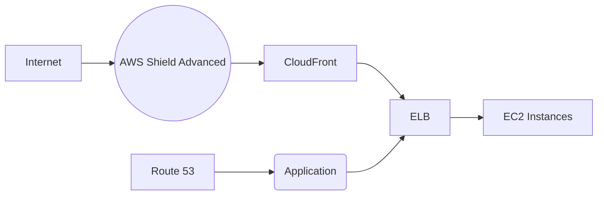

**[[RDS_Instance_Types|1. Advanced Architecture]]**

At its core, [[shield|AWS Shield]] is a managed Distributed Denial of Service (DDoS) protection service that provides always-on detection and automatic inline mitigations to safeguard applications running on AWS. There are two tiers of [[shield|AWS Shield]]: Standard and Advanced.

[[shield|AWS Shield]] Advanced operates at the network level and uses custom hardware components integrated into the AWS global network infrastructure. This enables real-time detection and mitigation of even the most sophisticated DDoS attacks without any performance impact or latency. It offers advanced protection against network and transport layer attacks, application layer attacks, and volumetric DDoS attacks. Moreover, it includes integration with [[Master/Git_hub_notes/AWS-SAP-C02-Notes-main/README|other AWS services]] like Amazon [[Master/Git_hub_notes/AWS-SAP-C02-Notes-main/README|CloudFront]], Elastic Load Balancing ([[elb]]), and Amazon [[Master/Git_hub_notes/AWS-SAP-C02-Notes-main/README|Route 53]] to offer comprehensive protection.

The following Mermaid diagram illustrates an example architecture using [[shield|AWS Shield]] Advanced with Amazon [[Master/Git_hub_notes/AWS-SAP-C02-Notes-main/README|CloudFront]], [[elb]], and [[Master/Git_hub_notes/AWS-SAP-C02-Notes-main/README|Route 53]]:



**[[RDS_Instance_Types|2. Comparison & Anti-Patterns]]**

| Feature | [[shield]] Standard | [[shield]] Advanced |
| --- | --- | --- |
| Attack Types Covered | Network and Transport layer attacks | Network, Transport, and Application layer attacks |
| Real-time Mitigations | Limited mitigations | Custom mitigation actions |
| Integration with Other Services | Limited integration | Comprehensive integration with [[Git_hub_notes/AWS-SAP-C02-Notes-main/README|CloudFront]], [[elb]], and [[Git_hub_notes/AWS-SAP-C02-Notes-main/README|Route 53]] |
| Price | Free | Additional charges apply |

Anti-patterns include using [[shield]] Standard instead of Advanced when dealing with mission-critical workloads requiring high availability and low latency. Another anti-pattern is not utilizing other AWS [[appsync|security]] services such as WAF, [[GuardDuty]], and [[AWS_SA_PRO_Obsidian_Notes/Master/Security/Macie|Macie]] in conjunction with [[shield]] Advanced.

**[[RDS_Instance_Types|3. Security & Governance]]**

Here are some complex [[Master/Git_hub_notes/AWS-SAP-C02-Notes-main/README|IAM]] [[policies]], cross-account access, and Organization SCPs related to [[shield|AWS Shield]] Advanced:

[[Master/Git_hub_notes/AWS-SAP-C02-Notes-main/README|IAM]] Policy JSON Snippet:
```json
{
    "Version": "2012-10-17",
    "Statement": [
        {
            "Effect": "Allow",
            "Action": [
                "shield::DescribeProtection",
                "shield::GetSubscriptionState",
                "shield::ListProtections"
            ],
            "Resource": "*"
        }
    ]
}
```
Cross-Account Access:

To enable cross-account access, you can create an [[Master/Git_hub_notes/AWS-SAP-C02-Notes-main/README|IAM]] role in the source account and attach an [[Master/Git_hub_notes/AWS-SAP-C02-Notes-main/README|IAM]] policy allowing specific API calls. Then, grant permissions in the destination account by attaching an inline policy to the principal user, group, or role.

Organization SCPs:

You can enforce the usage of [[shield|AWS Shield]] Advanced across accounts within an organization by creating an Organization Service Control Policy ([[SCP]]) that allows only specific API calls related to [[shield]] Advanced. For instance, you can restrict the `shield:CreateProtection` API call to specific resources.

**[[RDS_Instance_Types|4. Performance & Reliability]]**

Throttling limits for [[shield]] Advanced are as follows:

* `CreateProtection`: 5 requests per second
* All other API calls: 10 requests per second

Exponential backoff strategies should be implemented when making repeated API calls to avoid throttling [[api-gateway|errors]].

HA/DR patterns involve distributing traffic across multiple AWS regions and enabling [[shield]] Advanced protections in each region. Additionally, configuring [[Master/Git_hub_notes/AWS-SAP-C02-Notes-main/README|Route 53]] [[route53|health checks]] and failover [[policies]] ensure minimal downtime during disruptions.

**[[RDS_Instance_Types|5. Cost Optimization]]**

Granular cost controls include setting up [[billing]] alerts based on thresholds and monitoring usage trends. You can also optimize costs by applying [[shield]] Advanced protections only to critical resources while using [[shield]] Standard for less sensitive resources.

Calculation Example:

Suppose you have 20 [[ec2]] instances distributed across 2 regions, and you enable [[shield]] Advanced for all instances. The monthly cost would be calculated as follows:

* Number of instances: 20
* Regions: 2
* [[shield]] Advanced price: $300 per month per region
* Total cost: $300 \* 2 = $600 per month

**[[RDS_Instance_Types|6. Professional Exam Scenarios]]**

Scenario 1:
A company has a web application hosted on [[ec2]] instances in us-east-1 and us-west-2 regions. They want to protect their application from DDoS attacks while maintaining high availability and low latency. Which solution meets these requirements?

Correct Answer:
Enable [[shield|AWS Shield]] Advanced for both regions and distribute traffic between them using [[Master/Git_hub_notes/AWS-SAP-C02-Notes-main/README|Route 53]] [[route53|health checks]] and failover [[policies]].

Incorrect Answer:
Use [[shield]] Standard since it is free and sufficient for protecting against DDoS attacks.

Justification:
[[shield]] Advanced provides more comprehensive protection than [[shield]] Standard and supports high availability and low latency through its integration with [[Master/Git_hub_notes/AWS-SAP-C02-Notes-main/README|other AWS services]].

Scenario 2:
A customer wants to monitor and control the usage of [[shield|AWS Shield]] Advanced across multiple accounts within their organization. What is the recommended approach?

Correct Answer:
Create an Organization [[SCP]] that restricts the `shield:CreateProtection` API call to specific resources.

Incorrect Answer:
Implement a centralized [[vpc-flow-logs|logging]] and monitoring system using [[cloudwatch|CloudWatch Logs]] and Metrics.

Justification:
An Organization [[SCP]] provides centralized control over resource usage and ensures adherence to organizational [[policies]].