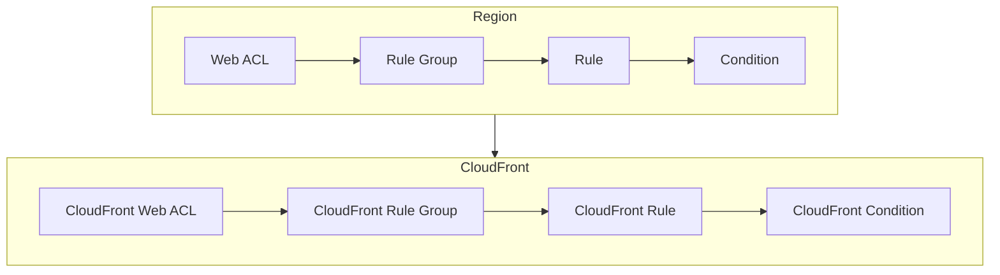

### Advanced Architecture
At its core, WAF is a web application firewall that helps protect your web applications from common web exploits that could lead to cross-site scripting (XSS), SQL injection, and other types of attacks. WAF operates at the edge of the AWS network, which allows it to provide protection for web applications regardless of their location. This section will cover advanced architecture topics such as [[RDS_Instance_Types|internals]], [[RDS_Instance_Types|global scale considerations]], and 'under the hood' mechanics.

#### [[RDS_Instance_Types|Internals]]
WAF uses rule-based statements called Web ACLs (Access Control Lists) to filter incoming HTTP/HTTPS requests based on [[cloudformation|conditions]] such as IP addresses, HTTP headers, URI strings, and body parameters. These rules can be configured at various levels including the regional level or the [[Master/Git_hub_notes/AWS-SAP-C02-Notes-main/README|CloudFront]] level. The following diagram shows the high-level components of WAF:

#### [[RDS_Instance_Types|Global Scale Considerations]]
WAF provides built-in support for global scale using [[shield|AWS Shield]], which is a managed DDoS protection service. [[shield]] Standard is included for free with every WAF subscription, while [[shield]] Advanced requires an additional charge. With [[shield]] Advanced, you get additional features such as advanced DDoS mitigation, customized DDoS protection, and access to the Amazon DDoS Response Team (DRT).

### Comparison & Anti-Patterns
While WAF is a powerful [[appsync|security]] tool, there are cases where it may not be the best solution. Here are some comparison points and anti-patterns:

| Service | Use Case | Pros | Cons |
|---|---|---|---|
| WAF | Protecting web applications from common web exploits | Easy to configure<br>Scalable and highly available<br>Integrates well with [[Git_hub_notes/AWS-SAP-C02-Notes-main/README|other AWS services]] | May require more fine-grained control than possible with WAF<br>May not cover all types of attacks |
| Network ACLs | Controlling traffic between subnets | Stateless inspection<br>Lower overhead compared to WAF | Limited to controlling traffic between subnets<br>Limited flexibility in defining rules |
| [[appsync|Security]] Groups | Controlling traffic to [[ec2]] instances | Stateful inspection<br>Easy to manage | Limited to controlling traffic to [[ec2]] instances<br>Less flexible than WAF |

### [[appsync|Security]] & Governance
WAF supports complex [[Master/Git_hub_notes/AWS-SAP-C02-Notes-main/README|IAM]] [[policies]], cross-account access, and organization SCPs. Here are some examples:

#### Complex [[Master/Git_hub_notes/AWS-SAP-C02-Notes-main/README|IAM]] [[policies]]
The following JSON policy grants permission to create, update, and delete WAF resources in a specific account:
```json
{
  "Version": "2012-10-17",
  "Statement": [
    {
      "Effect": "Allow",
      "Action": [
        "waf:CreateByteMatchSet",
        "waf:UpdateByteMatchSet",
        "waf:DeleteByteMatchSet"
      ],
      "Resource": [
        "*"
      ]
    }
  ]
}
```
#### Cross-Account Access
To enable cross-account access, you need to set up a trust relationship between the two accounts. For example, if Account A wants to allow Account B to manage its WAF resources, you would do the following:

1. In Account A, create an [[Master/Git_hub_notes/AWS-SAP-C02-Notes-main/README|IAM]] role that has the necessary permissions to manage WAF resources.
2. In Account B, create an [[Master/Git_hub_notes/AWS-SAP-C02-Notes-main/README|IAM]] user or role that has the `sts:AssumeRole` permission for the [[Master/Git_hub_notes/AWS-SAP-C02-Notes-main/README|IAM]] role created in step 1.
3. In Account B, use the `AssumeRole` API call to assume the [[Master/Git_hub_notes/AWS-SAP-C02-Notes-main/README|IAM]] role created in step 1 and make calls to the WAF API on behalf of Account A.

#### Organization SCPs
Organization SCPs can be used to enforce centralized control over WAF resources across multiple accounts. For example, you can create an [[SCP]] that denies the ability to delete WAF resources:
```json
{
  "Version": "2012-10-17",
  "Statement": [
    {
      "Sid": "DenyDeleteWAFResources",
      "Effect": "Deny",
      "Action": [
        "waf:Delete*",
        "wafv2:Delete*"
      ],
      "Resource": [
        "*"
      ],
      "Condition": {
        "StringEqualsIfExists": {
          "aws:RecursiveCall": [
            "true"
          ]
        },
        "NumericGreaterThanOrEqualToIfExists": {
          "aws:TokenLength": [
            1
          ]
        }
      }
    }
  ]
}
```
### Performance & Reliability
WAF has throttling limits that can impact performance and reliability. To address these issues, you can implement exponential backoff strategies and HA/DR patterns.

#### Throttling Limits
WAF has several throttling limits, such as the number of requests per second allowed through a single Web ACL. If you exceed these limits, you may receive a `429 Too Many Requests` response. To avoid this issue, you can implement exponential backoff strategies that gradually increase the time between retries.

#### HA/DR Patterns
To ensure high availability and [[Master/Git_hub_notes/AWS-SAP-C02-Notes-main/README|disaster recovery]] for WAF, you can distribute your resources across multiple regions and use [[Master/Git_hub_notes/AWS-SAP-C02-Notes-main/README|Route 53]] [[route53|health checks]] to failover to backup resources. For example, you can create a primary WAF resource in one region and a secondary WAF resource in another region. You can then use [[Master/Git_hub_notes/AWS-SAP-C02-Notes-main/README|Route 53]] [[route53|health checks]] to monitor the primary WAF resource and automatically failover to the secondary WAF resource if the primary resource becomes unavailable.

### [[Master/Git_hub_notes/AWS-SAP-C02-Notes-main/README|Cost Optimization]]
Granular cost controls are essential when using WAF. Here are some tips to optimize costs:

#### Granular Cost Controls
Use WAF effectively by creating separate Web ACLs for different parts of your application. This way, you only pay for what you need.

#### Calculation Examples
Here is an example of how to calculate the cost of using WAF:

Suppose you have a web application that receives 1 billion requests per month, and you want to use WAF to filter out malicious requests. Assume you use the following WAF resources:

* 1 Web ACL
* 1 Byte Match Set
* 1 Size Constraint Set
* 1 IP Set
* 1 Rule Group
* 1 Rule
* 10 [[cloudformation|Conditions]]

Using the AWS Pricing Calculator, you can estimate the monthly cost for each resource as follows:

| Resource | Monthly Cost |
|---|---|
| Web ACL | $1.80 |
| Byte Match Set | $0.00 |
| Size Constraint Set | $0.00 |
| IP Set | $0.00 |
| Rule Group | $0.00 |
| Rule | $0.00 |
| [[cloudformation|Conditions]] | $0.00 |

In total, the estimated monthly cost for using WAF with these resources is $1.80. However, keep in mind that this is just an estimate, and actual costs may vary depending on usage.

### Professional Exam Scenarios
#### Scenario 1
Suppose you work for a company that has a multi-account environment with multiple web applications hosted in different accounts. You want to implement a centralized WAF solution that can protect all web applications from common web exploits. Which of the following options should you choose?

A) Create a single WAF resource in one of the accounts and share it with the other accounts.
B) Create a separate WAF resource in each account and manage them centrally.
C) Implement a third-party WAF solution instead of using AWS WAF.
D) Do not use WAF since it is not designed for multi-account environments.

Correct Answer: B
Explanation: Option B is the correct answer because it allows you to maintain centralized management while ensuring that each account has its own WAF resources. Options A and C are incorrect because they either limit you to a single WAF resource (Option A) or introduce additional complexity (Option C). Option D is incorrect because WAF does support multi-account environments.

#### Scenario 2
Suppose you are working on a project that requires the use of WAF to protect a web application. Your team needs to implement rate limiting to prevent the application from being overwhelmed by too many requests. Which of the following options should you choose?

A) Use WAF rate-based rules to limit the number of requests per minute.
B) Use [[lambda|AWS Lambda]] to implement custom rate limiting logic.
C) Use [[Master/Git_hub_notes/AWS-SAP-C02-Notes-main/README|Application Load Balancer (ALB)]] rate limiting rules.
D) Use Elastic Load Balancing ([[elb]]) rate limiting rules.

Correct Answer: A
Explanation: Option A is the correct answer because it allows you to implement rate limiting directly within WAF without requiring additional services. Options B and C are incorrect because they introduce additional complexity and potentially higher costs. Option D is incorrect because [[elb]] does not support rate limiting natively.