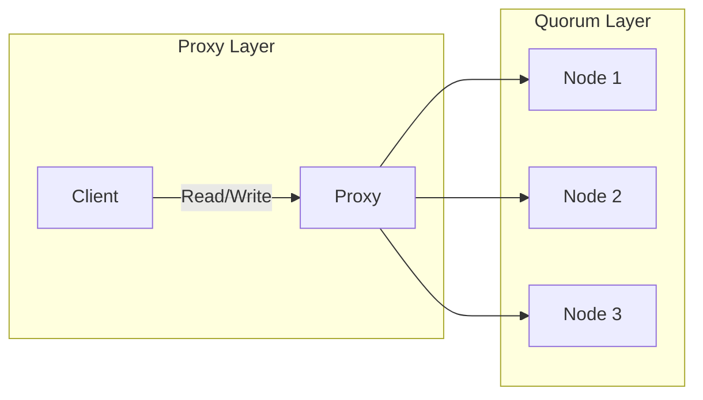

## [[RDS_Instance_Types|1. Advanced Architecture]]

At its core, [[aurora]] Serverless is a scalable, auto-adjusting DB capacity with a pay-per-use pricing model. It utilizes custom-built "Auto Scaling" technology that scales capacity in ACUs ([[aurora]] Capacity Units) based on workload demands. The system relies on a two-layered architecture: the "Quorum" layer (min. 2 nodes) managing store operations and the "Proxy" layer routing client requests.

### [[RDS_Instance_Types|Global Scale Considerations]]

[[aurora]] Serverless supports global database instances via "Global Database" feature which replicates data across multiple regions with millisecond latency. This enables [[Master/Git_hub_notes/AWS-SAP-C02-Notes-main/README|disaster recovery]] capabilities as well as lower latency reads from distributed applications. However, write operations can only be performed at one region (writer endpoint) while read operations can be served by any region (reader endpoints).

### Under the Hood Mechanics

When creating an [[aurora]] Serverless cluster, you define a minimum and maximum capacity level measured in ACUs. Based on your workload, the system will automatically adjust capacity within these bounds. Each ACU provides roughly equivalent power to a single modern CPU core.

The following Mermaid syntax illustrates how the Proxy Layer routes client queries to the Quorum Layer:


## [[RDS_Instance_Types|2. Comparison & Anti-Patterns]]

| Service       | Ideal Use Case                             |
|---------------|---------------------------------------------|
| [[aurora]] Serverless | Variable or unpredictable workloads, development/testing, infrequent query loads, small projects with budget constraints |
| [[Git_hub_notes/AWS-SAP-C02-Notes-main/README|RDS]]            | Predictable, high-throughput workloads, applications requiring full control over DB instance configuration |
| [[dynamodb]]      | Highly variable, unpredictable workloads requiring NoSQL support, serverless applications needing seamless integration |

Anti-patterns include production workloads with predictable traffic patterns, performance-critical applications demanding consistent low latencies, and large-scale mission-critical systems requiring manual tuning and advanced management features.

## [[RDS_Instance_Types|3. Security & Governance]]

Complex [[Master/Git_hub_notes/AWS-SAP-C02-Notes-main/README|IAM]] [[policies]] should follow the principle of least privilege. Here's a JSON policy snippet limiting access to specific resources:
```json
{
    "Version": "2012-10-17",
    "Statement": [
        {
            "Effect": "Allow",
            "Action": [
                "rds-data:BatchExecuteStatement",
                "rds-data:BeginTransaction",
                "rds-data:CommitTransaction",
                "rds-data:ExecuteCommand",
                "rds-data:ExecuteSql",
                "rds-data:ExecuteStatement",
                "rds-data:RollbackTransaction"
            ],
            "Resource": [
                "arn:aws:rds-data:*:123456789012:cluster:my-aurora-cluster/*"
            ]
        }
    ]
}
```
Cross-account access involves granting permissions to [[Master/Git_hub_notes/AWS-SAP-C02-Notes-main/README|IAM]] entities in another account using resource-based [[policies]] attached to the [[Aurora DB]] cluster. For centralized governance, [[organizations]] can enforce consistent [[policies]] through Service Control [[policies]] (SCPs) at the organization level.

## [[RDS_Instance_Types|4. Performance & Reliability]]

Throttling limits depend on the DB engine type and the number of active connections. To handle throttled requests, implement exponential backoff strategies such as increasing wait time between retries.

For high availability (HA) and [[Master/Git_hub_notes/AWS-SAP-C02-Notes-main/README|disaster recovery]] ([[dr]]), enable [[aurora]] Global Database and distribute read replicas across multiple AZs. In case of failure, automatic failover occurs within 1 second ensuring minimal downtime.

## [[RDS_Instance_Types|5. Cost Optimization]]

Granular cost controls include setting up [[billing]] alerts based on usage thresholds and configuring tags for cost allocation and tracking. Given that [[aurora]] Serverless charges per second of usage, it's essential to monitor usage patterns closely.

Calculation example: If you have a Serverless cluster running for 24 hours a day with a minimum capacity of 2 ACUs and a maximum capacity of 8 ACUs, your daily costs would be:

(Minimum capacity * $0.06/ACU-hour \* 24 hours) + (Maximum capacity * $0.06/ACU-hour \* 24 hours \* Fraction of time spent at max capacity)

## [[RDS_Instance_Types|6. Professional Exam Scenarios]]

Scenario 1: Your company is building a real-time analytics application processing millions of events per minute. They need a highly scalable and cost-effective solution. Should they use [[aurora]] Serverless? Why or why not?

Correct Answer: No, they should not use [[aurora]] Serverless due to its [[AWS_SA_PRO_Obsidian_Notes/Master/12-security-and-config/cloudhsm|limitations]] in handling high-throughput workloads consistently. Instead, they should consider [[dynamodb]] or other fully managed NoSQL databases designed for such requirements.

Incorrect Answer: Yes, they should use [[aurora]] Serverless because it offers automatic scaling and is more cost-effective than traditional [[Master/Git_hub_notes/AWS-SAP-C02-Notes-main/README|RDS]] solutions.

Scenario 2: A startup wants to develop a serverless web app sharing sensitive user data but doesn't want to manage infrastructure. Can they securely store this information in an [[aurora]] Serverless cluster? Explain.

Correct Answer: Yes, they can securely store this information if they properly configure [[Master/Git_hub_notes/AWS-SAP-C02-Notes-main/README|IAM]] roles, encrypt data at rest and in transit, and apply [[appsync|security]] [[iam|best practices]] like network isolation and regular auditing.

Incorrect Answer: No, they cannot securely store this information in an [[aurora]] Serverless cluster because it lacks robust [[appsync|security]] measures and encryption options compared to dedicated [[Master/Git_hub_notes/AWS-SAP-C02-Notes-main/README|RDS]] instances.

### AI Linked Diagram
![[Screenshot 2025-12-23 at 3.50.55 PM.png]]
