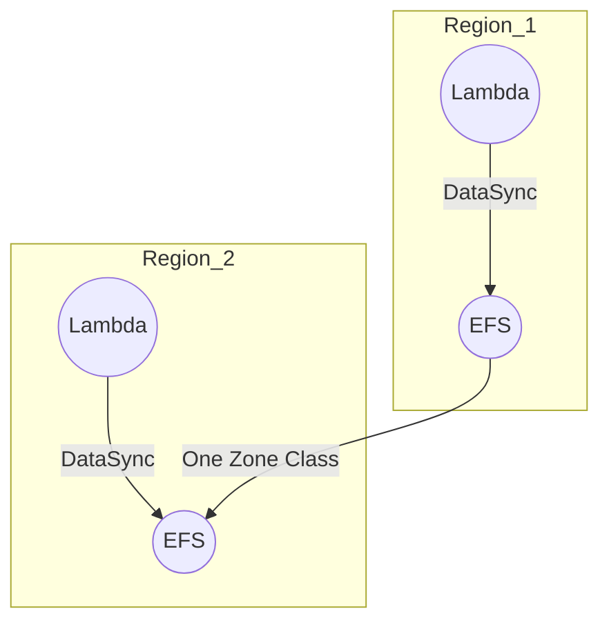

Advanced Architecture
---------------------

At its core, [[lambda|AWS Lambda]] with [[Master/Git_hub_notes/AWS-SAP-C02-Notes-main/README|EFS]] (Elastic File System) provides a serverless compute platform that can access a shared file system across multiple Availability Zones (AZs) and accounts. The [[lambda]] function can read from and write to the E mount point like a traditional file system, enabling use cases such as microservices, containerized workloads, and big data processing.

Internally, [[lambda]] uses the Network File System (NFS) protocol to connect to [[Master/Git_hub_notes/AWS-SAP-C02-Notes-main/README|EFS]]. To ensure high availability, [[lambda]] automatically creates and manages ENIs (Elastic Network Interfaces) in each AZ associated with your function's [[AWS_SA_PRO_Obsidian_Notes/Master/VPC|VPC]] configuration. This allows [[Master/Git_hub_notes/AWS-SAP-C02-Notes-main/README|Lambda functions]] to access [[Master/Git_hub_notes/AWS-SAP-C02-Notes-main/README|EFS]] files stored in multiple AZs within the same region.

[[RDS_Instance_Types|Global Scale Considerations]]
---------------------------

[[lambda|AWS Lambda]] with [[Master/Git_hub_notes/AWS-SAP-C02-Notes-main/README|EFS]] is currently limited to a single region. However, you can implement a multi-region architecture using [[Master/Git_hub_notes/AWS-SAP-C02-Notes-main/README|EFS]] One Zone [[AWS_SA_PRO_Obsidian_Notes/Master/04-storage/s3|storage classes]] or [[AWS_SA_PRO_Obsidian_Notes/Master/11-migrations/datasync|AWS DataSync]] for cross-region replication.

Here's an example Mermaid code snippet for a multi-region setup:

When NOT to use this service vs. alternatives
-----------------------------------------------

| Service   | Use Cases                                                              |
|-----------|------------------------------------------------------------------------|
| [[lambda]] w/ [[Git_hub_notes/AWS-SAP-C02-Notes-main/README|EFS]] | Big data processing, containerized workloads, microservices          |
| [[lambda]] w/ [[Srinivas_Notes/S3|S3]] | Event-driven, real-time data processing, [[iot]], mobile backend         |
| [[Git_hub_notes/AWS-SAP-C02-Notes-main/README|EBS]]        | [[ec2]] instances, [[ecs]], [[Git_hub_notes/AWS-SAP-C02-Notes-main/README|RDS]] snapshots                                      |
| [[fsx|FSx for Lustre]] | High-performance computing, machine learning, video rendering     |

[[appsync|Security]] & Governance
----------------------

To secure access to [[Master/Git_hub_notes/AWS-SAP-C02-Notes-main/README|EFS]] resources, you can create complex [[Master/Git_hub_notes/AWS-SAP-C02-Notes-main/README|IAM]] [[policies]] using JSON snippets. Here's an example policy granting [[lambda]] function permissions to access [[Master/Git_hub_notes/AWS-SAP-C02-Notes-main/README|EFS]]:
```json
{
  "Version": "2012-10-17",
  "Statement": [
    {
      "Effect": "Allow",
      "Action": [
        "elasticfilesystem:ClientMount",
        "elasticfilesystem:DescribeMountTargets"
      ],
      "Resource": "*"
    }
  ]
}
```
Cross-account access can be achieved by creating a role in the source account and assuming it in the destination account. Additionally, you can enforce [[appsync|security]] [[policies]] at the organization level using Service Control [[policies]] (SCPs).

Performance & Reliability
--------------------------

[[lambda]] has throttling limits based on the number of concurrent executions. To handle these [[AWS_SA_PRO_Obsidian_Notes/Master/12-security-and-config/cloudhsm|limitations]], implement exponential backoff strategies in your application logic. For high availability and [[Master/Git_hub_notes/AWS-SAP-C02-Notes-main/README|disaster recovery]], distribute your [[Master/Git_hub_notes/AWS-SAP-C02-Notes-main/README|Lambda functions]] across multiple AZs and regions.

[[Master/Git_hub_notes/AWS-SAP-C02-Notes-main/README|Cost Optimization]]
-----------------

Granular cost controls include provisioned throughput, burst [[Master/Git_hub_notes/certified-aws-solutions-architect-professional-main/README|credits]], and storage capacity. To optimize costs, select the appropriate [[Master/Git_hub_notes/AWS-SAP-C02-Notes-main/README|EFS]] storage class (Standard, Infrequent Access, One Zone) based on your use case. Also, enable lifecycle management [[policies]] to move less frequently accessed files to lower-cost storage tiers.

Complex Vignette-Style Questions
--------------------------------

Question 1: Your company needs to deploy a new serverless web app requiring shared storage between [[Master/Git_hub_notes/AWS-SAP-C02-Notes-main/README|Lambda functions]]. Which solution meets these requirements while minimizing latency?

Correct Answer: Deploy the [[Master/Git_hub_notes/AWS-SAP-C02-Notes-main/README|Lambda functions]] in a [[AWS_SA_PRO_Obsidian_Notes/Master/VPC|VPC]] and connect them to [[Master/Git_hub_notes/AWS-SAP-C02-Notes-main/README|EFS]] using the NFS protocol. This enables low-latency access to shared data between [[Master/Git_hub_notes/AWS-SAP-C02-Notes-main/README|Lambda functions]].

Incorrect Answer: Store data in [[AWS_SA_PRO_Obsidian_Notes/Master/S3|S3]] and use [[lambda]] triggers to process data. While this approach supports serverless architectures, it introduces higher latency compared to [[Master/Git_hub_notes/AWS-SAP-C02-Notes-main/README|EFS]] due to the event-driven nature of [[AWS_SA_PRO_Obsidian_Notes/Master/S3|S3]].

Question 2: Your organization wants to centralize [[Master/Git_hub_notes/AWS-SAP-C02-Notes-main/README|EFS]] storage across multiple AWS accounts while enforcing [[appsync|security]] [[policies]]. What steps should you take to achieve this goal?

Correct Answer: Create an [[organizations|AWS Organizations]] structure and apply SCPs to enforce [[appsync|security]] [[policies]]. In addition, create a role in the source account allowing cross-account access to [[Master/Git_hub_notes/AWS-SAP-C02-Notes-main/README|EFS]] resources and assume it in the destination account.

Incorrect Answer: Implement resource-based [[policies]] on individual [[Master/Git_hub_notes/AWS-SAP-C02-Notes-main/README|EFS]] resources. While this approach allows fine-grained control over resource access, it does not provide centralized management and enforcement of [[appsync|security]] [[policies]] across multiple accounts.