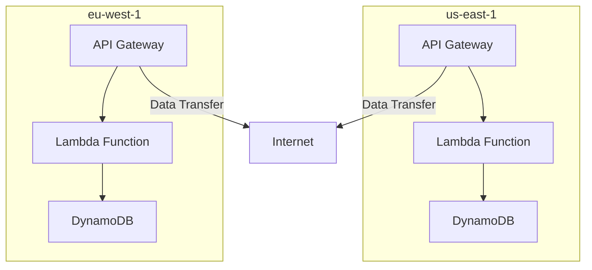

**[[RDS_Instance_Types|1. Advanced Architecture]]**

At the core of [[lambda]] is the *execution environment*, which includes the runtime, file system, and metadata available to your code. AWS offers several runtime environments, including Node.js, Python, Java, C#, Go, and Ruby. Custom runtimes can also be used. The execution environment is created when invoking a function and terminated after the function has executed.

For global scale applications, you need to consider *global deployments* using AWS Region and Edge Locations. For regions without [[lambda]], you can use [[Lambda@Edge]] to run [[Master/Git_hub_notes/AWS-SAP-C02-Notes-main/README|Lambda functions]] at [[Master/Git_hub_notes/AWS-SAP-C02-Notes-main/README|CloudFront]] edges. This enables low-latency responses across the globe. However, note that [[Lambda@Edge]] does not support custom runtimes or layers.

Data transferred between AWS services in the same region is free, but data transfer costs apply to other scenarios. To minimize these costs, place your functions close to their triggers.



**[[RDS_Instance_Types|2. Comparison & Anti-Patterns]]**

| Service | Suitable for | Not suitable for |
| --- | --- | --- |
| [[lambda]] | Event-driven, asynchronous workloads; [[api-gateway|API Gateway]], [[kinesis]], etc. | Long-running processes, heavy CPU workloads |
| [[ec2]] | Predictable performance, direct hardware control, high network throughput | Transient, event-driven workloads |
| [[Fargate]] | Containerized workloads, fine-grained resource control, scaling speed | High-performance computing, large VM requirements |

Common anti-patterns include:
- Running long-lived connections inside [[Master/Git_hub_notes/AWS-SAP-C02-Notes-main/README|Lambda functions]].
- Using [[lambda]] for tasks better suited to other services (e.g., [[ec2]] for long-term processing).
- Directly exposing [[Master/Git_hub_notes/AWS-SAP-C02-Notes-main/README|Lambda functions]] to the internet.

**[[RDS_Instance_Types|3. Security & Governance]]**

[[Master/Git_hub_notes/AWS-SAP-C02-Notes-main/README|IAM]] [[policies]] should follow the principle of least privilege. Here's an example policy allowing a user to invoke specific [[Master/Git_hub_notes/AWS-SAP-C02-Notes-main/README|Lambda functions]]:

```json
{
    "Version": "2012-10-17",
    "Statement": [
        {
            "Effect": "Allow",
            "Action": "lambda:InvokeFunction",
            "Resource": [
                "arn:aws:lambda:us-east-1:123456789012:function:MyFirstFunction",
                "arn:aws:lambda:us-east-1:123456789012:function:MySecondFunction"
            ]
        }
    ]
}
```

Cross-account access involves adding the necessary ARN to the [[Master/Git_hub_notes/AWS-SAP-C02-Notes-main/README|IAM]] role's trust policy. For organization-wide SCPs, limit actions like `lambda:AddPermission`, `lambda:CreateFunction`, and `lambda:UpdateFunctionCode`.

**[[RDS_Instance_Types|4. Performance & Reliability]]**

Throttling limits depend on the region and account type. If throttled, [[lambda]] responds with a `429 Too Many Requests` error. Implement exponential backoff strategies to handle such [[api-gateway|errors]].

HA/DR patterns involve deploying [[Master/Git_hub_notes/AWS-SAP-C02-Notes-main/README|Lambda functions]] in multiple regions. Ensure that any shared state is stored in replicated databases like [[dynamodb|DynamoDB Global Tables]].

**[[RDS_Instance_Types|5. Cost Optimization]]**

Granular cost controls include:
- Setting concurrency limits per function to prevent unexpected charges.
- Enabling provisioned concurrency for predictable, high-traffic workloads.
- Monitoring usage via [[cloudwatch|CloudWatch alarms]] and setting up [[billing]] alerts.

Calculation examples:
- Execution time: $0.000000208 per GB-second.
- Request count: $0.20 per million requests.

**[[RDS_Instance_Types|6. Professional Exam Scenarios]]**

Scenario 1:
Your company wants to serve static assets from an [[AWS_SA_PRO_Obsidian_Notes/Master/S3|S3]] bucket while transforming images on-the-fly using a [[lambda]] function. How would you implement this?

Correct answer: Implement a [[Master/Git_hub_notes/AWS-SAP-C02-Notes-main/README|CloudFront]] distribution with origin set to the [[AWS_SA_PRO_Obsidian_Notes/Master/S3|S3]] bucket. Create a [[Lambda@Edge]] function to process images and configure it as a behavior within the [[Master/Git_hub_notes/AWS-SAP-C02-Notes-main/README|CloudFront]] distribution.

Incorrect answer: Directly expose the [[lambda]] function to the internet.

Scenario 2:
You need to create a solution that automatically scales based on traffic spikes during events. The solution must store data in a central location and provide real-time analytics. Which AWS services would you choose?

Correct answer: Use [[api-gateway|API Gateway]] + [[lambda]] for the event-driven architecture. Store data in [[dynamodb]] and perform real-time analytics using [[kinesis|Kinesis Data Streams]] and [[kinesis|Kinesis Data Analytics]].

Incorrect answer: Use [[ec2]] instances to handle traffic spikes instead of serverless solutions.