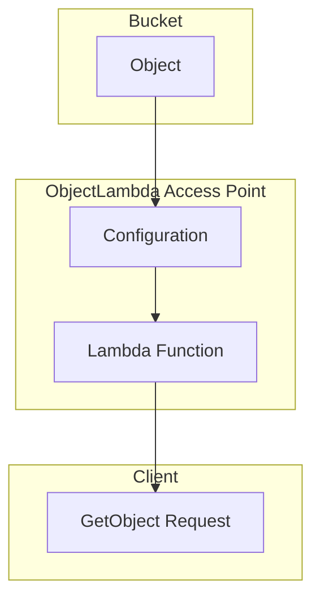

**Advanced Architecture: [[AWS_SA_PRO_Obsidian_Notes/Master/04-storage/s3|S3 Object Lambda]]**

[[AWS_SA_PRO_Obsidian_Notes/Master/04-storage/s3|S3 Object Lambda]] is a feature that allows you to perform serverless transformations on objects as they are retrieved from Amazon [[AWS_SA_PRO_Obsidian_Notes/Master/S3|S3]]. It enables custom code to be executed in response to GetObject, GetObjectVersion, or ListObjectsV2 API operations. The following diagram shows an [[AWS_SA_PRO_Obsidian_Notes/Master/S3|S3]] bucket configured with an ObjectLambda Access Point. A [[lambda]] function is associated with this access point, which processes the object before returning it to the client.



When a GET request is made, the ObjectLambda Access Point triggers the [[lambda]] function. The function receives an event containing the object's metadata and a signed URL to download the object. After processing, the function returns the modified data to the user. This process happens transparently, so the client perceives it as a regular [[AWS_SA_PRO_Obsidian_Notes/Master/S3|S3]] GET request.

**Comparison & Anti-Patterns**

| Service | Use Cases |
| --- | --- |
| [[Git_hub_notes/certified-aws-solutions-architect-professional-main/04-storage/s3|S3 Object Lambda]] | Real-time object transformation, image manipulation, data compression, etc. |
| [[Srinivas_Notes/S3|S3]] Select / [[Srinivas_Notes/S3|S3]] [[Git_hub_notes/AWS-SAP-C02-Notes-main/README|Glacier]] Select | Querying structured data within [[Srinivas_Notes/S3|S3]] objects |
| [[Lambda@Edge]] | Content transformation at [[Git_hub_notes/AWS-SAP-C02-Notes-main/README|CloudFront]] edge locations |

Anti-pattern: Using [[AWS_SA_PRO_Obsidian_Notes/Master/04-storage/s3|S3 Object Lambda]] when [[Lambda@Edge]] or [[AWS_SA_PRO_Obsidian_Notes/Master/S3|S3]] Select would suffice. These services can address specific use cases more efficiently than [[AWS_SA_PRO_Obsidian_Notes/Master/04-storage/s3|S3 Object Lambda]].

**[[appsync|Security]] & Governance**

[[Master/Git_hub_notes/AWS-SAP-C02-Notes-main/README|IAM]] [[policies]]:

To grant permissions to invoke a [[lambda]] function through an ObjectLambda Access Point, attach the following policy to the [[Master/Git_hub_notes/AWS-SAP-C02-Notes-main/README|IAM]] role associated with the function:

```json
{
  "Effect": "Allow",
  "Action": [
    "lambda:InvokeFunction"
  ],
  "Resource": "arn:aws:lambda:*:*:function:my-object-lambda-function",
  "Condition": {
    "StringEquals": {
      "aws:SourceVpce": "vpce-xxxxxxxx"
    }
  }
}
```

Cross-Account Access:

To allow cross-account access to an ObjectLambda Access Point, create a principal policy similar to the one above but replace `aws:SourceVpce` with `aws:PrincipalAccount`. Additionally, update the resource ARN to include the destination account ID.

Organization SCPs:

To enforce centralized control over [[AWS_SA_PRO_Obsidian_Notes/Master/04-storage/s3|S3 Object Lambda]] resources, implement Service Control [[policies]] (SCPs) at the organization level. For example, restrict who can create ObjectLambda Access Points by using the following [[SCP]]:

```json
{
  "Effect": "Deny",
  "Service": "s3",
  "Condition": {
    "StringNotEqualsIfExists": {
      "s3:ResourceTag/IsObjectLambdaAccessPoint": "true"
    }
  },
  "Resource": "arn:aws:s3::*",
  "Description": "Prevent non-ObjectLambdaAccessPoint creation"
}
```

**Performance & Reliability**

Throttling Limits:

[[AWS_SA_PRO_Obsidian_Notes/Master/04-storage/s3|S3 Object Lambda]] has the following throttling limits:

- Maximum number of simultaneous requests to a single [[lambda]] function version: 1000
- Maximum number of Object [[lambda]] Access Points per AWS account: 100

Exponential Backoff Strategies:

Implement exponential backoff strategies when handling [[api-gateway|errors]] during [[AWS_SA_PRO_Obsidian_Notes/Master/04-storage/s3|S3 Object Lambda]] invocations. This approach reduces the likelihood of repeatedly encountering the same error and improves overall system reliability.

HA/DR Patterns:

For high availability and [[Master/Git_hub_notes/AWS-SAP-C02-Notes-main/README|disaster recovery]], distribute ObjectLambda Access Points across multiple regions. Configure primary and secondary ObjectLambda Access Points with different [[Master/Git_hub_notes/AWS-SAP-C02-Notes-main/README|Lambda functions]] and ensure they have equivalent functionality.

**[[Master/Git_hub_notes/AWS-SAP-C02-Notes-main/README|Cost Optimization]]**

Granular Cost Controls:

Monitor costs by enabling [[cost-allocation-tags|cost allocation tags]] on your [[AWS_SA_PRO_Obsidian_Notes/Master/S3|S3]] buckets and [[Master/Git_hub_notes/AWS-SAP-C02-Notes-main/README|Lambda functions]]. Tagging helps track usage and optimize costs based on project, team, or other criteria.

Calculation Examples:

Suppose you store 10 TB of uncompressed images in an [[AWS_SA_PRO_Obsidian_Notes/Master/S3|S3]] bucket and apply lossless compression using [[AWS_SA_PRO_Obsidian_Notes/Master/04-storage/s3|S3 Object Lambda]]. Assume the average compressed image size is 75% smaller than the original. The total storage cost reduction is:

(Original Storage Cost \* Original Data Size) - (New Storage Cost \* New Data Size)

**Professional Exam Scenarios**

Scenario 1:

You work for a company that stores large datasets in [[AWS_SA_PRO_Obsidian_Notes/Master/S3|S3]] and needs to compress them on-the-fly for reduced transfer costs. Which solution should you choose?

Correct Answer: Implement [[AWS_SA_PRO_Obsidian_Notes/Master/04-storage/s3|S3 Object Lambda]] with a [[lambda]] function that compresses data before sending it to the requester.

Incorrect Answer: Use [[AWS_SA_PRO_Obsidian_Notes/Master/S3|S3]] Select to query and compress the data. [[AWS_SA_PRO_Obsidian_Notes/Master/S3|S3]] Select is designed for querying structured data rather than compression tasks.

Scenario 2:

Your organization uses [[AWS_SA_PRO_Obsidian_Notes/Master/04-storage/s3|S3 Object Lambda]] for real-time object transformations. However, the service is frequently hitting throttling limits due to high demand. How can you improve performance without increasing costs?

Correct Answer: Distribute ObjectLambda Access Points across multiple regions and enable cross-region replication.

Incorrect Answer: Increase the number of simultaneous requests to a single [[lambda]] function version. While this action increases capacity, it also raises costs.