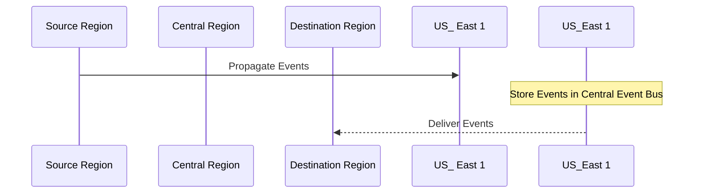

## Advanced Architecture

At its core, [[eventbridge]] is an event bus service that enables the creation of rules to match incoming events and corresponding actions based on their payloads. It operates at both regional and global scales, allowing for the routing of events across accounts and regions.

### [[RDS_Instance_Types|Global Scale Considerations]]

[[eventbridge]] utilizes a centralized Event Bus in the `us-east-1` region for cross-region delivery of events. This allows for the propagation of events from one region to another, ensuring high availability and reliability. The following Mermaid syntax diagram depicts how [[eventbridge]] handles cross-region delivery:

### Under the Hood Mechanics

[[eventbridge]] uses the concept of "rules" to filter incoming events based on specific criteria, such as event patterns or source accounts. These rules can be configured to trigger [[Master/Git_hub_notes/AWS-SAP-C02-Notes-main/README|Lambda functions]], target [[sns]] topics, or even cross-account invocations.

When an event matches a rule, [[eventbridge]] performs the following steps:

1. Validates the incoming event against the specified rule(s)
2. If the event matches the rule(s), it triggers the corresponding action(s), such as invoking a [[lambda]] function or publishing to an [[sns]] topic

## Comparison & Anti-Patterns

| Service            | Use Case                                                              |
|-------------------|----------------------------------------------------------------------|
| [[eventbridge]]       | Decoupling components, automating workflows, real-time file processing|
| [[sqs]]               | FIFO message ordering, dead-letter queue support                   |
| [[sns]]              | Pub/Sub messaging, decoupling microservices                         |

Anti-pattern: Using [[eventbridge]] for long-running tasks. Instead, consider using [[Master/Git_hub_notes/AWS-SAP-C02-Notes-main/README|Step Functions]] or a similar service.

## [[appsync|Security]] & Governance

Complex [[Master/Git_hub_notes/AWS-SAP-C02-Notes-main/README|IAM]] [[policies]] can be implemented using JSON snippets like the following example:
```json
{
    "Effect": "Allow",
    "Action": [
        "events:PutEvents",
        "events:PutTargets"
    ],
    "Resource": [
        "*"
    ],
    "Condition": {
        "ArnEquals": {
            "aws:SourceVpc": "arn:aws:ec2:us-west-2:123456789012:vpc/vpc-abcdefgh"
        }
    }
}
```
Cross-account access can be achieved by specifying the ARN of the destination account in the event pattern or through [[Master/Git_hub_notes/AWS-SAP-C02-Notes-main/README|IAM]] roles granting necessary permissions.

Organization Service Control [[policies]] (SCPs) can enforce restrictions on [[eventbridge]] usage, such as limiting which services can receive events.

## Performance & Reliability

Throttling limits vary depending on the type of event bus used. For example, the default Event Bus has a throttle limit of 10 events per second, while custom Event Buses have a limit of 100 events per second.

Exponential backoff strategies should be employed when handling throttled requests, allowing for retries after a specified delay period.

High availability and [[Master/Git_hub_notes/AWS-SAP-C02-Notes-main/README|disaster recovery]] patterns can be achieved by utilizing multiple EventBuses in different regions and configuring them to route events between each other.

## [[Master/Git_hub_notes/AWS-SAP-C02-Notes-main/README|Cost Optimization]]

Granular cost controls can be applied by enabling data encryption for individual EventBus instances, as well as setting up [[billing]] alarms for [[eventbridge]] usage.

Calculation Example:

Assuming a monthly rate of $1.00 per million events and a total of 50 million events processed through [[eventbridge]] during a month, the total cost would be calculated as follows:

(50,000,000 events / 1,000,000 events) \* $1.00 = $50

## Professional Exam Scenarios

Scenario 1: A company wants to replicate all events related to user activity in their application across two separate AWS accounts. How can they achieve this?

Correct Answer: By creating a rule in [[eventbridge]] that filters events based on source account and targeting the corresponding [[sns]] topic in the destination account.

Incorrect Answer: Utilizing [[sqs]] instead of [[sns]], as [[sqs]] does not natively support cross-account communication.

Scenario 2: A media processing application requires real-time transcoding of video files upon upload. What is the most appropriate solution?

Correct Answer: Configure an [[eventbridge]] rule to monitor Amazon [[AWS_SA_PRO_Obsidian_Notes/Master/S3|S3]] bucket events for PUT operations, then trigger a [[lambda]] function that initiates the transcoding process.

Incorrect Answer: Implementing a polling mechanism to frequently check for new videos, as this approach introduces unnecessary latency and resource waste.