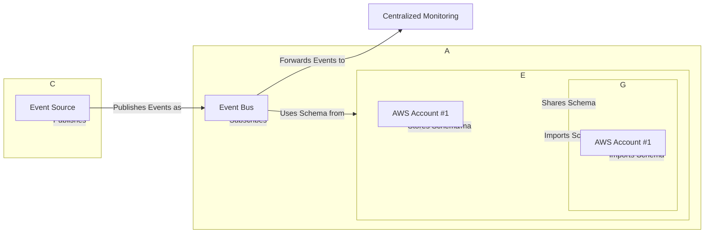

### Advanced Architecture

[[eventbridge]] Schema Registry is a fully managed registry for validating, storing, and discovering schemas associated with events. It enables easier integration between applications and services by providing a central repository for event schemas. The following diagram shows an advanced architecture using Schema Registry in a multi-account environment:



Internally, [[eventbridge]] Schema Registry uses Amazon [[AWS_SA_PRO_Obsidian_Notes/Master/S3|S3]] for schema storage and [[Master/Git_hub_notes/AWS-SAP-C02-Notes-main/README|AWS CloudFormation]] [[cloudformation|StackSets]] to enable cross-account schema sharing. Global scale is achieved through regional replication of schemas within a Region.

### Comparison & Anti-Patterns

| Service | Use Case |
|---|---|
| [[eventbridge]] Schema Registry | Centralized management and validation of event schemas. |
| Amazon [[sns]] Topics | Point-to-point messaging or fanout scenarios without complex event structures. |
| Amazon [[sqs]] Queues | Workload spikes, message ordering, and decoupling applications. |
| [[appsync|AWS AppSync]] | Real-time data synchronization and offline app support. |

Anti-patterns include:

- Using Schema Registry for non-event-based workloads such as RPC or direct messaging.
- Replacing existing pub/sub systems like [[sns]] and [[sqs]] with Schema Registry.

### [[appsync|Security]] & Governance

Complex [[Master/Git_hub_notes/AWS-SAP-C02-Notes-main/README|IAM]] [[policies]] can be created using JSON statements. Here's an example policy allowing a user to manage schemas in a specific region:

```json
{
    "Version": "2012-10-17",
    "Statement": [
        {
            "Effect": "Allow",
            "Action": [
                "events:GetSchemaDefinition",
                "events:DescribeSchema",
                "events:ListSchemas",
                "events:DeleteSchema",
                "events:UpdateSchema"
            ],
            "Resource": "*",
            "Condition": {
                "StringEquals": {
                    "aws:RequestedRegion": "us-west-2"
                }
            }
        }
    ]
}
```

Cross-account access can be established using the `Principal` field in the policy document. To grant permission across an entire organization, you should create Organization Service Control [[policies]] (SCPs) that restrict actions related to Schema Registry.

### Performance & Reliability

[[eventbridge]] Schema Registry has throttling limits based on API calls per second. To avoid exceeding these limits, implement exponential backoff strategies when handling [[api-gateway|errors]] during publishing or subscribing operations. High availability and [[Master/Git_hub_notes/AWS-SAP-C02-Notes-main/README|disaster recovery]] patterns involve deploying resources across multiple regions, ensuring each region has its own copy of the schemas.

### [[Master/Git_hub_notes/AWS-SAP-C02-Notes-main/README|Cost Optimization]]

Granular cost controls can be applied by managing usage at the individual event bus level. Calculate costs using the pricing formula:

```
(Number of events published + Number of events delivered) * Price per million events
```

### Professional Exam Scenarios

#### Scenario 1

You are designing a serverless application for a client that requires real-time updates between components. They want to minimize latency while maintaining high availability. Which solution would meet their requirements?

Correct answer: Implement a combination of [[eventbridge]] Schema Registry, [[eventbridge]] Event Bus, and [[appsync|AWS AppSync]]. This allows for centralized schema management with low-latency communication between components.

Incorrect answer: Use Amazon [[Master/Git_hub_notes/AWS-SAP-C02-Notes-main/README|Simple Notification Service (SNS)]] alone. While it provides pub/sub capabilities, it does not offer real-time updates as required by the scenario.

#### Scenario 2

Your organization wants to enforce consistent naming conventions for event schemas used in different AWS accounts. How can you achieve this using the Schema Registry?

Correct answer: Create an Organization Service Control Policy ([[SCP]]) that restricts schema creation and modification to authorized users. This ensures all schemas follow the specified naming conventions.

Incorrect answer: Share schemas across accounts using the Schema Registry UI. While this approach shares schemas, it does not enforce naming conventions consistently.