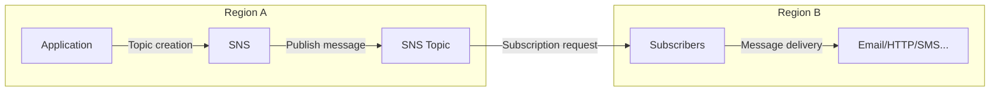

## Advanced Architecture

At its core, Amazon [[Master/Git_hub_notes/AWS-SAP-C02-Notes-main/README|Simple Notification Service (SNS)]] is a fully managed messaging service that allows for the publication and delivery of messages between different clients or services. [[sns]] supports various subscription types such as HTTP/S, Email, SMS, Mobile Push, [[lambda]], and even another [[sns]] topic. The following diagram provides an overview of [[sns]] [[RDS_Instance_Types|internals]]:



For [[RDS_Instance_Types|global scale considerations]], [[sns]] offers two features: Fanout and Topic Aliases. Fanout pushes a single publish request to multiple [[sns]] topics in different regions by creating a "fanout" topology. This enables low-latency pub/sub messaging at a global scale.

Topic Aliases can be used to create regional endpoints for [[sns]] topics, allowing mobile apps and devices to subscribe to a logical topic name instead of region-specific endpoint URLs.

## Comparison & Anti-Patterns

| Feature               | [[sns]]                   | Alternatives                          |
| --------------------- | --------------------- | ------------------------------------ |
| Ordering guarantees    | At-most-once         | [[kinesis|Kinesis Data Streams]] (at-least-once) |
| Delivery latency      | Low                   | [[sqs]] (lower)                           |
| Payload size limit    | 256 KB                | [[kinesis|Kinesis Data Streams]] (unlimited)       |
| Subscription filters  | Basic filtering       | [[iot]] Rules Engine (advanced)          |

Anti-patterns include using [[sns]] when strict ordering guarantees are needed, since [[sns]] only provides at-most-once delivery semantics. Moreover, if payload size needs to exceed 256 KB, [[kinesis|Kinesis Data Streams]] would be more appropriate.

## [[appsync|Security]] & Governance

Complex [[Master/Git_hub_notes/AWS-SAP-C02-Notes-main/README|IAM]] [[policies]] may involve granting specific permissions like `sns:Publish`, `sns:SetTopicAttributes`, `sns:Subscribe`, and `sns:Unsubscribe`. Here's an example JSON policy:

```json
{
  "Effect": "Allow",
  "Action": ["sns:Publish"],
  "Resource": [
    "arn:aws:sns:us-west-2:123456789012:MyTopic",
    "arn:aws:sns:us-west-2:123456789012:MyOtherTopic"
  ]
}
```

Cross-account access involves configuring resource-based [[policies]] on [[sns]] topics. For instance, to allow an AWS account to subscribe to a topic, add the following JSON code within the `AddPermission` API call:

```json
{
  "AWSAccountID": "123456789012",
  "ActionName": "Subscribe"
}
```

Organization Service Control [[policies]] (SCPs) can enforce restrictions across accounts. To prevent accidental deletion of [[sns]] topics, apply this [[SCP]]:

```json
{
  "Version": "2012-10-17",
  "StatementId": "DenySnsDelete",
  "Effect": "Deny",
  "Action": ["sns:DeleteTopic"],
  "Resource": "*",
  "Condition": {
    "StringNotEqualsIfExists": {
      "aws:Account": "<your_master_account_id>"
    }
  }
}
```

## Performance & Reliability

Throttling limits depend on the type of interaction with [[sns]]:

- Publishing messages: 10 req/sec per topic (can be increased)
- Subscribing to topics: 100 req/sec per user identity
- Unsubscribing from topics: 5 req/sec per user identity

Exponential backoff strategies should be applied when handling throttled requests. In case of temporary [[api-gateway|errors]], wait for increasing intervals before retrying.

HA/DR patterns may involve replicating topics across regions through Fanout or setting up separate [[dr]] topics with their own subscribers.

## [[Master/Git_hub_notes/AWS-SAP-C02-Notes-main/README|Cost Optimization]]

Granular cost controls include monitoring and reducing unnecessary notifications. You can enable [[cloudwatch]] metrics to monitor costs related to publishing, subscribing, and data transfer.

Calculation examples:

- Publish requests: $0.50 per 1 million requests
- Subscription confirmation calls: First 100,000 confirmations free, then $0.0001 each
- Monthly platform fee: Free for first 1M requests, $0.40 per million after

## Professional Exam Scenarios

### Scenario 1

Suppose you need to build a serverless application requiring real-time communication between components. Which AWS services should be considered, and what are their roles?

Correct answer: [[sns]] and [[sqs]]. [[sns]] acts as a fanout mechanism to distribute events among several [[sqs]] queues, allowing multiple consumers to process the same event. [[sqs]] ensures ordered processing while decoupling components.

Incorrect answer: Using [[sns]] alone could lead to potential data loss due to its at-most-once delivery guarantee.

### Scenario 2

You have a multi-tenant architecture with separate [[billing]] per tenant. How can you optimize costs while ensuring secure communication between microservices?

Correct answer: Create dedicated [[sns]] topics per tenant and leverage [[sns]] resource-based [[policies]] to control cross-account access. Configure granular [[Master/Git_hub_notes/AWS-SAP-C02-Notes-main/README|IAM]] [[policies]] to restrict actions like `sns:Publish`, `sns:SetTopicAttributes`, `sns:Subscribe`, and `sns:Unsubscribe`.

Incorrect answer: Sharing a single [[sns]] topic for all tenants could expose sensitive information between them and does not provide proper cost allocation.