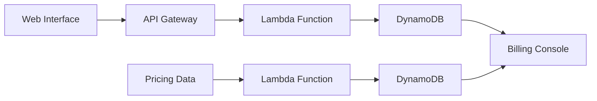

## Advanced Architecture

At its core, the AWS Pricing Calculator is a web-based tool that allows users to estimate their expected costs on AWS. It does this by aggregating data from various services, usage types, and pricing models. The calculator supports a wide range of AWS services, including but not limited to [[ec2]], [[Master/Git_hub_notes/AWS-SAP-C02-Notes-main/README|RDS]], [[AWS_SA_PRO_Obsidian_Notes/Master/S3|S3]], [[lambda]], and [[dynamodb]].

The calculator operates at a global scale, leveraging AWS Regions and Availability Zones to provide accurate estimates based on the user's specific deployment requirements. This includes support for custom currencies, tax settings, and price points based on location.

Under the hood, the AWS Pricing Calculator uses a combination of RESTful APIs, [[Master/Git_hub_notes/AWS-SAP-C02-Notes-main/README|Lambda functions]], and [[dynamodb|DynamoDB tables]] to store and retrieve pricing data. Here's a simplified Mermaid diagram illustrating the architecture:



## Comparison & Anti-Patterns

While the AWS Pricing Calculator is a powerful tool for estimating costs, there are several scenarios where it may not be the best choice. For example:

| Service | Advantages | Disadvantages |
| --- | --- | --- |
| AWS [[billing|Cost Explorer]] | Provides historical usage data and trends | Limited to 12 months of data; less accurate for long-term planning |
| [[billing|AWS Budgets]] | Allows for budget alerts and forecasted spending | Limited to simple financial operations |
| Custom Scripts | Full control over calculations and inputs | Requires development resources and maintenance |

Common anti-patterns include using the Pricing Calculator as a sole source of truth for financial management, or relying on outdated or incomplete pricing data.

## [[appsync|Security]] & Governance

To ensure proper [[appsync|security]] and governance, you can implement complex [[Master/Git_hub_notes/AWS-SAP-C02-Notes-main/README|IAM]] [[policies]], cross-account access, and organization Service Control [[policies]] (SCPs). Here's an example JSON policy snippet restricting access to the Pricing Calculator:

```json
{
    "Version": "2012-10-17",
    "Statement": [
        {
            "Effect": "Deny",
            "Action": "pricing:*",
            "Resource": "*",
            "Condition": {
                "StringNotEqualsIfExists": {
                    "aws:SourceVpce": "vpce-1234567890abcdef0"
                }
            }
        }
    ]
}
```

Additionally, you can create granular SCPs within your [[organizations|AWS Organizations]] structure to limit access to the Pricing Calculator across accounts.

## Performance & Reliability

The AWS Pricing Calculator offers high performance and reliability through its globally distributed infrastructure. However, there are [[AWS_SA_PRO_Obsidian_Notes/Master/12-security-and-config/cloudhsm|limitations]] to consider, such as throttling and potential slow responses during periods of high demand. In these cases, implementing exponential backoff strategies can help mitigate issues.

For high availability and [[Master/Git_hub_notes/AWS-SAP-C02-Notes-main/README|disaster recovery]], the Pricing Calculator supports multiple regions and availability zones. To improve performance, consider [[api-gateway|caching]] frequently accessed pricing data with services like Amazon [[Master/Git_hub_notes/AWS-SAP-C02-Notes-main/README|CloudFront]] or [[appsync|AWS AppSync]].

## [[Master/Git_hub_notes/AWS-SAP-C02-Notes-main/README|Cost Optimization]]

Granular cost controls are available in the AWS Pricing Calculator, allowing users to set up detailed estimates for individual services, usage types, and pricing models. Additionally, the calculator supports advanced features like [[cost-allocation-tags|cost allocation tags]] and resource groups, making it easier to track and optimize spending.

Here's an example calculation for a single Amazon [[ec2]] instance:

- Instance Type: `m5.large` ($0.096 per hour)
- Region: `us-west-2` (additional 5% regional discount)
- Tenancy: `Shared` (default)
- Total Estimated Monthly Cost: $69.12 (assuming 730 hours of usage)

## Professional Exam Scenarios

Scenario 1: A company wants to manage AWS costs across multiple accounts while ensuring proper access and [[appsync|security]]. How would you leverage the AWS Pricing Calculator, [[organizations|AWS Organizations]], and [[Master/Git_hub_notes/AWS-SAP-C02-Notes-main/README|IAM]] [[policies]] to meet these requirements?

Correct Answer: Create an [[organizations|AWS Organizations]] master account, invite member accounts, apply SCPs to restrict access to the Pricing Calculator, and configure [[Master/Git_hub_notes/AWS-SAP-C02-Notes-main/README|IAM]] [[policies]] to grant permission to specific member accounts.

Incorrect Answers: Implementing individual [[billing]] alerts in each account, sharing pricing data via an [[AWS_SA_PRO_Obsidian_Notes/Master/S3|S3]] bucket, or using [[billing|Cost Explorer]] for long-term planning.

Scenario 2: A developer needs to build a solution that automatically calculates AWS costs for a given project and sends notifications when estimated monthly costs exceed a specified threshold. Which AWS services should they use?

Correct Answer: [[lambda|AWS Lambda]], [[api-gateway|API Gateway]], and Amazon [[sns]] could be used to build a serverless solution that automates the process of calculating AWS costs and sending notifications based on predefined thresholds.

Incorrect Answers: Using the AWS Pricing Calculator directly for real-time cost monitoring, creating custom scripts without serverless components, or relying solely on AWS [[billing|Cost Explorer]] for automated alerts.