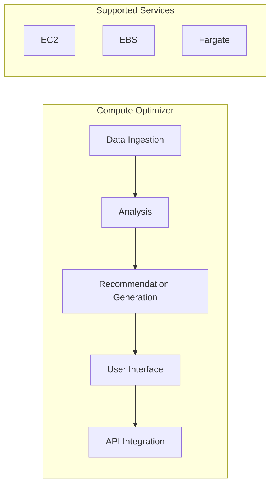

### Advanced Architecture

At its core, Compute Optimizer is a service that analyzes the running resources in your environment and provides recommendations to improve their cost and performance. The primary components of Compute Optimizer include data ingestion, analysis, and recommendation generation. Data ingestion involves pulling metadata from services like [[ec2]], [[Master/Git_hub_notes/AWS-SAP-C02-Notes-main/README|EBS]], and [[Fargate]]. This data is then analyzed using machine learning algorithms to generate recommendations based on [[iam|best practices]] and historical utilization patterns.

The following diagram illustrates the high-level architecture of Compute Optimizer:



Compute Optimizer operates at a global scale, collecting metadata from supported services across multiple regions. The collected metadata is stored in an Amazon [[AWS_SA_PRO_Obsidian_Notes/Master/S3|S3]] bucket within the region where the resource resides. However, the generated recommendations can be accessed through the Compute Optimizer API or Console from any region.

### Comparison & Anti-Patterns

Here's a comparison between Compute Optimizer and alternative solutions:

| Service                     | Real-time Recommendations | Cost-focused Recommendations | Customizable Recommendations |
|------------------------------|---------------------------|-----------------------------|----------------------------|
| **Compute Optimizer**        | Yes                       | Yes                         | Limited                    |
| **[[trusted-advisor|AWS Trusted Advisor]]**      | No                        | Yes                         | Limited                    |
| **AWS Personal Health Dashboard** | No                | No              | No            |

Anti-patterns for Compute Optimizer usage include:

* Running workloads with unsupported services (e.g., [[Master/Git_hub_notes/AWS-SAP-C02-Notes-main/README|RDS]], [[lambda]])
* Expecting customizable thresholds and rules for generating recommendations
* Using Compute Optimizer as a standalone monitoring solution instead of integrating it into existing monitoring and observability pipelines

### [[appsync|Security]] & Governance

Compute Optimizer supports fine-grained [[Master/Git_hub_notes/AWS-SAP-C02-Notes-main/README|IAM]] [[policies]] for controlling user access. For cross-account access, you can create an [[Master/Git_hub_notes/AWS-SAP-C02-Notes-main/README|IAM]] role in the source account and attach an inline policy granting permissions to the Compute Optimizer service principal:

```json
{
  "Version": "2012-10-17",
  "Statement": [
    {
      "Effect": "Allow",
      "Principal": {
        "Service": "compute-optimizer.amazonaws.com"
      },
      "Action": [
          "compute-optimizer:DescribeRecommendationSummary",
          "compute-optimizer:GetResourceCollection",
          "compute-optimizer:ListTagsForResource"
      ],
      "Resource": "*",
      "Condition": {
          "StringEquals": {
              "aws:SourceVpce": "<VPCE_ID>"
          }
      }
    }
  ]
}
```

To enable Compute Optimizer access across accounts within an [[AWS Organization]], create an organization service control policy ([[SCP]]) to allow Compute Optimizer actions:

```json
{
  "Version": "2012-10-17",
  "Statement": [
    {
      "Effect": "Allow",
      "Action": [
          "compute-optimizer:DescribeRecommendationSummary",
          "compute-optimizer:GetResourceCollection",
          "compute-optimizer:ListTagsForResource"
      ],
      "Resource": "*",
      "Condition": {
          "StringEquals": {
              "aws:SourceVpce": "<VPCE_ID>"
          }
      }
    }
  ]
}
```

### Performance & Reliability

Compute Optimizer has throttling limits for API requests and concurrent recommendations. To handle throttling, implement exponential backoff strategies using the `AWS SDK` or `AWS CLI`. Here's an example of handling throttling using Python and the `boto3` library:

```python
import time
import boto3
from botocore.exceptions import ThrottlingException

client = boto3.client('compute-optimizer')

def call_api(func, *args, **kwargs):
    attempts = 0
    max_attempts = 5
    backoff_time = 1

    while attempts < max_attempts:
        try:
            return func(*args, **kwargs)
        except ThrottlingException:
            attempts += 1
            if attempts < max_attempts:
                print(f"Throttled! Attempt {attempts}. Retrying after {backoff_time} seconds.")
                time.sleep(backoff_time)
                backoff_time *= 2
            else:
                raise
```

For high availability and [[Master/Git_hub_notes/AWS-SAP-C02-Notes-main/README|disaster recovery]], Compute Optimizer stores metadata in Amazon [[AWS_SA_PRO_Obsidian_Notes/Master/S3|S3]], which automatically replicates data across multiple regions. Additionally, users can access recommendations via the Compute Optimizer API, ensuring consistent access to recommendations even when some infrastructure components fail.

### [[Master/Git_hub_notes/AWS-SAP-C02-Notes-main/README|Cost Optimization]]

Compute Optimizer offers granular cost controls by recommending optimizations for underutilized resources. By applying these recommendations, you can reduce overall costs without affecting application performance. Calculating potential savings requires understanding the current resource utilization and the recommended instance types.

Example calculation:

* Instance A: m5.large (cost: $0.108/hour)
	+ Average CPU Utilization: 5%
	+ Average Memory Utilization: 20%
* Compute Optimizer suggests downgrading to t3.small (cost: $0.026/hour)
	+ Estimated CPU Utilization: 99%
	+ Estimated Memory Utilization: 60%

Potential monthly savings: ($0.108 - $0.026) \* 24 hours \* 30 days = $2.07

### Professional Exam Scenarios

#### Scenario 1: Multi-Account Strategy

You are working for a large enterprise with multiple AWS accounts managed through an [[AWS Organization]]. Your manager wants to enable Compute Optimizer to analyze all linked accounts and provide consolidated visibility for [[Master/Git_hub_notes/AWS-SAP-C02-Notes-main/README|cost optimization]] opportunities. Which of the following steps should you take?

A) Create an [[Master/Git_hub_notes/AWS-SAP-C02-Notes-main/README|IAM]] role with Compute Optimizer permissions in each linked account and share it with the management account.
B) Enable Compute Optimizer in the central management account and configure AWS [[Master/Git_hub_notes/AWS-SAP-C02-Notes-main/README|Resource Access Manager (RAM)]] to share resources from other accounts.
C) Implement [[organizations|AWS Organizations]] SCPs allowing Compute Optimizer actions in all linked accounts.
D) Connect all linked accounts to the same [[AWS_SA_PRO_Obsidian_Notes/Master/VPC|VPC]] endpoint (VPCE) for Compute Optimizer.

Correct answer: C
Justification: Option C correctly implements [[organizations|AWS Organizations]] SCPs to allow Compute Optimizer actions in all linked accounts. Options A, B, and D do not address the requirement of providing consolidated visibility for [[Master/Git_hub_notes/AWS-SAP-C02-Notes-main/README|cost optimization]] opportunities.

#### Scenario 2: Design Mistakes

Your team is implementing Compute Optimizer in a new AWS environment. They have created an [[Master/Git_hub_notes/AWS-SAP-C02-Notes-main/README|IAM]] policy that grants full access to Compute Optimizer but does not restrict the scope of accessible resources. What is the most likely negative impact of this design mistake?

A) Unauthorized users may access Compute Optimizer recommendations.
B) Users might receive more recommendations than necessary due to insufficient filtering.
C) Users could modify Compute Optimizer settings for resources they should not have access to.
D) Compute Optimizer might miss some resources during data collection.

Correct answer: C
Justification: Option C describes the most likely negative impact of the design mistake. Granting full access to Compute Optimizer without restricting the scope of accessible resources allows users to modify Compute Optimizer settings for resources they should not have access to. Options A, B, and D do not directly relate to the given scenario.