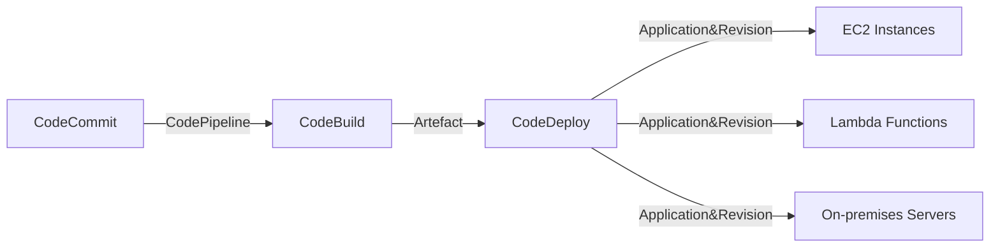

**Advanced Architecture**

At its core, CodeDeploy is a fully managed deployment service that automates code deployments to any instance, including Amazon [[ec2]] instances and serverless [[Master/Git_hub_notes/AWS-SAP-C02-Notes-main/README|Lambda functions]]. It can also deploy to on-premises servers. The internal mechanics involve a deployment agent installed on each instance, which receives and executes deployment commands from the CodeDeploy service.

Global scale is achieved through integration with [[Master/Git_hub_notes/AWS-SAP-C02-Notes-main/README|Route 53]], allowing multi-region deployments using [[route53|weighted routing]] [[policies]]. This enables traffic distribution across multiple regions, enhancing application availability and resiliency during deployments.

The following Mermaid syntax diagram illustrates how CodeDeploy interacts with [[Master/Git_hub_notes/AWS-SAP-C02-Notes-main/README|other AWS services]] in a typical architecture:


**Comparison & Anti-Patterns**

| Service | Use Case |
|---|---|
| CodeDeploy | Rolling, blue/green, and canary deployments; continuous deployment; compatibility with various environments. |
| Elastic Beanstalk | Primarily for application containers without significant customization needs. |
| [[Collab_Notes_detailed/Management_and_Governance/OpsWorks|OpsWorks]] | Ideal for managing applications as a collection of components, especially Chef-based workflows. |
| [[cloudformation]] | Infrastructure as Code (IaC) requirements, not recommended for standalone code deployments. |

Anti-patterns include using CodeDeploy solely for IaC or [[ecs]] tasks better suited for [[cloudformation]] or [[Master/Git_hub_notes/AWS-SAP-C02-Notes-main/README|Elastic Container Service (ECS)]]. Also, avoid overcomplicating deployments by manually scripting what CodeDeploy natively supports.

**[[appsync|Security]] & Governance**

Complex [[Master/Git_hub_notes/AWS-SAP-C02-Notes-main/README|IAM]] [[policies]] may involve permissions to create and manage applications, deployments, and roles within CodeDeploy. A sample policy might look like:
```json
{
    "Version": "2012-10-17",
    "Statement": [
        {
            "Effect": "Allow",
            "Action": [
              "codedeploy:*"
            ],
            "Resource": [
              "*"
            ]
        }
    ]
}
```
Cross-account access requires setting up an [[Master/Git_hub_notes/AWS-SAP-C02-Notes-main/README|IAM]] role in the source account granting necessary permissions, then assuming that role from the target account. Organization Service Control [[policies]] (SCPs) can enforce [[control-tower|guardrails]] around CodeDeploy usage.

**Performance & Reliability**

Throttling limits exist primarily around deployment creation rates, with exponential backoff strategies recommended during high failure scenarios. High availability/disaster recovery patterns often involve multi-region setup leveraging [[Master/Git_hub_notes/AWS-SAP-C02-Notes-main/README|Route 53]] [[route53|weighted routing]] [[policies]].

**[[Master/Git_hub_notes/AWS-SAP-C02-Notes-main/README|Cost Optimization]]**

Granular cost control can be implemented via proper tagging strategy, enabling [[billing]] based on specific resources or teams. [[Master/Git_hub_notes/AWS-SAP-C02-Notes-main/README|Cost optimization]] calculations depend on factors such as number of deployments per month, average duration of deployments, and the number and type of instances deployed.

**Professional Exam Scenario 1**

You are tasked with implementing a secure, scalable, and cost-effective solution for deploying containerized applications using CodeDeploy. What strategy would you adopt?

Correct answer: Utilize CodeDeploy with Amazon [[ecs]], defining tasks and services in the [[ecs]] cluster configuration while setting up appropriate [[appsync|security]] groups and network ACLs. Leverage CodeDeploy's [[Master/Git_hub_notes/AWS-SAP-C02-Notes-main/README|blue/green deployment]] feature for enhanced application availability during deployments.

Incorrect answer: Use CodeDeploy directly with Docker containers, which isn't supported. Instead, use Elastic Container Registry (ECR) or [[Master/Git_hub_notes/AWS-SAP-C02-Notes-main/README|Elastic Container Service (ECS)]] for container management.

**Professional Exam Scenario 2**

Suppose your organization uses [[organizations|AWS Organizations]] and has strict requirements regarding cross-account resource access. How could you enable CodeDeploy functionality between two accounts while adhering to these constraints?

Correct answer: Set up an [[Master/Git_hub_notes/AWS-SAP-C02-Notes-main/README|IAM]] role in the source account granting required CodeDeploy permissions, then assume that role from the target account. Configure both [[organizations|AWS Organizations]] and Service Control [[policies]] (SCPs) appropriately to ensure compliance with organizational standards.

Incorrect answer: Attempt to directly share CodeDeploy resources between accounts, which isn't supported. [[Master/Git_hub_notes/AWS-SAP-C02-Notes-main/README|IAM]] roles must be used to facilitate cross-account access.