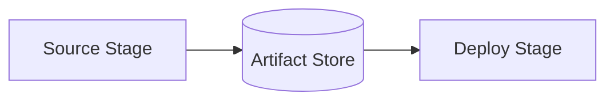

**Advanced Architecture**

CodePipeline is a continuous delivery service that automates building, testing, and deploying applications. It consists of [[api-gateway|stages]] and actions, where each stage contains one or more actions. The following diagram illustrates a pipeline with two [[api-gateway|stages]], Source and Deploy, connected by an [[Artifact]] store.



Actions can be customized using third-party tools, such as Jenkins or CodeBuild, through plugins called "action providers." Action providers interact with various services, like [[AWS_SA_PRO_Obsidian_Notes/Master/S3|S3]], ECR, or [[cloudformation]], via service integration points.

For multi-account scenarios, CodePipeline supports cross-account deployments through [[Master/Git_hub_notes/AWS-SAP-C02-Notes-main/README|IAM]] roles and resource [[policies]]. This allows for creating pipelines in a central account while targeting resources across multiple accounts.

Action throttles limit the number of concurrent executions per action provider instance. For example, CodeBuild has a default limit of 15 concurrent builds. To increase these limits, submit a service quota request.

**Comparison & Anti-Patterns**

| Service | Use Case |
| --- | --- |
| CodePipeline | Application deployment requiring multi-stage workflows, version control system integration, and manual approval steps. |
| [[CodeCommit]] / GitHub Actions | Version control repository hosting and simple [[cicd|CI/CD]] pipelines. |
| Jenkins | Customizable [[cicd|CI/CD]] pipelines with extensive plugin support. |
| AWS Amplify Console | Frontend web application deployment with integrated build and preview features. |

Anti-patterns include:

* Using CodePipeline for ad-hoc tasks instead of full application lifecycle management.
* Implementing complex branching strategies within CodePipeline; consider alternative solutions like GitFlow.

**[[appsync|Security]] & Governance**

CodePipeline uses [[Master/Git_hub_notes/AWS-SAP-C02-Notes-main/README|IAM]] [[policies]] and service roles to manage permissions. Multi-account setups require proper resource [[policies]] and [[Master/Git_hub_notes/AWS-SAP-C02-Notes-main/README|IAM]] role trust relationships.

Example [[Master/Git_hub_notes/AWS-SAP-C02-Notes-main/README|IAM]] policy allowing CodePipeline to invoke a [[lambda]] function:

```json
{
    "Effect": "Allow",
    "Action": ["lambda:InvokeFunction"],
    "Resource": "arn:aws:lambda:*:*:function:my-function"
}
```

Cross-account access involves configuring resource [[policies]] to allow specific actions from another account. An example policy permitting CodePipeline to write to an [[AWS_SA_PRO_Obsidian_Notes/Master/S3|S3]] bucket in another account:

```json
{
    "Version": "2012-10-17",
    "Statement": [
        {
            "Effect": "Allow",
            "Principal": {
                "AWS": "arn:aws:iam::pipeline_account_id:root"
            },
            "Action": [
                "s3:PutObject*"
            ],
            "Resource": "arn:aws:s3:::bucket_name/*",
            "Condition": {
                "StringEquals": {
                    "aws:SourceVpc": "vpc_id"
                }
            }
        }
    ]
}
```

Service Control [[policies]] (SCPs) at the organization level provide additional governance capabilities.

**Performance & Reliability**

To handle throttling limits, implement exponential backoff strategies when encountering [[api-gateway|errors]] during pipeline execution. Additionally, distribute deployments across multiple regions for high availability and [[Master/Git_hub_notes/AWS-SAP-C02-Notes-main/README|disaster recovery]].

**[[Master/Git_hub_notes/AWS-SAP-C02-Notes-main/README|Cost Optimization]]**

Enable deletion protection on your pipelines to prevent accidental deletion and ensure predictable costs. Monitor usage through AWS [[billing|Cost Explorer]], and apply granular cost controls using [[billing|AWS Budgets]].

**Professional Exam Scenario #1**

Scenario: A company requires a [[cicd|CI/CD]] solution for their containerized application hosted on Amazon Elastic Container Registry (ECR). They want to automatically rebuild their Docker images whenever they update their source code. They also need to manually approve deployments before releasing them to production.

Correct answer: Implement a CodePipeline with three [[api-gateway|stages]]: Source, Build, and Deploy. The Source stage will pull the latest source code from GitHub. The Build stage will use CodeBuild to compile the application and push the built Docker image to ECR. Finally, the Deploy stage should have a manual approval step before deploying the new image to production.

Incorrect answer: Directly connect the GitHub repository to [[Master/Git_hub_notes/AWS-SAP-C02-Notes-main/README|Elastic Container Service (ECS)]] using [[Fargate]] without any intermediary [[cicd|CI/CD]] tool. This approach does not allow for manual approval steps and may result in unstable deployments.

**Professional Exam Scenario #2**

Scenario: A consulting firm manages multiple clients' infrastructure and wants to create a centralized CodePipeline for deploying client resources.

Correct answer: Set up a central account containing the CodePipeline and enable cross-account deployments using [[Master/Git_hub_notes/AWS-SAP-C02-Notes-main/README|IAM]] roles and resource [[policies]]. Each client will grant necessary permissions to the central account, allowing it to manage deployments for their respective resources.

Incorrect answer: Create separate CodePipelines per client within the consulting firm's main account. This would lead to potential [[appsync|security]] risks due to overlapping [[Master/Git_hub_notes/AWS-SAP-C02-Notes-main/README|IAM]] [[policies]] and lack of separation between clients.