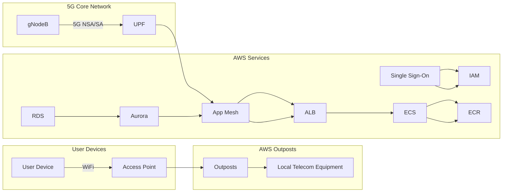

**Advanced Architecture**

[[AWS_SA_PRO_Obsidian_Notes/Master/05-compute/others|AWS Outposts]] combines Amazon's infrastructure, services, and technologies with local data centers or co-location spaces. This enables customers to have low-latency connectivity and consistent AWS functionality while meeting local data residency requirements. Outposts can support 5G private networks by providing ultra-low latency, high bandwidth connectivity required for demanding edge computing applications.

The following architecture diagram illustrates an example of a 5G private network setup using [[AWS_SA_PRO_Obsidian_Notes/Master/05-compute/others|AWS Outposts]] and [[Master/Git_hub_notes/AWS-SAP-C02-Notes-main/README|other AWS services]]:

In this architecture, the gNodeB (gnb) is connected to the UPF (User Plane Function) in the 5G core network through the 5G Next Generation (NSA) or Standalone (SA) interface. The UPF is then connected to the [[AWS_SA_PRO_Obsidian_Notes/Master/05-compute/others|AWS Outposts]] Local Telecom Equipment (awslte). The user devices connect to the Access Points (ap) via WiFi and then to the Outposts. The [[Master/Git_hub_notes/AWS-SAP-C02-Notes-main/README|Application Load Balancer (alb)]] is used as an entry point for the application running in [[ecs]] (Elastic Container Service) and uses ECR (Elastic Container Registry) for storing container images. App Mesh is used for managing microservices running in the Outposts. [[Master/Git_hub_notes/AWS-SAP-C02-Notes-main/README|RDS]] (Relational Database Service) is used as a database solution, specifically [[aurora]]. Single Sign-On (sso) is used for centralized [[api-gateway|authentication]] and authorization.

**Comparison & Anti-Patterns**

| Service | Use Case |
| --- | --- |
| [[Git_hub_notes/certified-aws-solutions-architect-professional-main/05-compute/others|AWS Wavelength]] | Best suited for mobile operators who want to deploy a 5G network with AWS infrastructure at the edge. It provides single digit latency, which makes it ideal for use cases like autonomous vehicles, industrial automation, [[iot]], and AR/VR. |
| [[Git_hub_notes/certified-aws-solutions-architect-professional-main/05-compute/others|AWS Outposts]] | Suitable for customers who need to run workloads in their own data center or colocation space but still want to benefit from AWS services and tools. Outposts supports a variety of deployment options, including 5G private networks. |
| [[Git_hub_notes/certified-aws-solutions-architect-professional-main/03-networking/vpc|AWS Local Zones]] | Ideal for customers who require low-latency access to AWS services without the need to deploy their own infrastructure. Local Zones provide a selection of AWS services closer to the end users. |

Anti-pattern: Using only one type of edge infrastructure for all use cases. Each edge infrastructure has its unique benefits and [[AWS_SA_PRO_Obsidian_Notes/Master/12-security-and-config/cloudhsm|limitations]], so selecting the right one based on the specific use case is essential.

**[[appsync|Security]] & Governance**

Complex [[Master/Git_hub_notes/AWS-SAP-C02-Notes-main/README|IAM]] [[policies]]:
```json
{
  "Version": "2012-10-17",
  "Statement": [
    {
      "Effect": "Allow",
      "Action": [
        "ec2:*"
      ],
      "Resource": [
        "*"
      ]
    },
    {
      "Effect": "Allow",
      "Action": [
        "elasticloadbalancing:*"
      ],
      "Resource": [
        "*"
      ]
    }
  ]
}
```
Cross-account access:
```json
{
  "Version": "2012-10-17",
  "Statement": [
    {
      "Effect": "Allow",
      "Principal": {
        "AWS": "arn:aws:iam::123456789012:root"
      },
      "Action": "sts:AssumeRole",
      "Condition": {
        "StringEquals": {
          "sts:ExternalId": "123456789012"
        }
      }
    }
  ]
}
```
Organization SCPs:
```json
{
  "Version": "2012-10-17",
  "Statement": [
    {
      "Sid": "DenyUnapprovedServices",
      "Effect": "Deny",
      "NotAction": [
          "ec2:Describe*",
          "elasticloadbalancing:Describe*",
          "autoscaling:Describe*"
      ],
      "Resource": "*"
    }
  ]
}
```

**Performance & Reliability**

Throttling limits: Refer to the [AWS documentation](https://docs.aws.amazon.com/general/latest/gr/aws_service_limits.html) for specific throttling limits for each service.

Exponential backoff strategies: Implementing an exponential backoff strategy involves increasing the waiting time between retries after a failure. For example, if the first retry waits for 1 second, the next could wait for 2 seconds, then 4 seconds, and so on.

HA/DR patterns: Implementing High Availability and [[Master/Git_hub_notes/AWS-SAP-C02-Notes-main/README|Disaster Recovery]] patterns involve distributing resources across multiple availability zones or regions. For example, running instances in different AZs and replicating data across regions.

**[[Master/Git_hub_notes/AWS-SAP-C02-Notes-main/README|Cost Optimization]]**

Granular cost controls: [[Master/Git_hub_notes/AWS-SAP-C02-Notes-main/README|Cost optimization]] can be achieved by setting up [[Budgets]], creating cost reports, and using [[billing|cost explorer]] to monitor usage. Additionally, using [[Master/Git_hub_notes/AWS-SAP-C02-Notes-main/README|reserved instances]], [[Master/Git_hub_notes/AWS-SAP-C02-Notes-main/README|spot instances]], and autoscaling groups can help reduce costs.

Calculation examples:

* Running 10 [[ec2]] instances for 24 hours would cost $0.10 per hour, resulting in a monthly cost of $720.
* Transferring 1 GB of data from [[ec2]] to [[AWS_SA_PRO_Obsidian_Notes/Master/S3|S3]] would cost $0.09, resulting in a monthly cost of $27 for 1 TB.

**Professional Exam Scenarios**

Scenario 1:
A company wants to implement a 5G private network using [[AWS_SA_PRO_Obsidian_Notes/Master/05-compute/others|AWS Outposts]]. They expect high traffic volumes and require low latency. How would you optimize the solution for performance and reliability?

Correct answer: To optimize the solution for performance and reliability, distribute resources across multiple availability zones within the Outposts. Implement High Availability and [[Master/Git_hub_notes/AWS-SAP-C02-Notes-main/README|Disaster Recovery]] patterns, such as running instances in different AZs and replicating data across regions.

Incorrect answer: Implementing all resources in a single availability zone.

Scenario 2:
A customer needs to implement a 5G private network using [[AWS_SA_PRO_Obsidian_Notes/Master/05-compute/others|AWS Wavelength]]. They want to minimize costs while ensuring high availability. What steps would you take to achieve this goal?

Correct answer: Minimizing costs while ensuring high availability can be achieved by using [[Master/Git_hub_notes/AWS-SAP-C02-Notes-main/README|reserved instances]], [[Master/Git_hub_notes/AWS-SAP-C02-Notes-main/README|spot instances]], and auto-scaling groups. Implementing these solutions allows the customer to pay less while maintaining a sufficient number of resources available to handle traffic spikes.

Incorrect answer: Implementing all resources using on-demand instances.