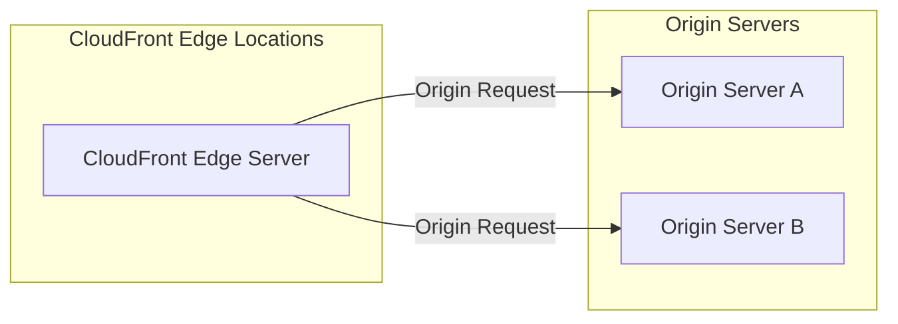

**Advanced Architecture**

At its core, [[Master/Git_hub_notes/AWS-SAP-C02-Notes-main/README|CloudFront]] is a globally distributed network of edge servers that cache and deliver content from the closest location to the end user. This is achieved through a process called *origin request* where [[Master/Git_hub_notes/AWS-SAP-C02-Notes-main/README|CloudFront]] sends requests to the origin server (e.g., an [[AWS_SA_PRO_Obsidian_Notes/Master/S3|S3]] bucket or an HTTP server) for resources not already cached at the edge.

When setting up [[Master/Git_hub_notes/AWS-SAP-C02-Notes-main/README|CloudFront]] origins, there are several advanced configurations to consider:

- **Multiple Origins:** You can configure multiple origins in one [[Master/Git_hub_notes/AWS-SAP-C02-Notes-main/README|CloudFront]] distribution, allowing you to serve assets from different locations based on URL path pattern, cache behavior, or other [[cloudformation|conditions]].
- **Origin Groups:** For high availability scenarios, use Origin Groups to failover between two or more identical origins.
- **Origin [[shield]]:** To reduce the load on your origin infrastructure, enable Origin [[shield]] to distribute requests across a set of [[shield]] locations before sending them to your origin.
- **Cache [[policies]]:** Control how long content remains in [[Master/Git_hub_notes/AWS-SAP-C02-Notes-main/README|CloudFront]] caches using predefined cache behaviors or custom cache [[policies]].

Here's a Mermaid diagram illustrating a typical multi-origin setup:



**Comparison & Anti-Patterns**

Comparing [[Master/Git_hub_notes/AWS-SAP-C02-Notes-main/README|CloudFront]] to alternative services like Amazon [[AWS_SA_PRO_Obsidian_Notes/Master/S3|S3]] Transfer Acceleration and [[Master/Git_hub_notes/AWS-SAP-C02-Notes-main/README|Route 53]], here are some factors to consider:

| Service | Ideal Use Case |
|---|---|
| [[Git_hub_notes/AWS-SAP-C02-Notes-main/README|CloudFront]] | Global delivery of dynamic and static web content with edge-caching capabilities. |
| [[Srinivas_Notes/S3|S3]] Transfer Acceleration | Point-to-point transfers to specific [[Srinivas_Notes/S3|S3]] buckets when serving from a centralized location. |
| [[Git_hub_notes/AWS-SAP-C02-Notes-main/README|Route 53]] | Content routing based on latency, geolocation, or multivalue answer. |

Anti-patterns include using [[Master/Git_hub_notes/AWS-SAP-C02-Notes-main/README|CloudFront]] as a simple CDN without considering granular cache control and [[appsync|security]] requirements. Additionally, using [[Master/Git_hub_notes/AWS-SAP-C02-Notes-main/README|CloudFront]] only for origin offloading may lead to underutilization of features such as device-detection, cookie-based cache manipulation, and query string parameters handling.

**[[appsync|Security]] & Governance**

Complex [[Master/Git_hub_notes/AWS-SAP-C02-Notes-main/README|IAM]] [[policies]] involve granting fine-grained permissions to [[Master/Git_hub_notes/AWS-SAP-C02-Notes-main/README|CloudFront]] users and roles. Here's an example JSON policy snippet demonstrating restricted access to [[Master/Git_hub_notes/AWS-SAP-C02-Notes-main/README|CloudFront]] distributions:

```json
{
  "Effect": "Allow",
  "Action": [
    "cloudfront:CreateInvalidation",
    "cloudfront:Get*"
  ],
  "Resource": [
    "*"
  ],
  "Condition": {
    "StringEquals": {
      "aws:SourceVpce": "vpce-1234567890abcdef0"
    }
  }
}
```

Cross-account access involves sharing [[Master/Git_hub_notes/AWS-SAP-C02-Notes-main/README|CloudFront]] distributions between accounts using origin access identities (OAI) or by specifying alternate payload [[kms|signing]] key pairs. Organizational Service Control [[policies]] (SCPs) can enforce restrictions related to creating, updating, or deleting [[Master/Git_hub_notes/AWS-SAP-C02-Notes-main/README|CloudFront]] distributions.

**Performance & Reliability**

Throttling limits vary depending on the type of operation performed on [[Master/Git_hub_notes/AWS-SAP-C02-Notes-main/README|CloudFront]] resources. In case of exceeding these limits, implement exponential backoff strategies for retries. High availability and [[Master/Git_hub_notes/AWS-SAP-C02-Notes-main/README|disaster recovery]] patterns include origin redundancy, origin groups, and active-active deployments.

**[[Master/Git_hub_notes/AWS-SAP-C02-Notes-main/README|Cost Optimization]]**

Granular cost controls involve monitoring usage metrics, enabling [[billing]] alarms, optimizing cache [[policies]], and selecting appropriate pricing options (e.g., pay-as-you-go or reserved capacity). Calculating costs requires understanding the pricing model, including data transfer charges, number of requests, and any additional features used (like [[cloudfront|field-level encryption]] or real-time logs).

**Professional Exam Scenarios**

Scenario 1: Multi-account Deployment

Suppose you have two AWS accounts: Account A (production) and Account B (staging). You want to share a single [[Master/Git_hub_notes/AWS-SAP-C02-Notes-main/README|CloudFront]] distribution from Account A with users in Account B while restricting their actions to invalidations only.

Correct Answer: Create an [[Master/Git_hub_notes/AWS-SAP-C02-Notes-main/README|IAM]] role in Account A with the necessary [[Master/Git_hub_notes/AWS-SAP-C02-Notes-main/README|CloudFront]] permissions and add a trust relationship with the [[Master/Git_hub_notes/AWS-SAP-C02-Notes-main/README|IAM]] entity (user or role) in Account B.

Incorrect Answers:

- Creating a second [[Master/Git_hub_notes/AWS-SAP-C02-Notes-main/README|CloudFront]] distribution in Account B pointing to the same origin.
- Modifying the existing [[Master/Git_hub_notes/AWS-SAP-C02-Notes-main/README|CloudFront]] distribution in Account A to allow cross-account access for Account B.

Scenario 2: Cost Management

Assume you need to minimize costs associated with serving large files via [[Master/Git_hub_notes/AWS-SAP-C02-Notes-main/README|CloudFront]]. The solution should ensure minimal latency and maintain high performance levels.

Correct Answer: Implement a combination of cache behaviors and price classes to optimize costs while maintaining acceptable performance levels.

Incorrect Answers:

- Using [[AWS_SA_PRO_Obsidian_Notes/Master/S3|S3]] Transfer Acceleration instead of [[Master/Git_hub_notes/AWS-SAP-C02-Notes-main/README|CloudFront]] due to higher costs.
- Serving all content over HTTPS regardless of file size and sensitivity, which would increase cost unnecessarily.