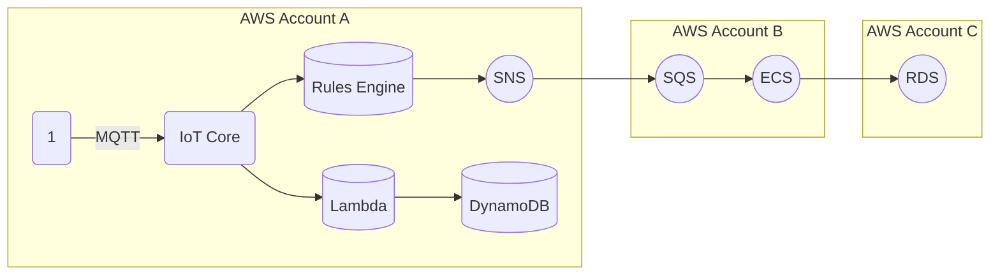

**[[RDS_Instance_Types|1. Advanced Architecture]]**

[[iot]] Core is a managed service that allows devices to connect securely and interact with [[Master/Git_hub_notes/AWS-SAP-C02-Notes-main/README|other AWS services]]. [[iot]] Core operates at two levels: the device level and the application level. At the device level, [[iot]] Core uses device shadows to provide a virtual version of each device, enabling you to query the state of a device even when it's offline. [[iot]] Core also supports customizable behavior using rules engine, which enables actions based on messages from devices or topics.

The following diagram shows an advanced architecture using [[iot]] Core:



In this example, multiple accounts are used to separate responsibilities and resources. Devices in Account A send data to [[iot]] Core, triggering actions through the rules engine. The rules engine can publish messages to [[sns]] topics, invoke [[Master/Git_hub_notes/AWS-SAP-C02-Notes-main/README|Lambda functions]], or store data in [[dynamodb]]. In Account B, [[sns]] messages are sent to [[sqs]] queues, triggering tasks in [[ecs]]. These tasks can then write data to [[Master/Git_hub_notes/AWS-SAP-C02-Notes-main/README|RDS]] instances in Account C.

**[[RDS_Instance_Types|2. Comparison & Anti-Patterns]]**

| Service | Use Case |
|---|---|
| [[iot]] Core | Secure device connectivity, real-time messaging, rule-based processing. |
| [[kinesis|Kinesis Data Streams]] | High-throughput, real-time data ingestion. |
| [[sqs]] | Asynchronous message passing between components. |
| [[sns]] | Publish-subscribe messaging for event-driven architectures. |

Anti-pattern: Using [[iot]] Core as a messaging system without considering other options like [[sqs]], [[sns]], or [[kinesis|Kinesis Data Streams]].

**[[RDS_Instance_Types|3. Security & Governance]]**

[[Master/Git_hub_notes/AWS-SAP-C02-Notes-main/README|IAM]] [[policies]] for [[iot]] Core should be fine-grained, allowing specific actions on particular resources. For instance, allow only MQTT connections from specific IP addresses:

```json
{
  "Effect": "Allow",
  "Action": "iot:Connect",
  "Resource": "arn:aws:iot:*:user/MyDevice",
  "Condition": {
    "IpAddress": {"AWS": ["192.0.2.0/24"]}
  }
}
```

Cross-account access can be granted by creating a role in the source account that allows [[iot]] Core actions. Then, add the role ARN to the destination account's [[iot]] Core resource policy.

Use Organization Service Control [[policies]] (SCPs) to restrict [[iot]] Core usage across member accounts:

```json
{
  "Version": "2012-10-17",
  "Statement": [
    {
      "Effect": "Deny",
      "Action": "iot:*",
      "Resource": "*",
      "Condition": {
        "StringEqualsIgnoreCase": {
          "aws:PrincipalOrgID": "o-123456789012"
        },
        "StringNotLikeIfExists": {
          "aws:SourceVpce": "vpce-1234abcd"
        }
      }
    }
  ]
}
```

**[[RDS_Instance_Types|4. Performance & Reliability]]**

Throttling limits apply to [[iot]] Core connections, topic rules, and device shadows. To handle throttling [[api-gateway|errors]], implement exponential backoff strategies using SDKs or client libraries.

For high availability and [[Master/Git_hub_notes/AWS-SAP-C02-Notes-main/README|disaster recovery]], distribute [[iot]] Core resources across different regions and Availability Zones. Ensure that your applications can handle failover scenarios and maintain session state.

**[[RDS_Instance_Types|5. Cost Optimization]]**

Granular cost controls include monitoring active connections and managing message size. Additionally, monitor unused things, certificates, and rules to avoid unnecessary costs.

Calculate [[iot]] Core costs using the pricing calculator or the AWS [[billing|Cost Explorer]] tool.

**[[RDS_Instance_Types|6. Professional Exam Scenarios]]**

Scenario 1:
You need to create a solution that collects temperature readings from thousands of sensors deployed worldwide. Process these readings in near real-time and store them in a database for later analysis. Design a scalable and cost-effective solution.

Correct answer: Use [[iot]] Core to manage sensor connections, device shadows, and rule-based processing. Send messages to [[kinesis|Kinesis Data Streams]] for real-time processing and storage. Store processed records in a time-series database like [[Timestream]].

Incorrect answer: Use [[iot]] Core to manage sensor connections and send all messages directly to [[AWS_SA_PRO_Obsidian_Notes/Master/S3|S3]] for storage. This approach lacks real-time processing capabilities and may result in higher latency and increased storage costs.

Scenario 2:
Design a solution that requires sharing telemetry data between two departments while ensuring proper governance and separation of concerns. Both departments need access to the same set of devices but have different requirements for processing and storing the data.

Correct answer: Set up two AWS accounts, one for each department. Connect devices to [[iot]] Core in the shared account. Create rules to share messages with both departments' accounts using [[sns]] topics. Implement separate [[Master/Git_hub_notes/AWS-SAP-C02-Notes-main/README|Lambda functions]], [[dynamodb|DynamoDB tables]], and [[AWS_SA_PRO_Obsidian_Notes/Master/S3|S3]] buckets in each department's account for further processing and storage.

Incorrect answer: Place all devices, [[iot]] Core, and downstream resources in the same account. While this approach simplifies management, it does not address the requirement for separation of concerns.