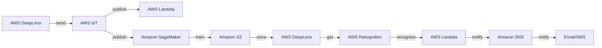

**[[RDS_Instance_Types|1. Advanced Architecture]]**

At its core, AWS DeepLens is a physical device that combines a camera, a computer, and a set of sensors. It runs Amazon Linux and supports [[iot|AWS Greengrass]] for local compute capabilities. The device has an array of pre-built models and sample projects, allowing developers to perform tasks such as object detection or facial recognition locally.

The following diagram shows how AWS DeepLens interacts with [[Master/Git_hub_notes/AWS-SAP-C02-Notes-main/README|other AWS services]] at a high level:



When using AWS DeepLens in production scenarios, it's crucial to understand [[RDS_Instance_Types|global scale considerations]]. For instance, if you need to deploy multiple devices across different regions, you should leverage separate AWS accounts for each region to ensure data isolation and optimize quota management. Also, consider using [[AWS_SA_PRO_Obsidian_Notes/Master/03-networking/privatelink|VPC endpoints]] for [[iot|AWS IoT]] to secure communications between your devices and AWS services.

**[[RDS_Instance_Types|2. Comparison & Anti-Patterns]]**

| Service | Use Case |
|---|---|
| AWS DeepLens | Prototyping ML applications with visual input, e.g., object detection or facial recognition. |
| [[lambda|AWS Lambda]] + Amazon [[kinesis-video-streams|Kinesis Video Streams]] | Real-time video processing without the need for physical devices. |
| [[Git_hub_notes/AWS-SAP-C02-Notes-main/README|Amazon Rekognition]] + Amazon [[api-gateway|API Gateway]] + [[lambda|AWS Lambda]] | Serverless image/video analysis in response to RESTful requests. |

Common anti-patterns include attempting to use AWS DeepLens for large-scale video processing or real-time analytics when alternative solutions like [[kinesis-video-streams|Kinesis Video Streams]] would be more appropriate. Additionally, using AWS DeepLens as a primary storage solution for images or videos captured by the device is discouraged due to limited local storage capacity.

**[[RDS_Instance_Types|3. Security & Governance]]**

To implement fine-grained [[appsync|security]] and governance [[policies]], consider using [[organizations|AWS Organizations]] and Service Control [[policies]] (SCPs) to restrict specific actions within AWS DeepLens. Here's an example [[SCP]] that prevents creating [[iot]] topics from the AWS DeepLens console:

```json
{
    "Version": "2012-10-17",
    "Statement": [
        {
            "Effect": "Deny",
            "Action": [
                "iot:CreateTopic"
            ],
            "Resource": [
                "*"
            ],
            "Condition": {
                "StringEqualsIfExists": {
                    "aws:PrincipalArn": [
                        "arn:aws:iam::*:role/AWSDeepLensAccessRole"
                    ]
                }
            }
        }
    ]
}
```

Additionally, ensure proper cross-account access by configuring [[Master/Git_hub_notes/AWS-SAP-C02-Notes-main/README|IAM]] roles and permissions using JSON [[policies]] similar to the following example:

```json
{
    "Version": "2012-10-17",
    "Statement": [
        {
            "Effect": "Allow",
            "Action": [
                "sagemaker:*",
                "s3:GetBucketLocation",
                "s3:PutObject",
                "s3:ListBucket",
                "iot:Publish",
                "iot:Subscribe",
                "lambda:InvokeFunction",
                "rekognition:Detect*",
                "greengrass:*"
            ],
            "Resource": [
                "*"
            ]
        }
    ]
}
```

**[[RDS_Instance_Types|4. Performance & Reliability]]**

AWS DeepLens imposes several throttling limits, including a maximum number of messages sent via MQTT (120 messages per minute) and a limit on concurrent [[lambda]] function executions. To manage these [[AWS_SA_PRO_Obsidian_Notes/Master/12-security-and-config/cloudhsm|limitations]], consider implementing exponential backoff strategies when handling [[api-gateway|errors]] during communication with AWS services.

For high availability and [[Master/Git_hub_notes/AWS-SAP-C02-Notes-main/README|disaster recovery]], distribute AWS DeepLens devices across multiple regions and AWS accounts while ensuring centralized monitoring and alerting through services like Amazon [[cloudwatch]].

**[[RDS_Instance_Types|5. Cost Optimization]]**

To optimize costs when working with AWS DeepLens, consider the following [[iam|best practices]]:

- Store media assets in Amazon [[AWS_SA_PRO_Obsidian_Notes/Master/S3|S3]] instead of using the local storage provided by AWS DeepLens.
- Monitor usage metrics and set up alerts for potential cost spikes.
- Utilize AWS [[billing|Cost Explorer]] to analyze spending trends and identify areas that require optimization.

Here's an example [[cloudwatch]] dashboard configuration that includes essential AWS DeepLens metrics:

```yaml
{
    "start": "-P14D",
    "views": [
        {
            "title": "AWS DeepLens Metrics",
            "width": 12,
            "widgets": [
                {
                    "view": "table",
                    "columns": [
                        "timestamp",
                        "label",
                        "value",
                        "unit"
                    ],
                    "region": "YOUR_REGION",
                    "statistics": [
                        "SampleCount",
                        "Sum",
                        "Minimum",
                        "Maximum"
                    ],
                    "period": 86400,
                    "namespace": "AWS/IoTData",
                    "dimensions": [
                        {
                            "name": "topicFilter",
                            "value": "deepLens/topic/*"
                        }
                    ],
                    "orderBy": "value desc"
                }
            ]
        }
    ]
}
```

**[[RDS_Instance_Types|6. Professional Exam Scenarios]]**

Scenario 1: A retail company wants to build an AI-powered store that uses AWS DeepLens to detect customers entering the store and display personalized greetings based on their purchase history. They also want to store images of customers for future analysis. However, they have strict privacy requirements and don't want to expose customer images publicly.

Correct answer:

Use AWS DeepLens to detect customers and trigger [[Master/Git_hub_notes/AWS-SAP-C02-Notes-main/README|Lambda functions]] that fetch customer information from a private database. Display personalized greetings on digital signage. Store images in Amazon [[AWS_SA_PRO_Obsidian_Notes/Master/S3|S3]] with restricted access control.

Incorrect answer:

Send customer images directly to [[Master/Git_hub_notes/AWS-SAP-C02-Notes-main/README|Amazon Rekognition]] for further analysis since this approach may violate privacy requirements.

Scenario 2: An industrial manufacturing firm needs to monitor equipment [[cloudformation|conditions]] using AWS DeepLens. The system must send notifications when anomalies are detected. However, the network infrastructure doesn't allow direct connections to [[iot|AWS IoT]].

Correct answer:

Set up [[iot|AWS Greengrass]] on AWS DeepLens to process video streams locally and send metadata to [[iot|AWS IoT Core]]. Implement [[Master/Git_hub_notes/AWS-SAP-C02-Notes-main/README|Lambda functions]] to analyze metadata and send notifications using Amazon [[sns]].

Incorrect answer:

Directly connect AWS DeepLens to [[iot|AWS IoT Core]] since this approach won't work without proper network configurations.