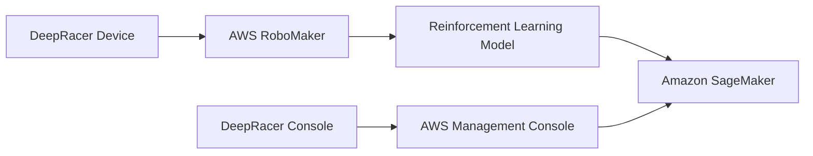

Advanced Architecture
---------------------

At its core, DeepRacer is built on a variety of AWS services including [[Master/Git_hub_notes/AWS-SAP-C02-Notes-main/README|Amazon SageMaker]], AWS [[RoboMaker]], and [[lambda|AWS Lambda]]. The service utilizes reinforcement learning models trained in a 3D racing simulator powered by [[Master/Git_hub_notes/AWS-SAP-C02-Notes-main/README|Amazon SageMaker]], which uses a variety of machine learning algorithms and techniques to train the model. The trained models are then deployed to the DeepRacer device, which uses AWS [[RoboMaker]] to control the vehicle.

The following Mermaid diagram illustrates the high-level architecture of DeepRacer:

When deploying DeepRacer at scale, there are several considerations that must be taken into account. One such consideration is the use of separate accounts for different environments (e.g. development, staging, production). This allows for granular control over permissions, quotas, and costs. Additionally, the use of [[organizations|AWS Organizations]] and Service Control [[policies]] (SCPs) can help ensure that these separate accounts adhere to organizational [[policies]] and guidelines.

Comparison & Anti-Patterns
---------------------------

While DeepRacer is a powerful tool for training reinforcement learning models, it is not always the best solution for every use case. Some common anti-patterns include:

* **Small-scale projects**: DeepRacer is designed for large-scale, enterprise-level projects. For small-scale projects or prototypes, other tools or services may be more appropriate.
* **Image recognition or natural language processing tasks**: DeepRacer is specifically designed for reinforcement learning tasks. For image recognition or natural language processing tasks, other services such as [[Master/Git_hub_notes/AWS-SAP-C02-Notes-main/README|Amazon Rekognition]] or [[AWS_SA_PRO_Obsidian_Notes/Master/16-other/comprehend|Amazon Comprehend]] may be more suitable.
* **Real-world data collection**: DeepRacer's 3D racing simulator does not allow for the collection of real-world data. For projects that require real-world data collection, other services such as [[iot|AWS IoT]] or Amazon [[kinesis]] may be more appropriate.

The following table compares DeepRacer to other machine learning services offered by AWS:

| Service | Primary Use Case |
| --- | --- |
| DeepRacer | Reinforcement learning |
| [[Git_hub_notes/AWS-SAP-C02-Notes-main/README|Amazon SageMaker]] | General machine learning |
| [[Git_hub_notes/AWS-SAP-C02-Notes-main/README|Amazon Rekognition]] | Image recognition |
| [[Git_hub_notes/certified-aws-solutions-architect-professional-main/16-other/comprehend|Amazon Comprehend]] | Natural language processing |
| [[iot|AWS IoT]] | Real-world data collection |

[[appsync|Security]] & Governance
----------------------

DeepRacer provides several [[appsync|security]] and governance features, including:

* **[[Master/Git_hub_notes/AWS-SAP-C02-Notes-main/README|IAM]] roles and [[policies]]**: DeepRacer utilizes [[Master/Git_hub_notes/AWS-SAP-C02-Notes-main/README|IAM]] roles and [[policies]] to manage permissions and access to resources. These roles and [[policies]] can be configured at both the account and organization level.
* **Cross-account access**: DeepRacer supports cross-account access, allowing resources from one account to access resources in another account. This can be useful when implementing multi-account strategies.
* **Organization Service Control [[policies]] (SCPs)**: [[organizations]] can use SCPs to enforce organizational [[policies]] and guidelines across all accounts within the organization.

The following JSON snippet shows an example [[Master/Git_hub_notes/AWS-SAP-C02-Notes-main/README|IAM]] policy for DeepRacer:
```json
{
    "Version": "2012-10-17",
    "Statement": [
        {
            "Effect": "Allow",
            "Action": [
                "sagemaker:CreateModel",
                "sagemaker:DescribeModel",
                "sagemaker:DeleteModel"
            ],
            "Resource": [
                "*"
            ]
        }
    ]
}
```
This policy allows the specified [[Master/Git_hub_notes/AWS-SAP-C02-Notes-main/README|IAM]] user or role to create, describe, and delete SageMaker models, which are used by DeepRacer.

Performance & Reliability
--------------------------

DeepRacer has several throttling limits and [[iam|best practices]] for handling throttling [[api-gateway|errors]]. Some of these [[iam|best practices]] include:

* **Exponential backoff**: When making requests to DeepRacer APIs, use an exponential backoff strategy to handle throttling [[api-gateway|errors]]. This involves increasing the amount of time between retries after each failed request.
* **Batch requests**: Instead of making individual requests, batch multiple requests together to reduce the number of API calls.
* **Throttling limits**: Be aware of the throttling limits for each DeepRacer API and design your application accordingly.

DeepRacer also supports high availability and [[Master/Git_hub_notes/AWS-SAP-C02-Notes-main/README|disaster recovery]] patterns, including:

* **Multi-region deployment**: Deploying DeepRacer resources across multiple regions can provide increased availability and redundancy.
* **Backup and restore**: Backup DeepRacer resources regularly to protect against data loss. In the event of a failure, restore the backup to a new region or account.

[[Master/Git_hub_notes/AWS-SAP-C02-Notes-main/README|Cost Optimization]]
------------------

DeepRacer provides several [[Master/Git_hub_notes/AWS-SAP-C02-Notes-main/README|cost optimization]] features, including:

* **Granular cost controls**: DeepRacer provides granular cost controls, allowing you to set [[Budgets]], alarms, and quotas at the account and organization level.
* **Usage reports**: DeepRacer provides usage reports, allowing you to track and analyze your spending.
* **Cost estimation**: DeepRacer provides cost estimation tools, allowing you to estimate the cost of your project before implementation.

The following formula can be used to calculate the cost of running a DeepRacer model:

Cost = (Number of Training Hours \* Training Cost) + (Number of Inference Hours \* Inference Cost)

For example, if a model is trained for 10 hours and then used for inference for 5 hours, and the training cost is $0.10 per hour and the inference cost is $0.05 per hour, the total cost would be:

Cost = (10 \* $0.10) + (5 \* $0.05) = $1.25

Professional Exam Scenario
--------------------------

### Scenario 1

You are tasked with designing a DeepRacer solution for a large enterprise. The solution must be scalable, secure, and cost-effective. You decide to implement a multi-account strategy, using separate accounts for development, staging, and production. You also configure [[Master/Git_hub_notes/AWS-SAP-C02-Notes-main/README|IAM]] roles and [[policies]] to manage permissions and access to resources. To further increase [[appsync|security]], you enable cross-account access and implement Organization SCPs.

#### Question 1

Which of the following statements regarding this scenario is true?

A) This solution is not scalable because it does not utilize multi-region deployment.
B) This solution is not secure because it does not implement [[Master/Git_hub_notes/AWS-SAP-C02-Notes-main/README|IAM]] roles and [[policies]].
C) This solution is not cost-effective because it utilizes separate accounts for development, staging, and production.
D) All of the above.

Answer: C) This solution is not cost-effective because it utilizes separate accounts for development, staging, and production.

Justification: While utilizing separate accounts for development, staging, and production can increase [[appsync|security]] and scalability, it can also increase costs. However, this cost can be justified by the increased [[appsync|security]] and scalability provided by the multi-account strategy.

#### Question 2

Which of the following steps should be taken to further optimize the cost of this solution?

A) Implementing a cost estimation tool to estimate the cost of the project before implementation.
B) Setting [[Budgets]], alarms, and quotas at the account and organization level.
C) Using batch requests to reduce the number of API calls.
D) All of the above.

Answer: D) All of the above.

Justification: All of the listed steps can help optimize the cost of the solution. Implementing a cost estimation tool can help estimate the cost of the project before implementation, while setting [[Budgets]], alarms, and quotas can help monitor and control costs. Using batch requests can also help reduce the number of API calls, which can help decrease costs.

### Scenario 2

You are tasked with implementing a reinforcement learning project using DeepRacer. You plan to train a model using the 3D racing simulator, and then deploy the trained model to a physical DeepRacer device. You want to ensure that the solution is highly available and reliable.

#### Question 1

Which of the following steps should be taken to ensure high availability and reliability of the solution?

A) Implementing a multi-region deployment.
B) Configuring backup and restore mechanisms.
C) Implementing an exponential backoff strategy for API requests.
D) All of the above.

Answer: B) Configuring backup and restore mechanisms.

Justification: While implementing a multi-region deployment and an exponential backoff strategy can improve availability and reliability, they are not necessary for this specific scenario. Configuring backup and restore mechanisms, however, is important to protect against data loss and ensure the availability and reliability of the solution.

#### Question 2

Which of the following throttling limits apply to the DeepRacer API?

A) 10 requests per second.
B) 100 requests per minute.
C) 1000 requests per hour.
D) There are no throttling limits for the DeepRacer API.

Answer: B) 100 requests per minute.

Justification: According to the DeepRacer documentation, the throttling limit for the DeepRacer API is 100 requests per minute. It is important to be aware of this limit and design your application accordingly to avoid throttling [[api-gateway|errors]].