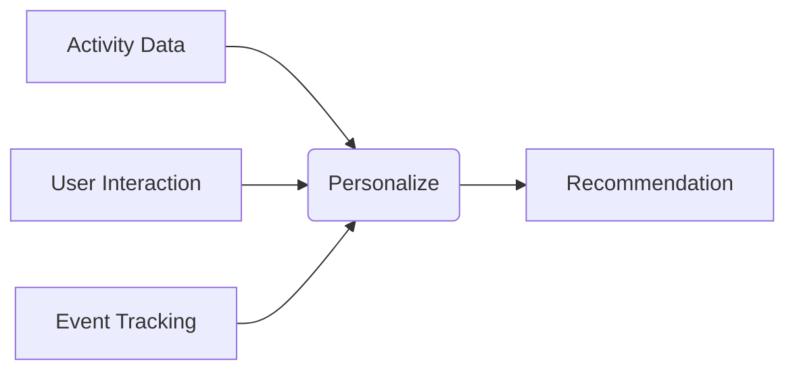

## [[RDS_Instance_Types|1. Advanced Architecture]]

At its core, Amazon Personalize is a fully managed AI service that uses machine learning algorithms to analyze user behavior and activity, and then provides individualized recommendations and tailored content. It does this by building a custom ML model from your data, which can be deployed across multiple regions for global scale. The following diagram shows an architecture using Personalize:



The primary components of Personalize include:

- **Activity Data**: User interaction data used as input to train the ML models. This could include user engagement metrics such as clicks, views, purchases, etc.
- **Recommendation**: The output of the Personalize service, which includes personalized recommendations based on the user's past interactions.
- **Event Tracking**: Tracks user events and sends them to Personalize in real time, allowing for continuous improvement of the ML models.

Global scale can be achieved by deploying Personalize solutions in multiple regions, and using [[AWS_SA_PRO_Obsidian_Notes/Master/11-migrations/datasync|AWS DataSync]] or [[kinesis|Kinesis Data Firehose]] to replicate activity data between regions.

## [[RDS_Instance_Types|2. Comparison & Anti-Patterns]]

When not to use Personalize:

| Service | Use Case |
| --- | --- |
| [[Git_hub_notes/AWS-SAP-C02-Notes-main/README|Amazon SageMaker]] | If you have existing ML expertise and prefer full control over the ML process, including training and deployment. |
| [[Git_hub_notes/AWS-SAP-C02-Notes-main/README|Amazon Rekognition]] | For image and video analysis tasks. |
| [[Git_hub_notes/certified-aws-solutions-architect-professional-main/16-other/comprehend|Amazon Comprehend]] | For natural language processing tasks. |

Common anti-patterns include:

- Using Personalize for non-personalization use cases, such as anomaly detection or fraud prevention.
- Not properly tracking user events, leading to poor quality recommendations.
- Ignoring throttling limits and [[iam|best practices]] for handling exceptions.

## [[RDS_Instance_Types|3. Security & Governance]]

To secure Personalize, it's important to follow [[iam|best practices]] for [[Master/Git_hub_notes/AWS-SAP-C02-Notes-main/README|IAM]] roles, cross-account access, and organization service control [[policies]] (SCPs):

[[Master/Git_hub_notes/AWS-SAP-C02-Notes-main/README|IAM]] Role Example:
```json
{
    "Version": "2012-10-17",
    "Statement": [
        {
            "Effect": "Allow",
            "Action": [
                "personalize:*"
            ],
            "Resource": [
                "*"
            ]
        }
    ]
}
```
Cross-Account Access Example:
```json
{
    "Version": "2012-10-17",
    "Statement": [
        {
            "Effect": "Allow",
            "Principal": {
                "AWS": "arn:aws:iam::123456789012:root"
            },
            "Action": [
                "personalize:CreateDataset*,createDatasetGroup*,createSchema*"
            ],
            "Resource": [
                "*"
            ],
            "Condition": {
                "StringEquals": {
                    "personalize:RecipeCategory": [
                        "aws-personalize-events"
                    ]
                }
            }
        }
    ]
}
```
Organization [[SCP]] Example:
```json
{
    "Version": "2012-10-17",
    "Statement": [
        {
            "Effect": "Deny",
            "NotAction": [
                "personalize:Describe*",
                "personalize:List*"
            ],
            "Resource": [
                "*"
            ]
        }
    ]
}
```

## [[RDS_Instance_Types|4. Performance & Reliability]]

Throttling limits in Personalize depend on the specific API operation, but generally range from 1 to 10 requests per second. To handle throttling exceptions, use exponential backoff strategies, such as:

1. Initial request without delay.
2. Wait for 2^n seconds before retrying, up to a maximum of 32 seconds.
3. Increase n by 1 after each failed attempt.

For high availability and [[Master/Git_hub_notes/AWS-SAP-C02-Notes-main/README|disaster recovery]], Personalize supports multi-region deployments, as well as backup and restore functionality.

## [[RDS_Instance_Types|5. Cost Optimization]]

Granular cost controls in Personalize include usage-based [[billing]] for each dataset, dataset group, and recommendation engine. Additionally, you can monitor costs using Amazon [[cloudwatch|CloudWatch alarms]] and [[Budgets]].

Calculation example:

Suppose you pay $4.00 per GB for active dataset storage, and you store 10 GB of data for 30 days. Your monthly cost would be:

(10 GB \* $4.00 / GB \* 30 days) = $120


## [[RDS_Instance_Types|6. Professional Exam Scenarios]]

### Scenario 1:

You need to build a personalized news recommendation system that supports multiple languages and operates at global scale. The solution must also meet strict [[appsync|security]] requirements, including encryption of all data at rest and in transit, and restricting access to authorized users only.

Correct Answer: Use Amazon Personalize with AWS Key Management Service ([[kms]]) for encryption, and deploy the solution in multiple regions for global scale. Implement [[Master/Git_hub_notes/AWS-SAP-C02-Notes-main/README|IAM]] roles and [[policies]] for fine-grained access control.

Incorrect Answers:

- Using Amazon Elasticsearch: While Elasticsearch can be used for search and analytics, it lacks the ML capabilities required for personalized recommendations.
- Storing all data in one region: This approach does not support global scale and may result in poor performance for users located far from the selected region.

### Scenario 2:

Your company wants to implement personalized product recommendations for its e-commerce platform. However, due to regulatory restrictions, all customer data must remain within the EU.

Correct Answer: Use Amazon Personalize with [[AWS_SA_PRO_Obsidian_Notes/Master/03-networking/privatelink|VPC endpoints]] to ensure private connectivity between the application and Personalize, and deploy the solution within the EU region.

Incorrect Answers:

- Using [[Master/Git_hub_notes/AWS-SAP-C02-Notes-main/README|Amazon SageMaker]]: While SageMaker offers more control over the ML process, it does not provide built-in privacy features like Personalize.
- Deploying the solution outside the EU: This approach violates regulatory requirements and may result in penalties.