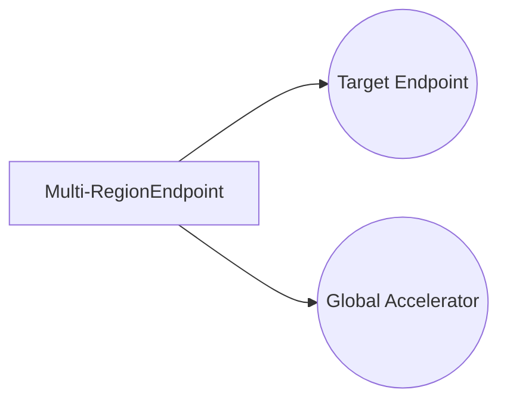

**[[RDS_Instance_Types|1. Advanced Architecture]]**

SageMaker Endpoints allow you to deploy ML models for real-time inference. They are composed of two parts: a *model* and a *variant*. The variant defines how the model is deployed, including instance type and number. Each variant can have multiple *invocation configurations*, which define things like the method used for inference (either synchronous or asynchronous) and the serialization formats for input/output data.

Internally, SageMaker Endpoints consist of one or more *hosting instances* that run the model code. These instances are managed by a *dispatcher*, which routes incoming requests to the appropriate instance(s). The dispatcher uses a load balancing algorithm to distribute traffic across instances, ensuring high availability.

For [[RDS_Instance_Types|global scale considerations]], you can set up Multi-Region Endpoints using [AWS Global Accelerator](https://aws.amazon.com/global-accelerator/). This allows you to improve latency by serving traffic from the region closest to your end users. To do this, create a Multi-RegionEndpoint resource in the source region, specifying the target endpoint(s) in other regions. Global Accelerator then assigns each user to the best region based on their location and network performance.



**[[RDS_Instance_Types|2. Comparison & Anti-Patterns]]**

| Service          | Use Case                                                         | Anti-Pattern                                              |
|------------------|-----------------------------------------------------------------|------------------------------------------------------------|
| SageMaker Endpoints    | Real-time inference, low-to-medium latency                      | High-throughput batch processing                           |
| Batch Transform    | High-throughput batch processing                                | Low-latency real-time inference                            |
| [[lambda]]           | Serverless architecture, variable workloads                     | Stateful applications requiring long-term storage            |
| ECS/EKS           | Containerized microservices, distributed systems                | Stateless workloads without container support                |

Common anti-patterns include using SageMaker Endpoints for high-throughput batch processing tasks (use Batch Transform instead) and using [[lambda]] or ECS/EKS for stateful applications that require long-term storage (use SageMaker Endpoints and store model artifacts in Amazon [[AWS_SA_PRO_Obsidian_Notes/Master/S3|S3]]).

**[[RDS_Instance_Types|3. Security & Governance]]**

To manage access to SageMaker Endpoints, use complex [[Master/Git_hub_notes/AWS-SAP-C02-Notes-main/README|IAM]] [[policies]] and organization SCPs. Here's an example policy allowing invocation of a specific endpoint:

```json
{
  "Effect": "Allow",
  "Action": [
    "sagemaker:InvokeEndpoint"
  ],
  "Resource": "arn:aws:sagemaker:us-west-2:123456789012:endpoint/MyEndpoint"
}
```

For cross-account access, attach the following [[Master/Git_hub_notes/AWS-SAP-C02-Notes-main/README|IAM]] role to the source account:

```json
{
  "Version": "2012-10-17",
  "Statement": [
    {
      "Effect": "Allow",
      "Principal": {
        "AWS": "123456789012"
      },
      "Action": [
        "sagemaker:CreatePresignedModelEndpoint",
        "sagemaker:DeleteEndpoint",
        "sagemaker:DescribeEndpoint",
        "sagemaker:UpdateEndpoint"
      ],
      "Resource": "arn:aws:sagemaker:us-west-2:012345678901:endpoint/MyEndpoint"
    }
  ]
}
```

Organization SCPs can enforce restrictions on creating and updating endpoints. For example:

```json
{
  "Sid": "DenySageMakerEndpoints",
  "Effect": "Deny",
  "Actions": [
    "sagemaker:CreateEndpoint",
    "sagemaker:UpdateEndpoint"
  ],
  "Resource": "*",
  "Condition": {
    "StringNotEqualsIfExists": {
      "sagemaker:ResourceType": "Endpoint"
    }
  }
}
```

**[[RDS_Instance_Types|4. Performance & Reliability]]**

Throttling limits for SageMaker Endpoints depend on the instance type and number of variants. [[nonportable_instructions|Review]] the [official documentation](https://docs.aws.amazon.com/sagemaker/latest/dg/service-quotas.html) for current limits.

Exponential backoff strategies should be implemented when handling throttled requests. A sample strategy includes:

1. Retry request with a fixed delay (e.g., 1 second).
2. If the request still fails, double the delay before retrying (e.g., 2 seconds).
3. Repeat steps 1 and 2 until reaching a maximum delay (e.g., 64 seconds).
4. After reaching the maximum delay, wait for a random period between 1x and 2x the maximum delay before retrying.

High availability and [[Master/Git_hub_notes/AWS-SAP-C02-Notes-main/README|disaster recovery]] patterns involve setting up multiple replicas of the same endpoint in different regions or Availability Zones. In case of failure, traffic will automatically be routed to healthy replicas.

**[[RDS_Instance_Types|5. Cost Optimization]]**

Granular cost controls for SageMaker Endpoints include selecting the right instance types, reducing idle time, and adjusting concurrency settings. Calculate costs using the [SageMaker pricing page](https://aws.amazon.com/sagemaker/pricing/) and monitor usage with [[cloudwatch]] metrics.

**6. Professional Exam Scenario #1**

You are tasked with building a real-time image recognition system for a retail company. The system must process customer images and identify products within them. Describe the architecture and justify your choices.

_Architecture:_

1. Train a machine learning model using [[Master/Git_hub_notes/AWS-SAP-C02-Notes-main/README|Amazon SageMaker]].
2. Store the trained model in Amazon [[AWS_SA_PRO_Obsidian_Notes/Master/S3|S3]].
3. Create a SageMaker Endpoint with the trained model.
4. Implement an [[api-gateway|API Gateway]] REST API that accepts images and invokes the SageMaker Endpoint.
5. Connect the [[api-gateway|API Gateway]] to a [[lambda]] function that processes the response and returns product information.

_Justification:_

Using SageMaker Endpoints enables real-time inference with low latency, meeting the project requirements. Storing the trained model in Amazon [[AWS_SA_PRO_Obsidian_Notes/Master/S3|S3]] ensures durability and scalability, while using [[api-gateway|API Gateway]] and [[lambda]] provides serverless infrastructure for processing responses.

**Professional Exam Scenario #2**

Your organization has a strict [[appsync|security]] policy that requires all resources to be accessible only through [[Master/Git_hub_notes/AWS-SAP-C02-Notes-main/README|IAM]] roles. Explain how to implement this requirement for SageMaker Endpoints.

_Implementation:_

1. Define an [[Master/Git_hub_notes/AWS-SAP-C02-Notes-main/README|IAM]] role with permissions to invoke the SageMaker Endpoint.
2. Attach the [[Master/Git_hub_notes/AWS-SAP-C02-Notes-main/README|IAM]] role to the user or group that needs access to the endpoint.
3. Grant necessary permissions to the [[Master/Git_hub_notes/AWS-SAP-C02-Notes-main/README|IAM]] role, such as `sagemaker:InvokeEndpoint`.
4. Ensure that the [[Master/Git_hub_notes/AWS-SAP-C02-Notes-main/README|IAM]] role does not grant unnecessary privileges beyond invoking the endpoint.
5. Periodically [[nonportable_instructions|review]] and update the [[Master/Git_hub_notes/AWS-SAP-C02-Notes-main/README|IAM]] role's permissions to maintain compliance with the [[appsync|security]] policy.