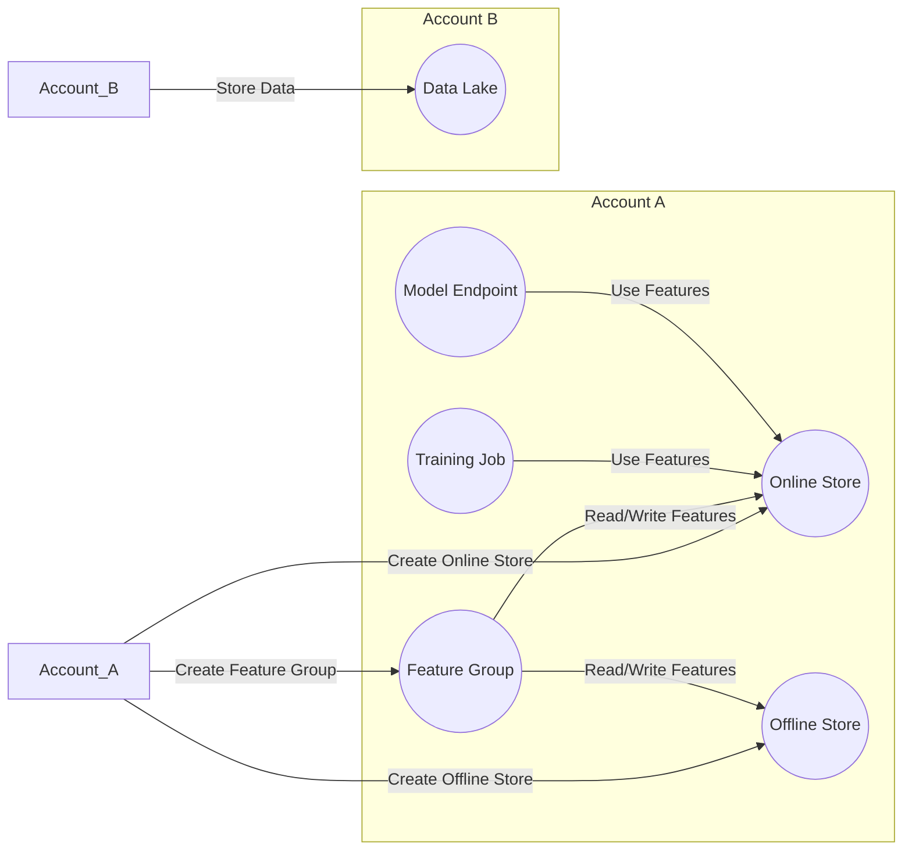

**Advanced Architecture: SageMaker Feature Store**

SageMaker Feature Store is a fully managed, centralized repository for machine learning (ML) features used in training and prediction workflows. It provides the following components:

* **Feature Groups**: represent a collection of features associated with a specific dataset or data source. They can be partitioned based on time or other categorical values. Feature groups support versioning and lineage tracking.
* **Feature Group Families**: logically group feature groups together based on shared characteristics. This allows for easier management and querying of related features.
* **Offline Store**: a purpose-built, high throughput, low latency storage system for online and offline access to features. It is built using Amazon [[dynamodb]] under the hood.
* **Online Store**: an Amazon [[elasticache]] for Redis-backed store for real-time access to features during model inferencing.

The following architecture diagram (Mermaid syntax) illustrates how various components interact within a multi-account environment:

**Comparison & Anti-Patterns**

| Service | Use Case |
|---|---|
| SageMaker Feature Store | Centralized feature management across multiple models and teams. High performance requirements. Global scale. |
| Amazon [[Srinivas_Notes/S3|S3]] + [[glue|AWS Glue]] | Infrequent access to features. Cost-sensitive environments. Custom ETL pipelines. |

Anti-patterns include using SageMaker Feature Store as a simple data lake or as a replacement for Apache Spark or Apache Flink when raw data processing is required.

**[[appsync|Security]] & Governance**

Implement fine-grained control over who can create, modify, and delete feature groups by attaching appropriate [[Master/Git_hub_notes/AWS-SAP-C02-Notes-main/README|IAM]] [[policies]] to [[Master/Git_hub_notes/AWS-SAP-C02-Notes-main/README|IAM]] roles and users. For cross-account access, apply [[Master/Git_hub_notes/AWS-SAP-C02-Notes-main/README|IAM]] roles and resource-based [[policies]] that allow specific actions from other AWS accounts. Implement organization Service Control [[policies]] (SCPs) to enforce [[control-tower|guardrails]] and restrict feature group creation at the organizational level.

Example [[Master/Git_hub_notes/AWS-SAP-C02-Notes-main/README|IAM]] policy:
```json
{
  "Version": "2012-10-17",
  "Statement": [
    {
      "Effect": "Allow",
      "Action": [
        "sagemaker:DescribeFeatureGroup",
        "sagemaker:DeleteFeatureGroup",
        "sagemaker:UpdateFeatureGroup"
      ],
      "Resource": "arn:aws:sagemaker:us-west-2:123456789012:feature-group/MyFeatureGroup*"
    }
  ]
}
```
**Performance & Reliability**

To improve performance and reliability, implement throttling limits and retry mechanisms using exponential backoff strategies. Utilize High Availability (HA) and [[Master/Git_hub_notes/AWS-SAP-C02-Notes-main/README|Disaster Recovery]] ([[dr]]) patterns such as Multi-Region replication and automatic failover between regions.

**[[Master/Git_hub_notes/AWS-SAP-C02-Notes-main/README|Cost Optimization]]**

Implement granular cost controls by enabling and disabling the Offline and Online stores based on your requirements. Monitor costs using AWS [[billing|Cost Explorer]] and set up budget alerts for daily spend thresholds. Consider using SageMaker Pipelines to automate ML processes and manage feature groups efficiently.

**Professional Exam Scenario #1**

Suppose you need to build a multi-tenant, serverless application that requires real-time feature access for ML inference. The solution must provide a separate workspace for each tenant while ensuring strict isolation of their data. Which architecture would best meet these requirements?

Architecture:

* Create a separate AWS account per tenant.
* Within each account, create a feature group for storing tenant-specific features.
* Enable the SageMaker Feature Store Online Store.
* Set up a REST [[api-gateway|API Gateway]] endpoint connected to a [[lambda]] function that retrieves features from the Online Store and invokes the ML model.
* Apply [[Master/Git_hub_notes/AWS-SAP-C02-Notes-main/README|IAM]] [[policies]] to ensure strict data isolation between tenants.

Justification:

This approach ensures strict data isolation since tenants have separate AWS accounts and resources. Using the Online Store enables real-time feature access while Serverless infrastructure scales automatically based on demand.

Incorrect answer:

Sharing a single feature group among all tenants in a single AWS account does not guarantee strict data isolation.

**Professional Exam Scenario #2**

Suppose you need to optimize the cost of a large-scale ML project that uses SageMaker Feature Store. Your company has strict cost control requirements, and you must minimize the number of active feature groups. How can you achieve this goal without impacting the availability of historical feature versions?

Solution:

* Periodically archive older feature group versions using the SageMaker Feature Store API.
* Implement a custom data lifecycle policy to automatically archive feature groups after a defined [[AWS_SA_PRO_Obsidian_Notes/Master/04-storage/s3|retention period]].
* Restore archived feature groups if needed for retraining or auditing purposes.

Justification:

Archiving older feature group versions reduces the number of active feature groups, minimizing costs. Automating the archival process simplifies maintenance and ensures that only necessary feature groups remain active.