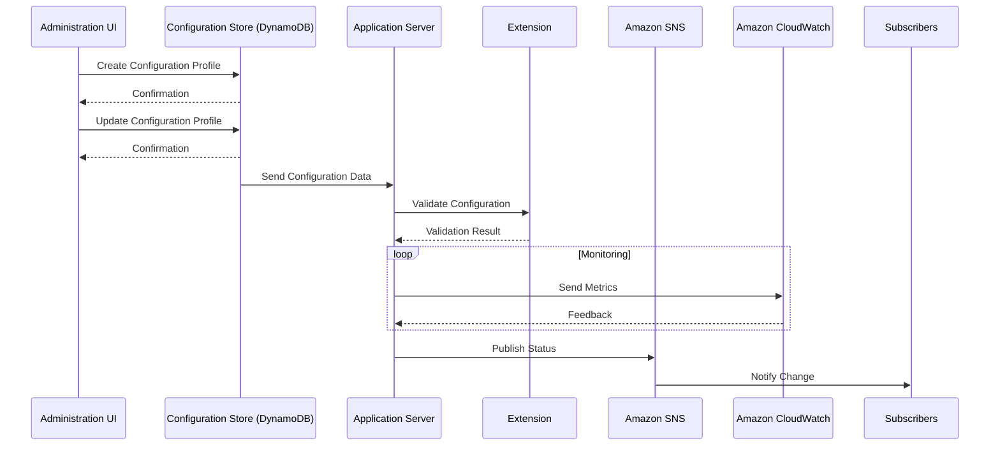

**Advanced Architecture: AppConfig [[RDS_Instance_Types|Internals]], [[RDS_Instance_Types|Global Scale Considerations]], and 'Under the Hood' Mechanics**

AppConfig is a service that enables developers to manage, deploy, and validate application configurations quickly and safely. It offers two primary features: configuration validation and [[Master/Git_hub_notes/AWS-SAP-C02-Notes-main/README|deployment strategies]]. The core components include Hosts, Configuration Profiles, Validators, [[Master/Git_hub_notes/AWS-SAP-C02-Notes-main/README|Deployment Strategies]], and Extension.

Internally, AppConfig uses Amazon [[Master/Git_hub_notes/AWS-SAP-C02-Notes-main/README|Simple Notification Service (SNS)]] and Amazon [[cloudwatch]] to monitor and notify about configuration changes. The underlying data store is Amazon [[dynamodb]]. To support global scale, AppConfig leverages Amazon [[Master/Git_hub_notes/AWS-SAP-C02-Notes-main/README|Route 53]] for geographically distributed deployments.

Here's a Mermaid sequence diagram of an AppConfig deployment:

**Comparison & Anti-Patterns: When NOT to use this service vs. alternatives**

| Factor                     | Alternatives           | Reason                                                                   |
|----------------------------|-----------------------|---------------------------------------------------------------------------|
| Real-time Analytics         | [[config|AWS Config]]            | Limited real-time monitoring capabilities in AppConfig                |
| Custom Validator Rules      | [[Lambda@Edge]]          | AppConfig validators don't support custom rules                       |
| Highly Regulated Workloads | N/A                   | May not meet specific regulatory requirements                             |
| Non-AWS Applications        | Azure App Configuration or GCP [[config]] Connector | Different cloud platform                                              |

Common anti-patterns include using AppConfig without proper change management and [[appsync|security]] practices, such as deploying sensitive data through configuration files or skipping validation checks.

**[[appsync|Security]] & Governance: Complex [[Master/Git_hub_notes/AWS-SAP-C02-Notes-main/README|IAM]] [[policies]], Cross-Account Access, and Organization SCPs**

To ensure secure access to AppConfig resources, create an [[Master/Git_hub_notes/AWS-SAP-C02-Notes-main/README|IAM]] policy in JSON format:
```json
{
  "Version": "2012-10-17",
  "Statement": [
    {
      "Effect": "Allow",
      "Action": [
        "appconfigdata:*"
      ],
      "Resource": [
        "*"
      ]
    }
  ]
}
```
Cross-account access can be established by creating an [[Master/Git_hub_notes/AWS-SAP-C02-Notes-main/README|IAM]] role in the source account allowing the target account principal to perform AppConfig actions. Additionally, you may enforce AppConfig restrictions across your organization using Service Control [[policies]] (SCPs):
```json
{
  "Version": "2012-10-17",
  "Statement": [
    {
      "Effect": "Deny",
      "Action": [
        "appconfigdata:*"
      ],
      "Resource": [
          "*"
      ],
      "Condition": {
          "StringNotEqualsIfExists": {
              "aws:SourceVpce": [
                  "vpce-1234567890abcdef0"
              ]
          }
      }
    }
  ]
}
```
**Performance & Reliability: Throttling Limits, Exponential Backoff Strategies, and HA/DR Patterns**

AppConfig has throttling limits based on the number of API calls per minute. If requests exceed these limits, the user receives a `429 Too Many Requests` response. Implement exponential backoff strategies to handle throttling [[api-gateway|errors]].

HA/DR patterns can be implemented using [[Master/Git_hub_notes/AWS-SAP-C02-Notes-main/README|Route 53]] failover and latency routing mechanisms along with multiple AppConfig configurations in different regions.

**[[Master/Git_hub_notes/AWS-SAP-C02-Notes-main/README|Cost Optimization]]: Granular Cost Controls and Calculation Examples**

AppConfig costs depend on the number of API calls made and the amount of data transferred. To optimize costs, consider implementing granular cost controls like setting up [[billing]] alerts and [[Budgets]].

For example, if you have 100 users making 1000 API calls each month, and assuming $1.00 per 1000 calls, the monthly cost would be calculated as follows:

(100 * 1000) \* ($1.00 / 100000) = $1

**Professional Exam Scenario 1**

Scenario: A company wants to implement AppConfig but needs to ensure it does not interfere with their existing [[config|AWS Config]] setup. How should they proceed?

Correct answer: Implement separate AppConfig and [[config|AWS Config]] setups, ensuring distinct resource types and avoiding overlapping tags.

Incorrect answer: Combine AppConfig and [[config|AWS Config]] resources into one solution, leading to confusion and unexpected behavior.

**Professional Exam Scenario 2**

Scenario: A client requires cross-account access to AppConfig resources between two AWS accounts. Explain how to achieve this while addressing potential [[appsync|security]] concerns.

Correct answer: Set up an [[Master/Git_hub_notes/AWS-SAP-C02-Notes-main/README|IAM]] role in the source account granting necessary permissions to the target account principal, and [[nonportable_instructions|review]] the trust policy to restrict unwanted access.

Incorrect answer: Share the AppConfig resources directly between the two accounts, which could expose other resources within those accounts unintentionally.