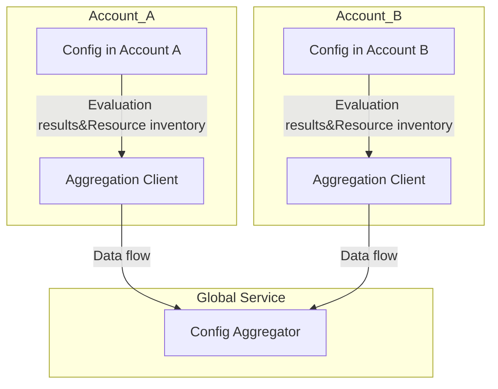

**Advanced Architecture: [[config]] Aggregators**

[[config]] Aggregators allow you to create a single [[config]] recorder view across multiple accounts and regions. They simplify configuration compliance evaluation and resource inventory management. The internal workings involve two components: aggregation clients and an aggregator.

*Aggregation clients:* These are the source [[config]] configurations in your [[organizations|AWS Organizations]] structure or specified through AWS Resource Groups. They can be AWS accounts, Organizational Units (OUs), or namespaces within an account.

*Aggregator:* This component receives data from all configured aggregation clients. It processes, normalizes, and stores the information in its bucketed storage.

The following Mermaid diagram illustrates [[config]] Aggregators' hierarchical organization:



[[RDS_Instance_Types|Global Scale Considerations]]:

* Data ingestion from thousands of aggregation clients is distributed among shards, ensuring efficient processing and minimal latency.
* Automatic handling of Organizational Unit (OU) changes enables seamless integration with [[organizations|AWS Organizations]].

**Comparison & Anti-Patterns**

| Service | Use Case |
| --- | --- |
| [[config]] Aggregators | Centralized monitoring and compliance analysis across multiple accounts and regions. |
| [[cloudwatch]] Events | Near real-time event triggering based on operational changes. |
| Systems Manager ([[ssm]]) | Managing and automating IT operations for hybrid and AWS workloads. |

Anti-pattern: Using [[config]] Aggregators as a standalone [[appsync|security]] solution instead of incorporating it into a comprehensive [[appsync|security]] strategy encompassing services like [[appsync|Security]] Hub, [[GuardDuty]], and [[AWS_SA_PRO_Obsidian_Notes/Master/Security/Macie|Macie]].

**[[appsync|Security]] & Governance**

Complex [[Master/Git_hub_notes/AWS-SAP-C02-Notes-main/README|IAM]] [[policies]] can grant permissions to [[config]] Aggregators using JSON statements similar to these:

```json
{
    "Effect": "Allow",
    "Action": [
      "config:PutEvaluationResults",
      "config:DeliverConfigSnapshot"
    ],
    "Resource": "arn:aws:config:us-east-1::resource/config-rule/*",
    "Condition": {
        "StringEquals": {
            "config.effectiveTargetType": [
                "AWS::Account",
                "AWS::OrganizationalUnit"
            ]
        }
    }
}
```

Cross-account access and Organization SCPs should be appropriately configured to ensure least privilege principles and secure delegation of required actions.

**Performance & Reliability**

Throttling limits depend on various factors such as invocation frequency, number of active rules, and resource types. To address throttling issues, implement exponential backoff strategies by increasing waiting periods between retries.

High Availability (HA) and [[Master/Git_hub_notes/AWS-SAP-C02-Notes-main/README|Disaster Recovery]] ([[dr]]) patterns include deploying [[config]] Aggregators in multiple regions and leveraging [[AWS_SA_PRO_Obsidian_Notes/Master/AWS Global Accelerator]] for load balancing and automatic failover.

**[[Master/Git_hub_notes/AWS-SAP-C02-Notes-main/README|Cost Optimization]]**

Granular cost controls involve setting up [[config]] Aggregators only when needed and deleting them afterward to minimize costs. Calculation examples:

* [[config]] Aggregator setup: $0 per aggregator + $0.001 per evaluated resource per day.
* Evaluated resource example: Assume 10 resources at $0.001 each daily = $0.01 per day.

**Professional Exam Scenarios**

Scenario 1: A company wants to centralize their AWS account configuration evaluation results. They have 500 accounts organized under 5 OUs in their [[AWS Organization]]. Which approach would best meet their requirements?

* Correct answer: Implement [[config]] Aggregators at the root level in the [[AWS Organization]].
* Incorrect answer: Create individual [[config]] configurations in each account without using [[config]] Aggregators.

Scenario 2: An organization has enabled [[config|AWS Config]] in one region. They want to replicate this configuration to another region. What steps should they follow?

* Correct answer: Enable [[config]] in the target region and set up a [[config]] Aggregator to collect data from both regions.
* Incorrect answer: Copy existing [[config]] settings manually to the new region.