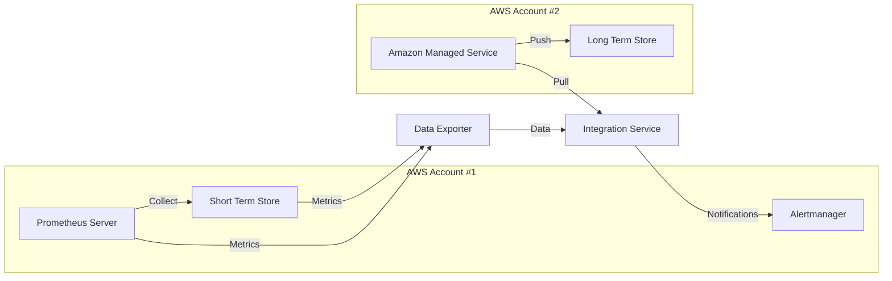

Advanced Architecture
---------------------

At its core, Amazon Managed Prometheus is a scalable monitoring and alerting system that makes it easy to collect, process, and query time series data. The service utilizes the popular open-source Prometheus project while extending its capabilities by offering long-term retention and integrating with [[Master/Git_hub_notes/AWS-SAP-C02-Notes-main/README|other AWS services]] natively.

The following diagram illustrates the components of an advanced architecture using Amazon Managed Prometheus:



In this architecture, multiple AWS accounts are utilized to separate the short-term storage and processing from the long-term retention and analysis of metrics. The Prometheus server and Alertmanager reside in one account, collecting and managing alerts based on predefined rules. The second account hosts the Amazon Managed Service, which includes a long-term store and integration capabilities. A data exporter transfers metrics between these two environments, while an integration service manages notifications.

Comparison & Anti-Patterns
---------------------------

| Criteria                     | Amazon Managed Prometheus              | Alternatives                                                                         |
| ---------------------------- | -------------------------------------- | ------------------------------------------------------------------------------------ |
| Scalability                | Highly scalable with native AWS support  | Kubernetes Service (e.g., Prometheus Operator)                                      |
| Long-Term Retention          | Built-in long-term store                   | Custom solution with [[Srinivas_Notes/S3|S3]] or [[Timestream]]                                                |
| Integration w/ Other Services | Native [[api-gateway|integrations]] with AWS services  | Custom [[api-gateway|integrations]] through [[api-gateway|API Gateway]], [[lambda]], etc.                             |
| Cost                         | Pay-per-use model                         | Self-hosted Prometheus with [[Git_hub_notes/AWS-SAP-C02-Notes-main/README|reserved instances]] or [[Git_hub_notes/AWS-SAP-C02-Notes-main/README|spot instances]]                    |
| Open Source Compatibility    | Based on Prometheus                       | Grafana, InfluxDB, etc.                                                              |

Common anti-patterns include attempting to manage your own Prometheus infrastructure instead of leveraging Amazon Managed Prometheus for long-term retention or trying to integrate non-AWS services without proper abstraction layers.

[[appsync|Security]] & Governance
----------------------

[[Master/Git_hub_notes/AWS-SAP-C02-Notes-main/README|IAM]] [[policies]] for Amazon Managed Prometheus should be fine-grained and follow the principle of least privilege. Here's an example JSON policy snippet for controlling access to the service:

```json
{
  "Effect": "Allow",
  "Action": [
    "prometheus:PutServiceGuardrail",
    "prometheus:UpdateServiceGuardrail"
  ],
  "Resource": "arn:aws:prometheus:*:*:service/*",
  "Condition": {
    "StringEquals": {
      "prometheus:serviceguardrail:action": [
        "ALLOW_CREATE_GROUP",
        "ALLOW_DELETE_GROUP",
        "ALLOW_UPDATE_GROUP"
      ]
    }
  }
}
```

Cross-account access can be achieved using cross-account roles and trust [[policies]]. Additionally, you may enforce [[appsync|security]] controls using Service Control [[policies]] (SCPs) within [[organizations|AWS Organizations]].

Performance & Reliability
--------------------------

Throttling limits apply when interacting with Amazon Managed Prometheus, including request rate limits and token bucket algorithms. To handle such [[AWS_SA_PRO_Obsidian_Notes/Master/12-security-and-config/cloudhsm|limitations]], implement exponential backoff strategies in your applications.

HA/DR patterns involve deploying Prometheus and Alertmanager across multiple availability zones and maintaining redundant connections to the Amazon Managed Service.

[[Master/Git_hub_notes/AWS-SAP-C02-Notes-main/README|Cost Optimization]]
------------------

Granular cost controls can be applied using AWS [[billing|Cost Explorer]], focusing on metrics like API calls, data ingested, and storage used. [[Master/Git_hub_notes/AWS-SAP-C02-Notes-main/README|Cost optimization]] techniques include:

* Using shorter retention periods for lower-priority metric sets
* Implementing granular access control to minimize over-provisioning
* Leveraging [[organizations|AWS Organizations]] to allocate costs to individual teams or projects

Professional Exam Scenarios
---------------------------

Scenario 1:

Your company operates a large microservices-based platform running on AWS. The development team wants to leverage Prometheus as their primary monitoring and observability tool. They require a highly available, scalable, and cost-effective solution. Which architecture would best meet these requirements?

Correct Answer: Amazon Managed Prometheus integrated with the existing microservices platform. This service provides native [[api-gateway|integrations]] with [[Master/Git_hub_notes/AWS-SAP-C02-Notes-main/README|other AWS services]], supports long-term retention, and follows a pay-per-use pricing model.

Incorrect Answer: Running self-managed Prometheus servers on [[ec2]] instances. While this approach offers more flexibility, it lacks native integration capabilities, requires manual scaling, and involves higher operational overhead.

Scenario 2:

You work at a financial institution that needs to comply with strict [[appsync|security]] requirements. Your organization uses Prometheus for monitoring purposes but has concerns about storing sensitive time-series data in the same environment. What measures could you take to address these concerns?

Correct Answer: Separate the Prometheus servers and Alertmanager into one AWS account, and configure the Amazon Managed Service in another account. Utilize [[AWS_SA_PRO_Obsidian_Notes/Master/VPC|VPC]] peering or private links to transfer metrics securely between the two environments. Apply tight [[Master/Git_hub_notes/AWS-SAP-C02-Notes-main/README|IAM]] [[policies]], restricting access to specific resources. Finally, enforce additional [[appsync|security]] controls using [[organizations|AWS Organizations]] and SCPOs.

Incorrect Answer: Storing sensitive data directly in the Prometheus databases. This approach does not provide sufficient access control or isolation between sensitive and non-sensitive data.