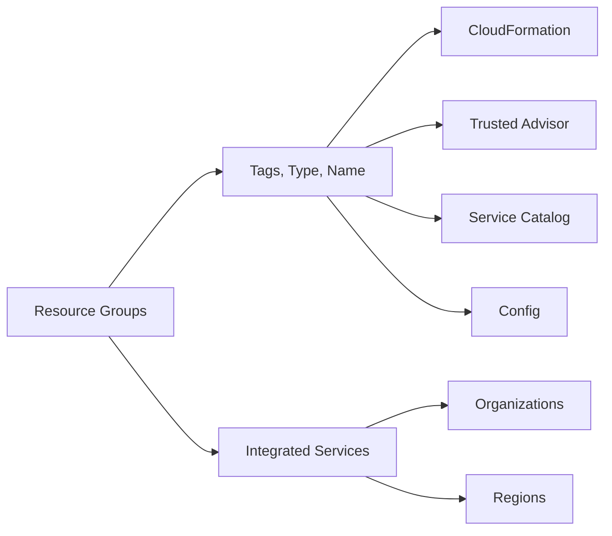

**[[RDS_Instance_Types|1. Advanced Architecture]]**

Resource Groups is a management and governance tool that allows you to organize your resources based on specific criteria such as tags, resource types, or custom names. It operates at both account and organization levels, enabling multi-account strategies. The service has several [[RDS_Instance_Types|internals]] worth noting:

- *Tag-based Groups*: Create groups using tags with any key-value pair. This allows flexible organization of resources.
- *Service Integration*: Integrates with AWS services like [[cloudformation]], Trusted Advisor, [[service-catalog|Service Catalog]], and [[config]] to provide additional capabilities.
- *[[RDS_Instance_Types|Global Scale Considerations]]*: While Resource Groups itself does not span regions, it can be used in conjunction with other tools (like [[organizations|AWS Organizations]]) to manage resources across multiple regions.

The following Mermaid diagram illustrates how AWS Resource Groups work under the hood:



**[[RDS_Instance_Types|2. Comparison & Anti-Patterns]]**

| Service | Use Case |
|---|---|
| Resource Groups | Managing resources based on tags, type, or name; multi-account strategies. |
| AWS [[billing|Cost Explorer]] | Analyzing costs and usage. |
| AWS Resource Groups Tagging API | Programmatically creating, updating, or deleting tags. |

Anti-pattern: Using Resource Groups when detailed cost analysis is required. [[billing|Cost Explorer]] should be used instead.

**[[RDS_Instance_Types|3. Security & Governance]]**

Complex [[Master/Git_hub_notes/AWS-SAP-C02-Notes-main/README|IAM]] [[policies]] can be implemented using JSON snippets. Here's an example allowing access to a specific Resource Group:

```json
{
    "Version": "2012-10-17",
    "Statement": [
        {
            "Effect": "Allow",
            "Action": [
                "resource-groups:CreateGroup",
                "resource-groups:DeleteGroup",
                "resource-groups:DescribeGroup",
                "resource-groups:GetGroupQueryResults",
                "resource-groups:IncludeResourceInGroup",
                "resource-groups:TagResource"
            ],
            "Resource": [
                "*"
            ],
            "Condition": {
                "StringEquals": {
                    "aws:ResourceGroups:groupName": "<Your Resource Group Name>"
                }
            }
        }
    ]
}
```

Cross-account access and Organization Service Control [[policies]] (SCPs) can also be set up to control who can create or modify Resource Groups.

**[[RDS_Instance_Types|4. Performance & Reliability]]**

Throttling limits exist for certain API operations. If these limits are exceeded, requests will fail with a 429 HTTP status code. Implement exponential backoff strategies in such cases.

High availability (HA) and [[Master/Git_hub_notes/AWS-SAP-C02-Notes-main/README|disaster recovery]] ([[dr]]) patterns involve distributing resources across different regions or availability zones. Since Resource Groups do not span regions, they cannot directly contribute to these patterns. However, they can help manage resources within each region as part of a broader [[dr]] or HA strategy.

**[[RDS_Instance_Types|5. Cost Optimization]]**

Granular cost controls can be achieved by combining Resource Groups with other cost management tools like AWS [[billing|Cost Explorer]] and [[billing|AWS Budgets]]. For instance, you could create a Resource Group containing all resources associated with a specific project, then analyze its costs using [[billing|Cost Explorer]].

**[[RDS_Instance_Types|6. Professional Exam Scenarios]]**

*Scenario 1*: Your company uses [[organizations|AWS Organizations]] and wants to ensure only certain teams can create Resource Groups. How would you implement this?

Correct answer: Utilize [[Master/Git_hub_notes/AWS-SAP-C02-Notes-main/README|IAM]] roles with appropriate permissions scoped to specific Resource Groups. Incorrect answers might suggest using Service Control [[policies]] (SCPs), but those would unnecessarily restrict actions beyond Resource Groups.

*Scenario 2*: A client needs to track spending for their marketing department spanning multiple accounts. Should they use AWS [[billing|Cost Explorer]] or Resource Groups?

Correct answer: AWS [[billing|Cost Explorer]], because while Resource Groups can organize resources, they don't offer detailed cost analysis capabilities. Incorrect answers might propose using Resource Groups due to misunderstanding the purpose and [[AWS_SA_PRO_Obsidian_Notes/Master/12-security-and-config/cloudhsm|limitations]] of each service.