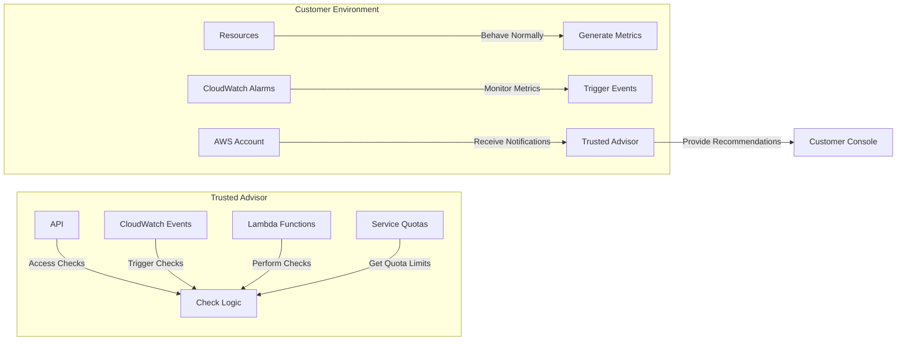

## Advanced Architecture
At its core, [[trusted-advisor|AWS Trusted Advisor]] is a cloud management tool that provides real-time guidance to help AWS customers ensure their environments are configured according to [[iam|best practices]]. It offers a wide range of checks across various categories such as [[Master/Git_hub_notes/AWS-SAP-C02-Notes-main/README|cost optimization]], performance, [[appsync|security]], and fault tolerance.

Internally, Trusted Advisor uses a combination of APIs, [[cloudwatch]] Events, [[Master/Git_hub_notes/AWS-SAP-C02-Notes-main/README|Lambda functions]], and Service Quotas to perform checks and provide recommendations. The following diagram illustrates the high-level architecture of Trusted Advisor:

When deploying Trusted Advisor in a multi-account environment, it can be integrated with [[organizations|AWS Organizations]] and AWS Single Sign-On (SSO) to centralize management and enable cross-account access. This allows administrators to view check results and manage alerts from a single pane of glass. Additionally, Trusted Advisor supports Amazon [[eventbridge]], which enables [[organizations]] to create custom event rules and respond to changes in their environment more effectively.

## Comparison & Anti-Patterns
While Trusted Advisor is a powerful tool for managing AWS resources, there are cases where alternative services or tools may be more appropriate. Here are some comparisons and anti-patterns:

| Service | Use Case |
|---|---|
| [[billing|Cost Explorer]] | Detailed cost analysis and forecasting |
| AWS Personal Health Dashboard | Personalized view of AWS service health |
| AWS Support Center | Creating and managing support cases |
| [[config|AWS Config]] | Managing AWS resource configurations |
| [[parameter-store|AWS Systems Manager Parameter Store]] | Storing and retrieving parameter values |

Anti-Patterns:

* Using Trusted Advisor as a replacement for native monitoring and alerting mechanisms (e.g., [[cloudwatch|CloudWatch Alarms]])
* Relying solely on Trusted Advisor for [[appsync|security]] compliance without implementing additional [[appsync|security]] measures (e.g., [[Master/Git_hub_notes/AWS-SAP-C02-Notes-main/README|IAM]] [[policies]], [[appsync|Security]] Hub)

## [[appsync|Security]] & Governance
Trusted Advisor supports fine-grained [[Master/Git_hub_notes/AWS-SAP-C02-Notes-main/README|IAM]] [[policies]] using JSON statements to control user and group permissions. For example, the following policy grants access to Trusted Advisor checks and alerts within an AWS account:
```json
{
    "Version": "2012-10-17",
    "Statement": [
        {
            "Effect": "Allow",
            "Action": [
                "trustedadvisor:DescribeCheckResult",
                "trustedadvisor:DescribeCheckStatus",
                "trustedadvisor:ListChecks",
                "trustedadvisor:GetEnabledCheckRefs"
            ],
            "Resource": "*"
        },
        {
            "Effect": "Allow",
            "Action": [
                "support:ResolveCase",
                "support:UpdateCase",
                "support:CreateCase",
                "support:DescribeCase",
                "support:List cases"
            ],
            "Resource": "arn:aws:support:*::case/*"
        }
    ]
}
```
Cross-account access can be enabled by creating a role in the source account with the required permissions and allowing the target account to assume the role. Alternatively, Service Control [[policies]] (SCPs) can be applied at the organization level to enforce specific Trusted Advisor settings.

## Performance & Reliability
Trusted Advisor has built-in throttling limits to prevent overloading the system and negatively affecting performance. If requests exceed these limits, a `ThrottlingException` will be returned. To handle throttling exceptions, implement exponential backoff strategies using [[Master/Git_hub_notes/AWS-SAP-C02-Notes-main/README|Lambda functions]] or SDKs.

For high availability and [[Master/Git_hub_notes/AWS-SAP-C02-Notes-main/README|disaster recovery]], Trusted Advisor supports multiple regions and automatically fails over to standby regions when necessary. However, it does not offer manual failover capabilities.

## [[Master/Git_hub_notes/AWS-SAP-C02-Notes-main/README|Cost Optimization]]
Granular cost controls in Trusted Advisor include setting alerts for specific checks and configuring thresholds based on usage or cost. For example, you can set up an alert to notify you if your monthly [[ec2]] costs exceed $10,000.

Calculation Example:
Assume you have 50 [[ec2]] instances running in a single region, and each instance has a monthly cost of $100. Your total monthly cost for [[ec2]] instances would be:
```makefile
Total Monthly Cost = Number of Instances * Monthly Instance Cost
Total Monthly Cost = 50 * $100
Total Monthly Cost = $5,000
```
If you want to receive an alert when your [[ec2]] costs reach 80% of the monthly budget ($4,000), you could configure a Trusted Advisor alert with the following settings:
```yaml
Alert Name: High EC2 Cost
Threshold: 80%
Metric: Cost
Statistic: Sum
Period: Monthly
Unit: USD
```
## Professional Exam Scenarios
### Scenario 1:
You need to integrate Trusted Advisor into your [[organizations|AWS Organizations]] setup to monitor and manage [[appsync|security]] checks across all member accounts. What steps should you take?

Correct Answer:

1. Enable Trusted Advisor in all member accounts
2. Create an [[Master/Git_hub_notes/AWS-SAP-C02-Notes-main/README|IAM]] role in each member account granting Trusted Advisor access
3. Add the [[Master/Git_hub_notes/AWS-SAP-C02-Notes-main/README|IAM]] role ARNs to the Organization's Service Control Policy ([[SCP]])

Incorrect Answers:

1. Use AWS Support Center to link all member accounts (not related to Trusted Advisor integration)
2. Configure [[config|AWS Config]] to send configuration change notifications to Trusted Advisor ([[config]] does not interact directly with Trusted Advisor)

### Scenario 2:
Your company wants to limit Trusted Advisor users to only access certain checks and alerts. How can you achieve this using [[Master/Git_hub_notes/AWS-SAP-C02-Notes-main/README|IAM]] [[policies]]?

Correct Answer:

1. Create an [[Master/Git_hub_notes/AWS-SAP-C02-Notes-main/README|IAM]] group for Trusted Advisor users
2. Define an [[Master/Git_hub_notes/AWS-SAP-C02-Notes-main/README|IAM]] policy granting access to specific checks and alerts
3. Attach the policy to the [[Master/Git_hub_notes/AWS-SAP-C02-Notes-main/README|IAM]] group

Incorrect Answers:

1. Modify the Trusted Advisor service role (this role is managed by AWS)
2. Implement SCPs to restrict access to checks and alerts (SCPs cannot control individual check access)