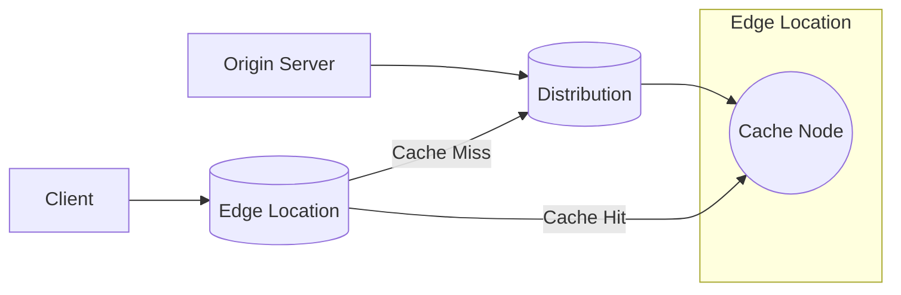

**[[RDS_Instance_Types|1. Advanced Architecture]]**

At its core, [[Master/Git_hub_notes/AWS-SAP-C02-Notes-main/README|CloudFront]] is a globally distributed network of edge locations and caches that deliver content to end users with low latency and high data transfer rates. It operates by distributing copies of static and dynamic web content across its edge locations, which then serve as the source for subsequent requests.

Internally, [[Master/Git_hub_notes/AWS-SAP-C02-Notes-main/README|CloudFront]] uses a variety of techniques to optimize performance, such as TCP/IP optimization, HTTP/2 and QUIC protocol support, and request collapsing. It also supports advanced features like [[cloudfront|field-level encryption]], device-adaptive streaming, and real-time log processing.

When it comes to [[RDS_Instance_Types|global scale considerations]], [[Master/Git_hub_notes/AWS-SAP-C02-Notes-main/README|CloudFront]] allows you to create cache behaviors based on URL path patterns, enabling fine-grained control over how content is cached and served. This includes origin failover, allowing automatic fallback to a secondary origin if the primary one fails.

[[Master/Git_hub_notes/AWS-SAP-C02-Notes-main/README|CloudFront]]'s "under the hood" mechanics involve several components working in concert. These include:

- **Edge Locations**: Geographically dispersed points of presence that serve as the first point of contact for client requests.
- **Cache Nodes**: Servers within Edge Locations that store and serve cached responses.
- **Origin Servers**: The original sources of your content, which can be an Amazon [[AWS_SA_PRO_Obsidian_Notes/Master/S3|S3]] bucket, an HTTP server, or any other custom origin.
- **Distribution**: A logical construct representing a unique URL that maps to one or more origins. There are two types of distributions: *Web* and *RTMP*.

Here's a Mermaid syntax diagram visualizing the interaction between these components:

**[[RDS_Instance_Types|2. Comparison & Anti-Patterns]]**

Comparing [[Master/Git_hub_notes/AWS-SAP-C02-Notes-main/README|CloudFront]] to alternative services, we have:

| Service          | Use Case                                                              |
|------------------|----------------------------------------------------------------------|
| [[Git_hub_notes/AWS-SAP-C02-Notes-main/README|CloudFront]]       | Publicly accessible websites, media delivery, accelerating APIs         |
| Amazon [[Srinivas_Notes/VPC|VPC]]      | Private resources requiring isolation, [[Srinivas_Notes/VPN|VPN]] connectivity               |
| [[Git_hub_notes/AWS-SAP-C02-Notes-main/README|AWS Direct Connect]] | High bandwidth, dedicated network connection from on-premises to AWS |

Common anti-patterns and misuses of [[Master/Git_hub_notes/AWS-SAP-C02-Notes-main/README|CloudFront]] include:

- Serving private content through [[Master/Git_hub_notes/AWS-SAP-C02-Notes-main/README|CloudFront]] without proper [[api-gateway|authentication]] and authorization checks.
- Failing to invalidate cached content after updates, leading to stale data being served.
- Using [[Master/Git_hub_notes/AWS-SAP-C02-Notes-main/README|CloudFront]] as a generic load balancer instead of leveraging Application Load Balancers.

**[[RDS_Instance_Types|3. Security & Governance]]**

Complex [[Master/Git_hub_notes/AWS-SAP-C02-Notes-main/README|IAM]] [[policies]] for [[Master/Git_hub_notes/AWS-SAP-C02-Notes-main/README|CloudFront]] often involve controlling who can create, modify, and delete distributions. Here's a JSON policy example denying creation of new distributions:
```json
{
    "Version": "2012-10-17",
    "Statement": [
        {
            "Effect": "Deny",
            "Action": "cloudfront:CreateDistribution",
            "Resource": "*",
            "Condition": {
                "StringNotEqualsIfExists": {
                    "aws:PrincipalArn": [
                        "arn:aws:iam::ACCOUNT_ID:role/TrustedRoleForCloudFrontCreation"
                    ]
                }
            }
        }
    ]
}
```
Cross-account access can be granted using Origin Access Identity (OAI) and adding permissions to the origin server. For [[organizations]], Service Control [[policies]] (SCPs) can enforce restrictions on [[Master/Git_hub_notes/AWS-SAP-C02-Notes-main/README|CloudFront]] usage at the organization level.

**[[RDS_Instance_Types|4. Performance & Reliability]]**

Throttling limits for [[Master/Git_hub_notes/AWS-SAP-C02-Notes-main/README|CloudFront]] depend on various factors, including the number of [[Master/Git_hub_notes/AWS-SAP-C02-Notes-main/README|CloudFront]] web distributions, invalidation requests, and alternate domain names. To handle throttling, implement exponential backoff strategies when handling [[api-gateway|errors]] during API calls.

HA/DR patterns can benefit from multiple [[Master/Git_hub_notes/AWS-SAP-C02-Notes-main/README|CloudFront]] distributions serving different regions or availability zones. In case of failure, traffic can be redirected to the remaining active distribution(s).

**[[RDS_Instance_Types|5. Cost Optimization]]**

Granular cost controls for [[Master/Git_hub_notes/AWS-SAP-C02-Notes-main/README|CloudFront]] can be achieved through monitoring and analyzing usage patterns, invalidating unused cache objects, and optimizing pricing classes based on target audience location. Calculating costs involves understanding the pricing model, which charges for data transferred, number of requests, and optional features used.

**6. Professional Exam Scenario**

Scenario 1: A company has multiple AWS accounts hosting their public-facing website and needs to ensure all sites share the same SSL certificate. They want to minimize latency while maintaining high availability. How would you architect this solution?

Correct Answer: Leverage [[Master/Git_hub_notes/AWS-SAP-C02-Notes-main/README|CloudFront]] with a single Web Distribution shared among all AWS accounts. Attach a common ACM-issued SSL certificate to the distribution, configure appropriate cache behaviors, and set up origin servers in each account.

Incorrect Answer: Implement Elastic Load Balancing in front of each AWS account and terminate SSL connections there.

Justification: [[elb]] does not span across multiple AWS accounts, whereas [[Master/Git_hub_notes/AWS-SAP-C02-Notes-main/README|CloudFront]] provides centralized management and sharing of SSL certificates.

Scenario 2: An e-commerce platform requires real-time logs for every user request to monitor customer behavior. What is the best way to achieve this?

Correct Answer: Enable Real-Time Log Processing in [[Master/Git_hub_notes/AWS-SAP-C02-Notes-main/README|CloudFront]] and forward logs to [[kinesis|Kinesis Data Firehose]] for downstream processing.

Incorrect Answer: Configure [[Master/Git_hub_notes/AWS-SAP-C02-Notes-main/README|CloudTrail]] to log all API calls related to [[Master/Git_hub_notes/AWS-SAP-C02-Notes-main/README|CloudFront]].

Justification: [[Master/Git_hub_notes/AWS-SAP-C02-Notes-main/README|CloudTrail]] logs API actions, not individual user requests. Therefore, it cannot provide real-time logs for every user request.