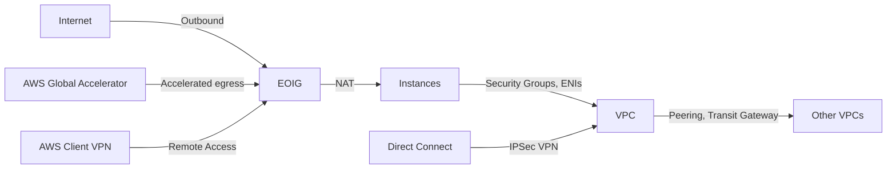

## Advanced Architecture

At its core, an Egress-Only Internet Gateway (EOIG) is a managed network component that allows outbound communication from Amazon Virtual Private Cloud ([[AWS_SA_PRO_Obsidian_Notes/Master/VPC|VPC]]) instances to the public internet, while preventing inbound connections. This is achieved by programmatically configuring route tables within the [[AWS_SA_PRO_Obsidian_Notes/Master/VPC|VPC]] to direct all outbound traffic through the EOIG. The following diagram illustrates how EOIGs interact with other AWS networking services:

[[RDS_Instance_Types|Global scale considerations]] involve placing EOIGs in strategically chosen regions based on data residency requirements or performance needs. Since EOIGs operate at the [[AWS_SA_PRO_Obsidian_Notes/Master/VPC|VPC]] level, they inherit the regional scope of their associated VPCs. To enable global egress capabilities, you can pair EOIGs with [[AWS_SA_PRO_Obsidian_Notes/Master/AWS Global Accelerator]], which uses Amazon's optimized global network to improve application responsiveness and availability.

## Comparison & Anti-Patterns

Comparing EOIGs to alternative solutions like NAT Gateways and NAT Instances, it's important to consider factors such as maintenance, scalability, and performance. Here's a comparison table highlighting key differences:

| Service            | Maintenance   | Scalability   | Performance    |
|-------------------|---------------|---------------|----------------|
| EOIG              | Managed       | High          | High           |
| [[Git_hub_notes/AWS-SAP-C02-Notes-main/README|NAT Gateway]]      | Managed       | Limited       | High           |
| [[NAT Instance]]      | Customer      | High          | Variable       |

Anti-patterns include using EOIGs in situations requiring inbound connectivity or load balancing between multiple origin servers. In these cases, alternatives like Application Load Balancers, Network Load Balancers, or Direct Connect should be considered instead.

## [[appsync|Security]] & Governance

Implementing complex [[Master/Git_hub_notes/AWS-SAP-C02-Notes-main/README|IAM]] [[policies]] for EOIGs involves managing permissions at various levels. For example, restricting instance tenancy to [[Master/Git_hub_notes/AWS-SAP-C02-Notes-main/README|dedicated instances]] may require adjustments to the `ec2.instancetypes` resource type in [[Master/Git_hub_notes/AWS-SAP-C02-Notes-main/README|IAM]] [[policies]]. Cross-account access can be enabled via [[AWS_SA_PRO_Obsidian_Notes/Master/VPC|VPC]] Peering or [[AWS_SA_PRO_Obsidian_Notes/Master/03-networking/privatelink|VPC Endpoints]], allowing secure communication between resources across different AWS accounts.

Organization Service Control [[policies]] (SCPs) provide centralized control over the maximum allowable permissions for accounts within an organization. To enforce the usage of EOIGs, [[organizations]] can create custom SCPs disallowing the creation of Internet Gateways while permitting EOIGs.

## Performance & Reliability

Throttling limits for EOIGs are primarily determined by the number of active flows, which is currently set to a maximum of 50,000 per EOIG. In scenarios involving high flow volumes, deploying multiple EOIGs across multiple Availability Zones is recommended. To handle throttling exceptions, implement exponential backoff strategies with jitter to ensure efficient handling of transient [[api-gateway|errors]].

For high availability and [[Master/Git_hub_notes/AWS-SAP-C02-Notes-main/README|disaster recovery]] purposes, EOIGs should be deployed in pairs across distinct Availability Zones. If an entire region becomes unavailable, backup egress paths using Direct Connect or [[AWS_SA_PRO_Obsidian_Notes/Master/VPN|VPN]] connections can be utilized.

## [[Master/Git_hub_notes/AWS-SAP-C02-Notes-main/README|Cost Optimization]]

Granular cost controls for EOIGs involve monitoring and analyzing costs associated with data transfer fees, since EOIGs themselves do not incur additional charges beyond standard [[AWS_SA_PRO_Obsidian_Notes/Master/VPC|VPC]] and data transfer pricing. Implementing [[Master/Git_hub_notes/AWS-SAP-C02-Notes-main/README|cost optimization]] techniques such as data transfer [[cost-allocation-tags|cost allocation tags]], [[organizations|consolidated billing]], and [[Master/Git_hub_notes/AWS-SAP-C02-Notes-main/README|reserved instances]] can help manage overall expenses.

## Professional Exam Scenarios

### Scenario 1: Multi-Account Strategy

An organization has multiple AWS accounts hosting applications with varying data residency requirements. They want to enable outbound connectivity to the internet for these applications while preventing inbound connections. Which solution would best meet these requirements?

*Deploy EOIGs in each account and [[AWS_SA_PRO_Obsidian_Notes/Master/VPC|VPC]] hosting the applications.*

Correct answer: Deploying EOIGs in each account ensures compliance with data residency requirements and prevents inbound connections. Alternatives like NAT Gateways or NAT Instances introduce additional maintenance overhead and complexity.

Incorrect answer: Using Application Load Balancers or Direct Connect would not effectively address the requirement for outbound-only connectivity.

### Scenario 2: Enforcing Usage of EOIGs

An organization wants to enforce the usage of EOIGs across all its AWS accounts. How can they achieve this using Organizational SCPs?

*Create an [[SCP]] disallowing the creation of Internet Gateways while permitting EOIGs.*

Correct answer: By creating an [[SCP]] disallowing the creation of Internet Gateways while permitting EOIGs, the organization enforces the usage of EOIGs for outbound connectivity.

Incorrect answer: Allowing the creation of EOIGs without explicitly denying Internet Gateways would still permit the usage of Internet Gateways, potentially leading to misconfigured VPCs.