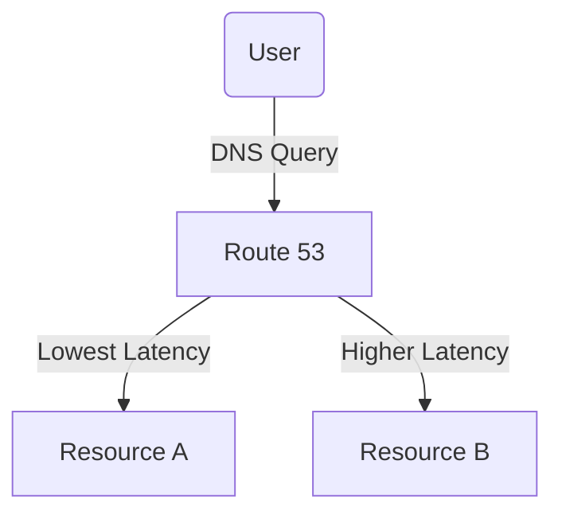
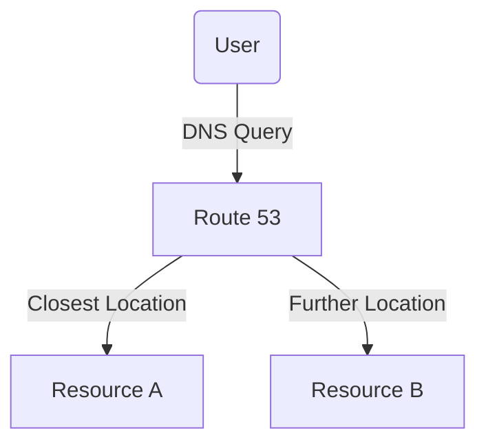

### Advanced Architecture
At its core, [[Master/Git_hub_notes/AWS-SAP-C02-Notes-main/README|Route 53]] is a highly scalable Domain Name System (DNS) service that translates human-friendly domain names like `example.com` into IP addresses like `192.0.2.1`. [[Master/Git_hub_notes/AWS-SAP-C02-Notes-main/README|Route 53]] uses a variety of routing [[policies]] to direct internet traffic to your resources, such as [[ec2]] instances, [[elb]] load balancers, or [[AWS_SA_PRO_Obsidian_Notes/Master/S3|S3]] buckets. The following advanced architecture concepts highlight [[Master/Git_hub_notes/AWS-SAP-C02-Notes-main/README|Route 53]] [[RDS_Instance_Types|internals]], [[RDS_Instance_Types|global scale considerations]], and underlying mechanics.

##### **Latency Based Routing (LBR)**
By using LBR, you can improve the performance of your applications by directing user requests to the lowest latency endpoint. LBR allows associating multiple resources with a single domain name and selecting which endpoints should serve traffic based on geographic location. Mermaid representation:

##### **[[route53|Geoproximity Routing]]**
[[route53|Geoproximity routing]] enables users to route traffic based on the proximity of the user to the selected resource. This policy requires at least one resource to have a physical address associated with it. Mermaid representation:

##### **[[route53|Health Checks]]**
[[route53|Health checks]] monitor the status of specified resources, allowing [[Master/Git_hub_notes/AWS-SAP-C02-Notes-main/README|Route 53]] to reroute traffic when an issue is detected. [[route53|Health checks]] can be used in conjunction with various routing [[policies]], including failover, weighted, and [[route53|geoproximity routing]].

### Comparison & Anti-Patterns
Although [[Master/Git_hub_notes/AWS-SAP-C02-Notes-main/README|Route 53]] offers numerous benefits, there are cases where alternative solutions might be more suitable. Here's a comparison table between [[Master/Git_hub_notes/AWS-SAP-C02-Notes-main/README|Route 53]] and other services, along with anti-patterns:

| Service                   | Use Case                                                             | Anti-Pattern                            |
|----------------------------|---------------------------------------------------------------------|-------------------------------------------|
| [[Git_hub_notes/AWS-SAP-C02-Notes-main/README|Route 53]]                  | DNS resolution, [[route53|health checks]], and low latency                      | Manual DNS configuration                |
| [[Git_hub_notes/AWS-SAP-C02-Notes-main/README|CloudFront]]                | Content Delivery Network (CDN) for media and static content        | Serving dynamic content through CDN       |
| Application Load Balancer  | Distribute incoming application traffic across multiple targets     | Using ALBs for non-application workloads   |

### [[appsync|Security]] & Governance
[[Master/Git_hub_notes/AWS-SAP-C02-Notes-main/README|Route 53]] supports fine-grained [[appsync|security]] and governance features through complex [[Master/Git_hub_notes/AWS-SAP-C02-Notes-main/README|IAM]] [[policies]], cross-account access, and organization Service Control [[policies]] (SCPs).

##### **[[Master/Git_hub_notes/AWS-SAP-C02-Notes-main/README|IAM]] JSON Policy Snippet**
The following JSON policy snippet demonstrates granting permissions to create, update, and delete [[Master/Git_hub_notes/AWS-SAP-C02-Notes-main/README|Route 53]] [[route53|hosted zones]]:
```json
{
    "Version": "2012-10-17",
    "Statement": [
        {
            "Effect": "Allow",
            "Action": [
              "route53:ChangeResourceRecordSets",
              "route53:CreateHostedZone",
              "route53:DeleteHostedZone"
            ],
            "Resource": "*"
        }
    ]
}
```
##### **Cross-Account Access**
To enable cross-account access, configure an [[Master/Git_hub_notes/AWS-SAP-C02-Notes-main/README|IAM]] role with a trust policy that accepts calls from the desired account. Then, attach the necessary permissions to the role.

##### **Organization SCPs**
Use Organization SCPs to enforce centralized control over [[Master/Git_hub_notes/AWS-SAP-C02-Notes-main/README|Route 53]] configurations, ensuring compliance with organizational standards.

### Performance & Reliability
[[Master/Git_hub_notes/AWS-SAP-C02-Notes-main/README|Route 53]] provides throttling limits, exponential backoff strategies, and high availability/disaster recovery patterns to ensure performance and reliability.

##### **Throttling Limits**
Refer to the [Route 53 quotas](https://docs.aws.amazon.com/general/latest/gr/aws_service_limits.html?short=apn#route53_limits) page for details on the number of queries per second allowed for each API operation.

##### **Exponential Backoff Strategies**
When making API calls, implement exponential backoff strategies to handle potential rate limiting issues.

##### **High Availability & [[Master/Git_hub_notes/AWS-SAP-C02-Notes-main/README|Disaster Recovery]] Patterns**
Implement [[route53|health checks]] and [[route53|failover routing]] [[policies]] to achieve high availability and [[Master/Git_hub_notes/AWS-SAP-C02-Notes-main/README|disaster recovery]] objectives.

### [[Master/Git_hub_notes/AWS-SAP-C02-Notes-main/README|Cost Optimization]]
Granular cost controls include monitoring and optimizing the number of queries and [[route53|hosted zones]], calculating costs based on usage, and taking advantage of volume discounts.

##### **Calculation Examples**
Assuming 1 billion queries per month:
- Basic query cost: $0.40 per million queries (excluding any data transfer fees)
- Monthly cost: $0.40 \* (1,000 / 1,000,000) = $0.0004

### Professional Exam Scenarios

##### **Scenario 1**
Your company operates globally, hosting web applications in multiple regions. Users report slow response times due to network latency. How would you optimize the user experience while minimizing operational overhead?

Correct Answer: Implement Latency Based Routing (LBR) within [[Master/Git_hub_notes/AWS-SAP-C02-Notes-main/README|Route 53]]. By doing so, you can direct user requests to the lowest latency endpoint, improving the overall user experience.

Incorrect Answer: Configure Elastic Load Balancing ([[elb]]) to distribute traffic based on latency. This answer is incorrect because [[elb]] does not provide [[route53|latency-based routing]] capabilities.

##### **Scenario 2**
Your organization has strict [[appsync|security]] requirements, mandating all AWS resources follow specific naming conventions and tagging schemes. How do you ensure [[Master/Git_hub_notes/AWS-SAP-C02-Notes-main/README|Route 53]] complies with these requirements?

Correct Answer: Utilize [[Master/Git_hub_notes/AWS-SAP-C02-Notes-main/README|IAM]] [[policies]], cross-account access, and organization Service Control [[policies]] (SCPs) to enforce naming conventions and tagging schemes.

Incorrect Answer: Modify [[Master/Git_hub_notes/AWS-SAP-C02-Notes-main/README|Route 53]] settings directly. This answer is incorrect since [[Master/Git_hub_notes/AWS-SAP-C02-Notes-main/README|Route 53]] settings cannot be modified via the console without proper authorization.