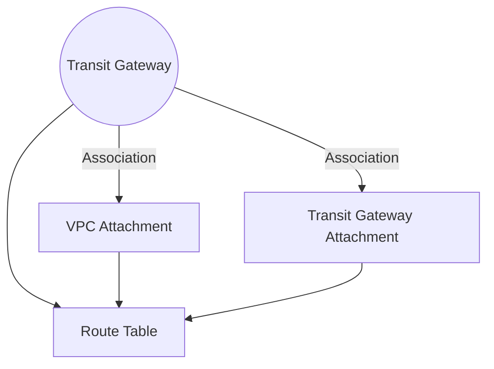

**[[RDS_Instance_Types|1. Advanced Architecture]]**

[[Transit gateway]] (TGW) is a regional, managed network service that enables connectivity between VPCs, data centers, and remote networks. TGW simplifies network architecture by providing a central hub for all networking needs. It supports multiple transit gateways in an account and region, and up to five transit gateways can be created in an region per account by default.

TGW uses two types of attachments:

- *[[AWS_SA_PRO_Obsidian_Notes/Master/VPC|VPC]] Attachments*: Connect VPCs to TGW. Supports IPv4 and IPv6 CIDR blocks.
- *[[Transit gateway]] Attachments*: Connect Transit Gateways or third-party devices to TGW.

TGW operates at Layer 3 using [[AWS_SA_PRO_Obsidian_Notes/Master/BGP|BGP]] routing protocol, allowing it to propagate routes across attachments. This allows TGW to automatically learn peer addresses and manage route tables.

TGW has several components under the hood:

- *Association*: A link between a TGW and its attachment.
- *Route Table*: Stores routes associated with each attachment.
- *Propagation*: Copies routes from one table to another.




**[[RDS_Instance_Types|2. Comparison & Anti-Patterns]]**

*Use TGW when:*

- Centralized network management is needed.
- Interconnecting multiple VPCs.
- Multi-region connectivity is required.

*Don't use TGW when:*

- Single [[AWS_SA_PRO_Obsidian_Notes/Master/VPC|VPC]] connectivity is sufficient.
- Direct Internet connectivity is needed.

Common anti-patterns include:

- Using TGW as a replacement for [[AWS_SA_PRO_Obsidian_Notes/Master/VPN|VPN]] or Direct Connect.
- Overusing TGW instead of peering VPCs directly.

**[[RDS_Instance_Types|3. Security & Governance]]**

[[Master/Git_hub_notes/AWS-SAP-C02-Notes-main/README|IAM]] [[policies]] for TGW should be configured carefully. For example:

```json
{
    "Effect": "Allow",
    "Action": [
        "ec2:CreateTransitGateway",
        "ec2:DeleteTransitGateway"
    ],
    "Resource": "*",
    "Condition": {
        "StringEquals": {
            "ec2:CreatedBy": "${aws:username}"
        }
    }
}
```
Cross-account access requires configuring Route Table entries to allow traffic flow. Organization Service Control [[policies]] (SCPs) can limit TGW usage.

**[[RDS_Instance_Types|4. Performance & Reliability]]**

TGW has throttling limits, e.g., 100 API calls per second. If exceeded, exponential backoff strategies should be used. High availability (HA)/disaster recovery ([[dr]]) patterns involve creating redundant TGWs in different regions.

**[[RDS_Instance_Types|5. Cost Optimization]]**

Granular cost controls include enabling/disabling TGWs, monitoring costs via [[cloudwatch]], and setting budget alerts. The formula for calculating TGW costs is:

```
Cost = (Number of attached ENIs + Number of attached VPCs) × Price per hour
```

**[[RDS_Instance_Types|6. Professional Exam Scenarios]]**

Scenario 1:
A company wants to interconnect three VPCs in the same region. Which solution provides the best performance and reliability?

Correct answer: TGW, due to its ability to handle multiple VPCs, automatic [[AWS_SA_PRO_Obsidian_Notes/Master/BGP|BGP]] route propagation, and built-in redundancy.

Incorrect answer: [[AWS_SA_PRO_Obsidian_Notes/Master/VPC|VPC]] Peering, since it doesn't support transitive peering relationships.

Scenario 2:
A company wants to enable secure communication between their corporate data center and AWS. Which pattern ensures least privilege access while minimizing operational overhead?

Correct answer: [[AWS_SA_PRO_Obsidian_Notes/Master/VPN|VPN]] over TGW, which offers centralized network management and granular [[appsync|security]] [[policies]].

Incorrect answer: Direct Connect without TGW, as it lacks the benefits of TGW's centralized management and policy enforcement.