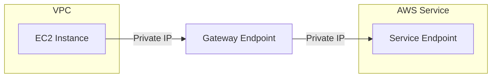

## Advanced Architecture

At its core, a [[AWS_SA_PRO_Obsidian_Notes/Master/VPC|VPC]] Endpoint (Gateway) is a network interface that connects an Amazon [[AWS_SA_PRO_Obsidian_Notes/Master/VPC|VPC]] to another AWS service without requiring internet gateways, NAT devices, [[AWS_SA_PRO_Obsidian_Notes/Master/VPN|VPN]] connections, or [[Master/Git_hub_notes/AWS-SAP-C02-Notes-main/README|AWS Direct Connect]]. It uses AWS's private network infrastructure to create a secure connection between the two services. The following diagram shows how a Gateway endpoint works:



Internally, the Gateway endpoint creates a [[Master/Git_hub_notes/AWS-SAP-C02-Notes-main/README|Network Load Balancer (NLB)]] in the background, which then routes traffic to the destination service through AWS's private network. This allows for low-latency and high-bandwidth communication between the [[AWS_SA_PRO_Obsidian_Notes/Master/VPC|VPC]] and the service.

[[RDS_Instance_Types|Global scale considerations]] are essential when designing a system with [[AWS_SA_PRO_Obsidian_Notes/Master/03-networking/privatelink|Gateway endpoints]]. If your architecture spans multiple regions, you must create separate [[AWS_SA_PRO_Obsidian_Notes/Master/03-networking/privatelink|Gateway endpoints]] in each region. However, since [[AWS_SA_PRO_Obsidian_Notes/Master/03-networking/privatelink|Gateway endpoints]] are regional resources, they cannot be used across regions. In such cases, it is recommended to use [[AWS_SA_PRO_Obsidian_Notes/Master/VPC|VPC]] Peering or [[transit-gateway|AWS Transit Gateway]] instead.

## Comparison & Anti-Patterns

The table below compares [[AWS_SA_PRO_Obsidian_Notes/Master/03-networking/privatelink|Gateway endpoints]] to other similar services like [[AWS_SA_PRO_Obsidian_Notes/Master/03-networking/privatelink|VPC Endpoints]] (Interface) and [[AWS_SA_PRO_Obsidian_Notes/Master/VPC|VPC]] Peering.

| Service | Use Case | Advantages | Disadvantages |
| --- | --- | --- | --- |
| Gateway Endpoint | Accessing AWS services like [[Srinivas_Notes/S3|S3]], [[dynamodb]], and [[lambda]] | Secure, no internet connectivity required, low latency | Limited to specific AWS services |
| [[Srinivas_Notes/VPC|VPC]] Endpoint (Interface) | Accessing AWS services like [[kinesis|Kinesis Data Firehose]], Service Quotas, and [[sts]] | Supports Bring Your Own IP (BYOIP), supports Enhanced [[appsync|Security]] features | Higher cost than Gateway Endpoint |
| [[Srinivas_Notes/VPC|VPC]] Peering | Connecting two VPCs within the same region | Allows inter-VPC communication, low latency | Requires manual route propagation, limited to same region |

Anti-patterns include using [[AWS_SA_PRO_Obsidian_Notes/Master/03-networking/privatelink|Gateway endpoints]] for non-supported services, as it may result in additional complexity and higher costs. For example, connecting to a third-party service via Gateway endpoint would require additional components like NAT devices or [[AWS_SA_PRO_Obsidian_Notes/Master/VPN|VPN]] connections.

## [[appsync|Security]] & Governance

Complex [[Master/Git_hub_notes/AWS-SAP-C02-Notes-main/README|IAM]] [[policies]] can be created for [[AWS_SA_PRO_Obsidian_Notes/Master/03-networking/privatelink|Gateway endpoints]] by using JSON [[policies]]. Here's an example policy that restricts access to a specific [[AWS_SA_PRO_Obsidian_Notes/Master/S3|S3]] bucket:

```json
{
    "Version": "2012-10-17",
    "Statement": [
        {
            "Effect": "Allow",
            "Principal": "*",
            "Action": [
                "s3:GetObject"
            ],
            "Resource": "arn:aws:s3:::example-bucket/*",
            "Condition": {
                "StringEquals": {
                    "aws:SourceVpc": "vpc-abcdefg123"
                }
            }
        }
    ]
}
```

Cross-account access can be granted by attaching the necessary [[Master/Git_hub_notes/AWS-SAP-C02-Notes-main/README|IAM]] [[policies]] to the appropriate roles in both accounts. To enforce [[appsync|security]] at scale, Organizational Service Control [[policies]] (SCPs) can be used to limit the creation of [[AWS_SA_PRO_Obsidian_Notes/Master/03-networking/privatelink|Gateway endpoints]] only to specific VPCs.

## Performance & Reliability

Throttling limits apply to [[AWS_SA_PRO_Obsidian_Notes/Master/03-networking/privatelink|Gateway endpoints]], including a maximum number of concurrent requests per second and a burst limit. To handle throttling [[api-gateway|errors]], exponential backoff strategies should be employed. Here's an example code snippet in Python:

```python
import time
import random

def call_api(service):
    if not service.call():
        error = service.last_error
        print("Error:", error)
        time.sleep(2 * (2 ** error.retry_after))
        random_jitter = random.uniform(0, 0.5)
        time.sleep(random_jitter)
        service.call()
```

High availability/disaster recovery patterns involve creating redundant [[AWS_SA_PRO_Obsidian_Notes/Master/03-networking/privatelink|Gateway endpoints]] in different Availability Zones (AZs) within a single region. For multi-region deployments, consider using [[AWS_SA_PRO_Obsidian_Notes/Master/VPC|VPC]] Peering or [[Transit gateway]].

## [[Master/Git_hub_notes/AWS-SAP-C02-Notes-main/README|Cost Optimization]]

Granular cost controls can be achieved by enabling [[cost-allocation-tags|cost allocation tags]] for [[AWS_SA_PRO_Obsidian_Notes/Master/03-networking/privatelink|Gateway endpoints]]. Calculating the cost of using [[AWS_SA_PRO_Obsidian_Notes/Master/03-networking/privatelink|Gateway endpoints]] involves considering the data processing charges for using the associated [[NLB]]. To calculate the cost, use the AWS Pricing Calculator and input the estimated amount of data processed.

## Professional Exam Scenario 1

You are tasked with designing a solution that enables [[ec2]] instances in a [[AWS_SA_PRO_Obsidian_Notes/Master/VPC|VPC]] to access Amazon [[AWS_SA_PRO_Obsidian_Notes/Master/S3|S3]] using [[AWS_SA_PRO_Obsidian_Notes/Master/03-networking/privatelink|Gateway endpoints]]. Which of the following options best meets these requirements?

A. Create a Gateway endpoint for the [[AWS_SA_PRO_Obsidian_Notes/Master/S3|S3]] service and attach it to the relevant [[AWS_SA_PRO_Obsidian_Notes/Master/VPC|VPC]].
B. Create a [[AWS_SA_PRO_Obsidian_Notes/Master/VPC|VPC]] peering connection between the [[AWS_SA_PRO_Obsidian_Notes/Master/VPC|VPC]] and a new [[AWS_SA_PRO_Obsidian_Notes/Master/VPC|VPC]] containing an S3-enabled endpoint.
C. Create a [[AWS_SA_PRO_Obsidian_Notes/Master/VPC|VPC]] Endpoint (Interface) for [[AWS_SA_PRO_Obsidian_Notes/Master/S3|S3]] and attach it to the relevant [[AWS_SA_PRO_Obsidian_Notes/Master/VPC|VPC]].

Correct Answer: A. Option A is the correct answer because [[AWS_SA_PRO_Obsidian_Notes/Master/03-networking/privatelink|Gateway endpoints]] enable access to specific AWS services like [[AWS_SA_PRO_Obsidian_Notes/Master/S3|S3]].

Incorrect Answers:

* Option B is incorrect because [[AWS_SA_PRO_Obsidian_Notes/Master/VPC|VPC]] Peering is used to connect two VPCs within the same region and does not provide access to AWS services like [[AWS_SA_PRO_Obsidian_Notes/Master/S3|S3]].
* Option C is incorrect because [[AWS_SA_PRO_Obsidian_Notes/Master/VPC|VPC]] Endpoint (Interface) provides access to a different set of AWS services than [[AWS_SA_PRO_Obsidian_Notes/Master/03-networking/privatelink|Gateway endpoints]].

## Professional Exam Scenario 2

Your organization has implemented [[AWS_SA_PRO_Obsidian_Notes/Master/03-networking/privatelink|Gateway endpoints]] to access [[AWS_SA_PRO_Obsidian_Notes/Master/S3|S3]] buckets from a centralized [[AWS_SA_PRO_Obsidian_Notes/Master/VPC|VPC]]. Recently, the operations team reported throttling issues while accessing [[AWS_SA_PRO_Obsidian_Notes/Master/S3|S3]]. How would you address this issue?

A. Implement exponential backoff strategies in the application code.
B. Increase the throttling limits for the [[AWS_SA_PRO_Obsidian_Notes/Master/03-networking/privatelink|Gateway endpoints]].
C. Switch from [[AWS_SA_PRO_Obsidian_Notes/Master/03-networking/privatelink|Gateway endpoints]] to [[AWS_SA_PRO_Obsidian_Notes/Master/VPC|VPC]] Endpoint (Interface) for [[AWS_SA_PRO_Obsidian_Notes/Master/S3|S3]].

Correct Answer: A. Option A is the correct answer because implementing exponential backoff strategies in the application code will help mitigate throttling issues.

Incorrect Answers:

* Option B is incorrect because increasing throttling limits is not possible. Instead, exponential backoff strategies should be employed to handle throttling [[api-gateway|errors]].
* Option C is incorrect because switching to [[AWS_SA_PRO_Obsidian_Notes/Master/VPC|VPC]] Endpoint (Interface) does not solve the throttling issue. Both types of endpoints have their own throttling limits.