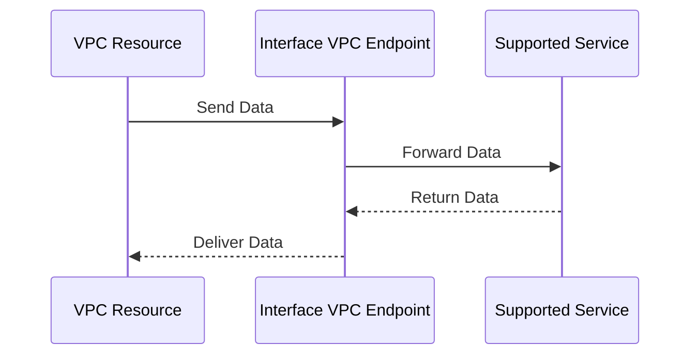

### Advanced Architecture

At its core, an Interface [[AWS_SA_PRO_Obsidian_Notes/Master/VPC|VPC]] Endpoint is a network interface that serves as an entry point into a [[AWS_SA_PRO_Obsidian_Notes/Master/VPC|VPC]] from Amazon's private network infrastructure. It uses AWS's private network backbone to enable direct communication between [[AWS_SA_PRO_Obsidian_Notes/Master/VPC|VPC]] resources and supported services without using public IP addresses or internet gateways. This improves [[appsync|security]] and reduces latency and bandwidth costs.

Under the hood, when data is sent to an endpoint, it traverses the AWS global and regional networks until it reaches the region where the service is hosted. Then, it gets routed to the specific endpoint within that region. Each region can have multiple endpoints for high availability and automatic failover.

Here's a Mermaid sequence diagram illustrating this process:


### Comparison & Anti-Patterns

| Factor | Interface [[Srinivas_Notes/VPC|VPC]] Endpoint | [[Git_hub_notes/AWS-SAP-C02-Notes-main/README|NAT Gateway]] | [[Srinivas_Notes/VPN|VPN]] Gateway | Direct Connect |
|---|---|---|---|---|
| Service Integration | Limited supported services | Any Internet-accessible resource | Any remote network | Any on-premises network |
| Traffic Encryption | Depends on service | Yes | Yes | Yes |
| Public IP Address Required | No | Yes | Yes | Yes |
| Performance | High due to private network usage | Lower due to internet usage | Varies based on connection quality | Varies based on connection quality |

Anti-patterns include using Interface [[AWS_SA_PRO_Obsidian_Notes/Master/03-networking/privatelink|VPC Endpoints]] when the service isn't supported, exposing resources unnecessarily to the public internet via NAT Gateways, or overcomplicating connectivity by using [[AWS_SA_PRO_Obsidian_Notes/Master/VPN|VPN]] Gateways or Direct Connect for resources already accessible through an Interface [[AWS_SA_PRO_Obsidian_Notes/Master/VPC|VPC]] Endpoint.

### [[appsync|Security]] & Governance

Complex [[Master/Git_hub_notes/AWS-SAP-C02-Notes-main/README|IAM]] [[policies]] for Interface [[AWS_SA_PRO_Obsidian_Notes/Master/03-networking/privatelink|VPC Endpoints]] involve granting permissions to specific users, roles, or groups. Here's an example JSON policy snippet allowing access to a specific [[AWS_SA_PRO_Obsidian_Notes/Master/S3|S3]] bucket:
```json
{
    "Version": "2012-10-17",
    "Statement": [
        {
            "Effect": "Allow",
            "Principal": "*",
            "Action": [
                "s3:GetObject"
            ],
            "Resource": "arn:aws:s3:::example-bucket/*",
            "Condition": {
                "StringEquals": {
                    "aws:SourceVpc": "vpc-abcdefghij01234567"
                }
            }
        }
    ]
}
```
Cross-account access involves creating an endpoint in one account and specifying the allowed source [[AWS_SA_PRO_Obsidian_Notes/Master/VPC|VPC]](s) in another account. Organizational Service Control [[policies]] (SCPs) can enforce restrictions on creating endpoints across accounts.

### Performance & Reliability

Throttling limits depend on the service but generally range from hundreds of requests per second to tens of thousands. Exponential backoff strategies should be implemented when approaching throttling limits.

High availability and [[Master/Git_hub_notes/AWS-SAP-C02-Notes-main/README|disaster recovery]] patterns include deploying endpoints in multiple AZs and regions, respectively. Services must support these features for successful redundancy.

### [[Master/Git_hub_notes/AWS-SAP-C02-Notes-main/README|Cost Optimization]]

Granular cost controls involve monitoring usage metrics like number of requests, bytes transferred, and duration. Calculation examples include comparing the cost of sending data via an Interface [[AWS_SA_PRO_Obsidian_Notes/Master/VPC|VPC]] Endpoint versus a [[Master/Git_hub_notes/AWS-SAP-C02-Notes-main/README|NAT Gateway]] or Internet Gateway.

### Professional Exam Scenario 1

You are tasked with designing a secure solution for a company that needs to transfer large files between their [[AWS_SA_PRO_Obsidian_Notes/Master/VPC|VPC]] and an AWS-managed service supporting Interface [[AWS_SA_PRO_Obsidian_Notes/Master/03-networking/privatelink|VPC Endpoints]]. The managed service requires encryption during transit. Which configuration meets these requirements?

Correct Answer: Configure an Interface [[AWS_SA_PRO_Obsidian_Notes/Master/VPC|VPC]] Endpoint connected to the required AWS-managed service and ensure the service supports encryption during transit.

Incorrect Answer: Set up a [[AWS_SA_PRO_Obsidian_Notes/Master/VPN|VPN]] Gateway as the service doesn't support Interface [[AWS_SA_PRO_Obsidian_Notes/Master/03-networking/privatelink|VPC Endpoints]].

Justification: The correct answer utilizes an Interface [[AWS_SA_PRO_Obsidian_Notes/Master/VPC|VPC]] Endpoint, which provides lower latency and higher performance than a [[AWS_SA_PRO_Obsidian_Notes/Master/VPN|VPN]] Gateway. Additionally, since the service supports encryption during transit, there's no need to add extra layers of complexity with a [[AWS_SA_PRO_Obsidian_Notes/Master/VPN|VPN]] Gateway.

### Professional Exam Scenario 2

Your organization has strict compliance requirements and wants to prevent any accidental creation of Interface [[AWS_SA_PRO_Obsidian_Notes/Master/03-networking/privatelink|VPC Endpoints]]. How would you implement this using [[organizations|AWS Organizations]] Service Control [[policies]] (SCPs)?

Correct Answer: Create an [[SCP]] denying the `CreateVpcEndpoint` action for all relevant member accounts.

Incorrect Answer: Implement [[Master/Git_hub_notes/AWS-SAP-C02-Notes-main/README|IAM]] [[policies]] restricting specific users, roles, or groups from creating Interface [[AWS_SA_PRO_Obsidian_Notes/Master/03-networking/privatelink|VPC Endpoints]].

Justification: The correct answer prevents any user in the specified member accounts from creating Interface [[AWS_SA_PRO_Obsidian_Notes/Master/03-networking/privatelink|VPC Endpoints]], ensuring compliance with organizational [[policies]]. In contrast, [[Master/Git_hub_notes/AWS-SAP-C02-Notes-main/README|IAM]] [[policies]] only affect individual users, roles, or groups, leaving room for potential misconfigurations.