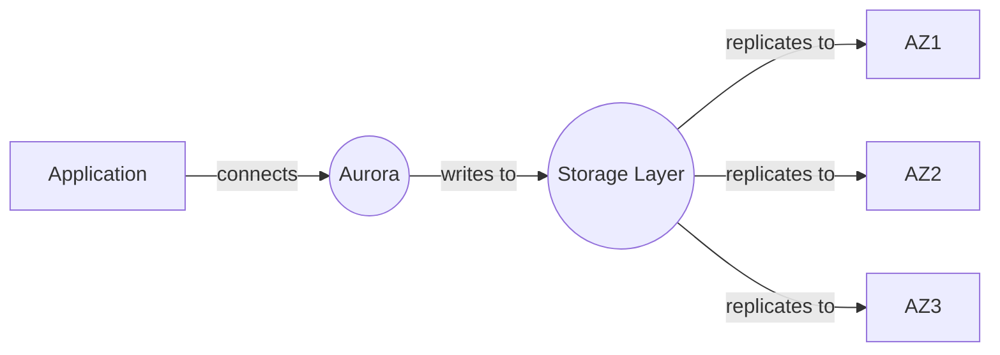
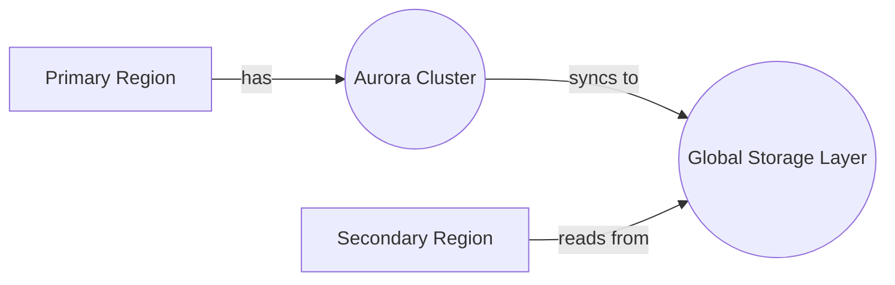

### Advanced [[aurora]] Architecture

#### [[RDS_Instance_Types|Internals]]
[[Master/Git_hub_notes/AWS-SAP-C02-Notes-main/README|Amazon Aurora]] is a relational database engine that combines the speed and availability of high-end commercial databases with the simplicity and cost-effectiveness of open source databases. [[aurora]]'s architecture includes a distributed storage layer that replicates six ways within an Availability Zone (AZ) for high durability, and up to fifteen replicas across three AZs for [[Master/Git_hub_notes/AWS-SAP-C02-Notes-main/README|disaster recovery]] and read scaling.

[[aurora]]'s storage layer is designed as a "serverless" component, meaning it automatically scales storage capacity up to 128TB without requiring any manual intervention. The storage layer also handles provisioned IOPS, which can be scaled from 10 GiB to 3,000 GiB in increments of 100 MiB.



#### [[RDS_Instance_Types|Global Scale Considerations]]
[[aurora]] Global Database provides a new level of availability and failover support by allowing a single [[Aurora DB]] cluster to span multiple regions. This allows for fast local reads and automatic failover to a cross-region secondary if the primary region goes down.



### Comparison & Anti-Patterns

| Service          | Use Case                                                              | Anti-pattern                                                   |
|------------------|----------------------------------------------------------------------|------------------------------------------------------------------|
| Amazon [[Git_hub_notes/AWS-SAP-C02-Notes-main/README|RDS]]      | Standard SQL workloads, ease of management                           | Data warehousing, large datasets, high-performance OLTP        |
| [[redshift|Amazon Redshift]] | Data warehousing, business intelligence, ETL                         | Real-time analytics, transactional workloads                    |
| Amazon [[DocumentDB]]| Document-based workloads, MongoDB compatibility                     | Relational data modeling, ACID transactions                    |
| Amazon Keyspace  | Time series data, Cassandra compatibility                            | Relational data modeling, complex queries                       |
| Amazon [[QLDB]]     | Immutable ledger, blockchain use cases                                | High-volume write operations, real-time analytics                 |

### [[appsync|Security]] & Governance

Cross-account access to [[aurora]] can be granted through [[Master/Git_hub_notes/AWS-SAP-C02-Notes-main/README|IAM]] roles and [[policies]]. Here's an example JSON policy granting access to an [[Master/Git_hub_notes/AWS-SAP-C02-Notes-main/README|IAM]] user in another account:

```json
{
    "Version": "2012-10-17",
    "Statement": [
        {
            "Effect": "Allow",
            "Action": [
                "rds-db:connect"
            ],
            "Resource": [
                "arn:aws:rds-db:us-east-1:123456789012:dbuser:database1/*"
            ],
            "Condition": {
                "StringEquals": {
                    "aws:SourceVpc": "vpc-1a2b3c4d"
                }
            }
        }
    ]
}
```

Organization Service Control [[policies]] (SCPs) can be used to enforce [[control-tower|guardrails]] around [[aurora]] usage. For example, an [[SCP]] could prevent the creation of [[aurora]] instances outside of approved VPCs or subnets.

### Performance & Reliability

To handle throttling limits, implement exponential backoff strategies in your application code. For example, instead of immediately retrying a failed operation, wait for increasing intervals before each attempt.

For high availability and [[Master/Git_hub_notes/AWS-SAP-C02-Notes-main/README|disaster recovery]], implement multi-AZ deployments and enable automatic failover. This ensures minimal downtime during planned maintenance and unplanned outages.

### [[Master/Git_hub_notes/AWS-SAP-C02-Notes-main/README|Cost Optimization]]

Granular cost controls for [[aurora]] include setting up [[billing]] alarms based on usage thresholds, enabling performance insights to optimize resource utilization, and using [[Master/Git_hub_notes/AWS-SAP-C02-Notes-main/README|reserved instances]] for predictable workloads.

Calculation example: If you have a 20 GB [[aurora]] instance running 24/7, the estimated monthly cost would be $0.10 per GB per month x 20 GB = $2.00 + $0.20 per hour of usage (assuming 750 hours per month) = $15.00 + additional costs for backups, snapshots, and I/O requests.

### Professional Exam Scenarios

Scenario 1: Your company operates in two regions, US West (oregon) and EU West (ireland). You need to setup a highly available MySQL-compatible database solution that supports low latency reads and automatic failover. What solution should you choose?

Correct answer: [[Master/Git_hub_notes/AWS-SAP-C02-Notes-main/README|Amazon Aurora]] Multi-Region with Global Database.

Incorrect answer: Amazon [[Master/Git_hub_notes/AWS-SAP-C02-Notes-main/README|RDS]] with Read Replicas. While this solution provides high availability within a single region, it does not provide low latency reads or automatic failover between regions.

Scenario 2: Your company needs to store large amounts of time series data and requires Cassandra compatibility. However, the data must be encrypted at rest and in transit. Which solution should you choose?

Correct answer: Amazon Keyspace with encryption at rest and in transit.

Incorrect answer: Amazon [[DocumentDB]]. While [[DocumentDB]] is a document-based database compatible with MongoDB, it does not support Cassandra compatibility or encryption at rest.