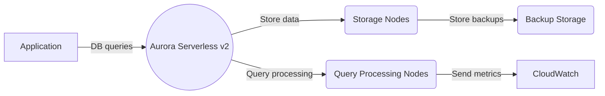

**[[aurora]] Serverless v1/v2: Advanced Architecture and [[RDS_Instance_Types|Internals]]**

[[aurora]] Serverless is an on-demand auto-scaling configuration for [[aurora]]. It enables customers to pay only for the database capacity that they consume without worrying about managing the underlying infrastructure. There are two versions of [[aurora]] Serverless: v1 and v2. The primary difference between them is that v2 supports the MySQL and PostgreSQL engines, while v1 only supports the MySQL engine.

[[aurora]] Serverless v1 uses a "burstable" model to manage capacity, which means it scales quickly by using a large pool of resources. In contrast, [[aurora]] Serverless v2 uses a "scale-in/scale-out" model that allows it to scale more granularly based on actual workload needs.

The following diagram illustrates the architecture of [[aurora]] Serverless v2:



* Application sends DB queries to [[aurora]] Serverless v2
* [[aurora]] Serverless v2 stores data in Storage Nodes
* Query Processing Nodes process queries and retrieve data from Storage Nodes
* Backup Storage stores backups of the database
* [[cloudwatch]] receives metrics from [[aurora]] Serverless v2

Global scale can be achieved through Global Database, which replicates data across multiple regions for low-latency reads and [[Master/Git_hub_notes/AWS-SAP-C02-Notes-main/README|disaster recovery]] purposes. However, [[aurora]] Serverless does not support Global Database directly. To implement this pattern, you need to create a separate [[aurora]] provisioned cluster and manually promote replicas to standalone instances.

**Comparison & Anti-Patterns: When NOT to use this service vs. alternatives**

| Service | Characteristics | Use Cases |
| --- | --- | --- |
| [[aurora]] Serverless v1/v2 | On-demand scaling, pay-per-use pricing, limited control over capacity | Development/testing environments, intermittent workloads, unpredictable traffic, small databases |
| [[aurora]] Provisioned | Pre-provisioned capacity, predictable performance, higher costs | Mission-critical applications, high-performance workloads, large databases |
| [[Git_hub_notes/AWS-SAP-C02-Notes-main/README|RDS]] | Limited scalability, traditional SQL engines, easy setup and management | Legacy applications, specific SQL engines, simple workloads |

Anti-patterns include using [[aurora]] Serverless for mission-critical applications or high-performance workloads due to its variable performance. Additionally, using Serverless for very large databases may result in excessive throttling and higher costs than provisioned capacity.

**[[appsync|Security]] & Governance: Complex [[Master/Git_hub_notes/AWS-SAP-C02-Notes-main/README|IAM]] [[policies]], Cross-Account Access, and Organization SCPs**

[[Master/Git_hub_notes/AWS-SAP-C02-Notes-main/README|IAM]] [[policies]] should restrict access to [[aurora]] Serverless resources based on the principle of least privilege. For example, allow users to connect to the database only if they require access:

```json
{
    "Version": "2012-10-17",
    "Statement": [
        {
            "Effect": "Allow",
            "Action": [
                "rds-db:connect"
            ],
            "Resource": [
              "arn:aws:rds-db:us-east-1:123456789012:dbuser:databaseusername/*"
            ]
        }
    ]
}
```

Cross-account access requires creating a resource-based policy on the [[aurora]] Serverless instance:

```json
{
    "Version": "2012-10-17",
    "Statement": [
        {
            "Effect": "Allow",
            "Principal": {
                "AWS": "arn:aws:iam::123456789012:root"
            },
            "Action": [
                "rds-data:ExecuteStatement",
                "rds-data:BatchExecuteStatement",
                "rds-data:BeginTransaction",
                "rds-data:CommitTransaction",
                "rds-data:RollbackTransaction",
                "rds-data:ExecuteSql"
            ],
            "Resource": "arn:aws:rds-data:us-east-1:012345678901:db:serverless-cluster:[@auroradbresource-name][/schema-name].*",
            "Condition": {
                "Bool": {
                    "aws:ViaAWSService": "true"
                }
            }
        }
    ]
}
```

Organization Service Control [[policies]] (SCPs) can enforce restrictions on [[aurora]] Serverless usage at the organization level.

**Performance & Reliability: Throttling Limits, Exponential Backoff Strategies, and HA/DR Patterns**

Throttling limits depend on the version and region. For example, [[aurora]] Serverless v2 has a maximum connection limit of 4,000 connections per account. Implementing exponential backoff strategies can help mitigate throttling issues.

HA/DR patterns involve deploying [[aurora]] Serverless clusters in multiple AZs within the same region and using Global Database to replicate data across regions.

**[[Master/Git_hub_notes/AWS-SAP-C02-Notes-main/README|Cost Optimization]]: Granular Cost Controls and Calculation Examples**

Granular cost controls include monitoring usage through [[cloudwatch]] metrics and configuring alarms for specific thresholds. For example, setting up a [[billing]] alarm when monthly costs reach $1,000:

```json
{
    "Version": "2012-10-17",
    "Statement": [
        {
            "Effect": "Allow",
            "Action": [
                "budgets:ModifyBudget",
                "budgets:CreateBudget",
                "budgets:DeleteBudget",
                "budgets:DescribeBudget",
                "budgets:UpdateBudget"
            ],
            "Resource": "arn:aws:budgets:us-east-1:123456789012:budget/example_budget"
        }
    ]
}
```

Calculate costs based on hourly usage and the number of active ACUs ([[aurora]] Capacity Units):

ACU-hours = Number of ACUs \* Hours used

Total cost = ACU-hours \* Price per ACU-hour + Data transfer fees